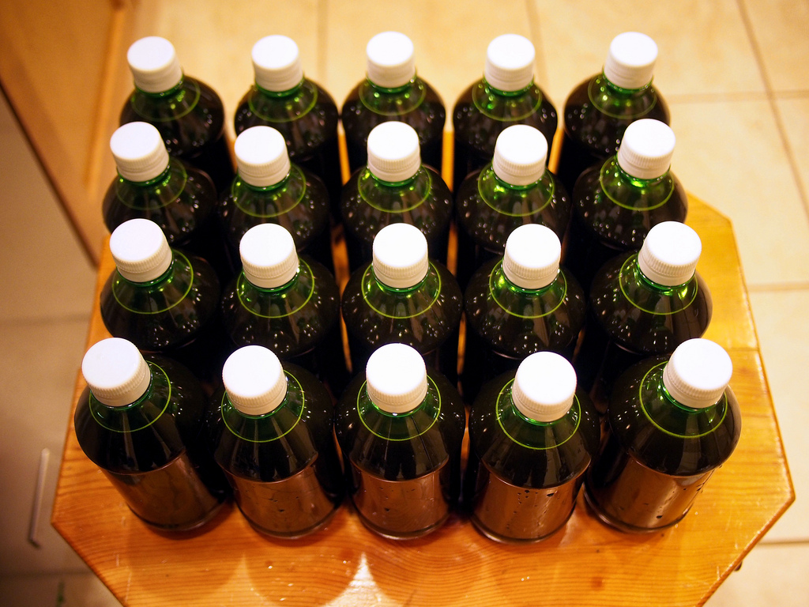

My previous beer, a [Milk Stout](/1202/), was pretty much a total failure. So I decided I would make another attempt at a stout, this time without lactose though (for arbitrary reasons).

A beer I've always quite enjoyed is Howe Sound Brewery's Oatmeal Stout, so I thought I would try my hand at making an oatmeal stout. An oatmeal stout, as the name implies, uses oatmeal as part of its grain bill. While the oats don't really add a dominant taste, they do impart a particular body to the beer as well as some complexity.

### Recipe

The local home brew supply shop I normally use was pretty much out of every English yeast I wanted to use for this stout, so I ended up grabbing some Windsor Dry Yeast. I didn't really research it all that much, since it's basically all I could get my hands on at the time, but I've since learned it's not a very well liked yeast.

| Amount | Malt Type |
| --- | --- |
| 7lb, 4oz | Marris Otter |
| 1lb, 12oz | Flaked Oats |
| 12oz | Chocolate Malt |
| 8oz | Brown Malt |
| 8oz | Roasted Barley |
| 1oz | Fuggles (@ 60min) |
| 1oz | Fuggles (@ 25min) |
| 1 pkg | Windsor Yeast |

### Notes

The Windsor yeast is known to ferment very quickly. In my case it lived up to expectations - at the end of 48 hours the FG hit 1.030, and it basically stayed there forever. While this yeast is a pretty poor attenuator, I was expecting to get down to 1.020.

At this point I let the carboy warm up to around 70F, stirred up some of the sediment, and also pitched some additional yeast. Other than to produce a few short-term bubbles in the airlock, none of that had any long-term affect. At day 5 the FG was still at 1.030, so I just assumed that was all she wrote.

I mashed this one at 156F to try and shoot for a fuller bodied beer, but given the results I think I'll shoot for around 154F next time. The OG in the fermentor was 1.065, which puts the final ABV at 4.6% - definitely lower than I was shooting for, but not horrible.

Given the reviews of the Windsor yeast and the basic end to my fermentation after 48 hours, I decided to just bottle it at the end of day 7 to free up the fermenter for something else. My plan is to bottle condition it for three of four weeks, after which point it's hopefully somewhat drinkable.

This was my first attempt at bottling, and for the most part it went off pretty smoothly. Unfortunately though, despite my best efforts at preventing it, I still ended up with some trub in my bottles as well as quite a lot of yeast. I'm not too worried since I'm sure I can still pour a good glass of beer with it, but it doesn't look very appealing. The Windsor yeast is known not to clear very well, and I would definitely agree. I also didn't use any Irish Moss during the boil, and it's possible that could have helped. I don't really have the means to cold crash a carboy or bottling buck yet, so I don't have any other options except to perhaps leave the beer longer and hope more crud settles out.

### Results

Despite using a yeast that generally isn't well regarded, I actually quite liked this beer when I tasted it. I gave a few away to friends and family, and they really enjoyed it as well. Right after sampling a few glasses of it I went down to the local pub to try a few different porters and stouts, and this beer definitely held its own (at least for me) amongst them.

Unfortunately there were a few issues during the bottling. The first was that I measured out the amount of corn sugar to use based on the batch size I thought I had. I added this to the bottling bucket and then siphoned the beer on top of it. Once I left some of the trub behind in fermenter though I realized that I had about 0.75 gal less in the bottling bucket than I thought. That meant I basically over-primed the beer by a significant amount.

It also turns out that I probably should have stirred the liquid at this stage to make sure the sugar was well dispersed. Basically as I opened these, it became clear that the ones at the start of the process (which came from the top of the bottling bucket) were very much undercarbonated, and the ones from the end of the process (which came from the bottom of the bottling bucket) were very much overcarbonated (which would gush all over the place when opened).

Unfortunately for me I gave most of the undercarbonated ones away, and those were actually pretty nice to drink. The few I left for myself in my fridge were so overcarbonated as to be basically undrinkable (half would gush out the top and the rest would be a gross suspension of yeast for 30 - 60 minutes).

I'm definitely looking forward to doing another run of these sometime soon though, hopefully correcting all the mistakes I made along the way with this one.
