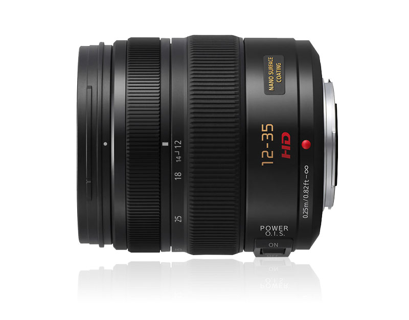

Last year I sold my Nikon DSLR and replaced it with an [Olympus OM-D M5 micro four-thirds](/travel/reviews/products/olympus-om-d-e-m5-micro-four-thirds-camera-review/) camera. While I've had a few of the micro four-thirds cameras, the Olympus OM-D camera was the first one where the image quality seemed on par with my DSLR, not just for outdoor photos with tons of light, but also for low-light photography as well.

As a former wedding and concert photographer, it was a bit challenging to go from my Nikon and Canon gear (where most of my lenses were f/2.8 or faster) to my micro four-thirds lenses, where most zooms are f/3.5 or slower. The lack of a built-in flash on the OM-D complicates this further, since the camera doesn't have the ability to increase the ambient light without purchasing a flash unit.

\[caption id="attachment\_11118" align="aligncenter" width="800"\] Panasonic Lumix Vario 12-35mm Lens\[/caption\]

For the most part I had been using my [Panasonic Lumix 20mm f/1.7 lens](http://www.amazon.com/gp/product/B00DJS8322/ref=as_li_qf_sp_asin_il_tl?ie=UTF8&camp=1789&creative=9325&creativeASIN=B00DJS8322&linkCode=as2&tag=duanstor-20) on all my micro four-thirds camera bodies, mainly because it's amazingly sharp and allows me to take photos inside most venues without a flash. The only real problem with it is that the focal length isn't ideal for taking photos of more than two or three people, or any type of architecture while travelling. My solution to this problem previously was to simply attach the kit lens that came with the Olympus in those scenarios, but it's not really that great a lens, and a far cry from the Canon f/2.8L lenses I was used to using.

\[caption id="attachment\_10819" align="aligncenter" width="1024"\] Moraine Lake, Canada, Photographed with the Panasonic Lumix Vario 12-35mm f/2.8 Lens\[/caption\]

### Panasonic Lumix 12-35mm f/2.8 Lens

When Panasonic finally announced the [Panasonic 12-35mm f/2.8 lens](http://www.amazon.com/gp/product/B00843ERMW/ref=as_li_qf_sp_asin_il_tl?ie=UTF8&camp=1789&creative=9325&creativeASIN=B00843ERMW&linkCode=as2&tag=duanstor-20), I immediately put in an order for it. The 12-35mm focal range on the Olympus OM-D is equivalent to 24-70mm on a 35mm camera, which is the perfect focal range for a primary walk-around lens.

At nearly $1200 USD, it's definitely not a cheap lens, something that other people have pointed out as a negative against this lens. But even though it's priced similarly to some of the Canon and Nikon zoom lenses as well, the Panasonic Lumix Vario 12-35mm lens is significantly smaller and lighter, which is a huge plus for me personally (and why I like the micro four-thirds form factor).

\[caption id="attachment\_10615" align="aligncenter" width="1024"\] Cuzco, Peru, Photographed with the Panasonic Lumix Vario 12-35mm f/2.8 Lens\[/caption\]

I've been using the Panasonic 12-35mm f/2.8 lens for almost six months now, and it's definitely exceeded my expectations. The lens is amazingly sharp, has great colour, and also produces highly contrasted images, which I really like.

Here are the technical specifications for the Panasonic Vario 12-35mm f/2.8 lens:

- F2.8 brightness over the entire zoom range
- Nano Surface Coating technology for dramatic reduction of ghost and flare
- Four aspherical lens elements for improved image clarity
- Built in Optical Image Stabilizer which makes it easier to hand-hold shots in low light
- Metal lens mount

Despite having 14 lens elements this lens only weights 305 grams, making its addition to my backpack hardly noticeable. I've taken it to Canada, Australia, and recently to Peru - it's performed amazingly in all conditions.

\[caption id="attachment\_10630" align="aligncenter" width="1024"\] Machu Picchu and the Surrounding Landscape, Photographed with the Panasonic Lumix Vario 12-35mm f/2.8 Lens\[/caption\]

The Olympus OM-D and the [Panasonic Lumix Vario 12-35mm f/2.8 lens](http://amzn.to/15ExxUa) is the perfect combination, and is now my main camera for when I travel. After using this combination for a few months, there's no way I would ever travel with a DSLR again.

If you're looking for a professional series lens for any micro four-thirds mount cameras, then I highly recommend purchasing the [Panasonic Lumix Vario 12-35mm f/2.8 lens](http://amzn.to/15ExxUa) if you can afford it. It's now my primary walk-around lens and I've been extremely happy with the image quality.

If you have a camera like this and are looking for a great storage medium for your photos, consider picking up what I consider [the best external hard drive](/reviews/products/best-external-hard-drive-for-travel/) for traveling.
