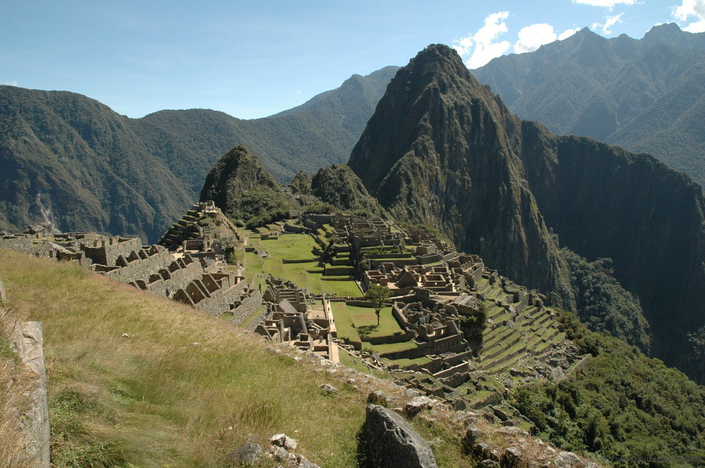

I few months ago I blogged about the fact that I had finally purchased a ticket to go to Peru and see Machu Picchu. Unfortunately due to the launch of WPtouch Pro 3, I wasn't able to go at the time, and ended up tossing a $1,000 plane ticket in the garbage since Expedia wouldn't give me a refund.

All in all though the launch was a big success, so I can't really complain. Sacrifices like that are part of owning your own business, and why I personally don't feel as guilty when I enjoy a bit of relaxation time when things occasionally slow down for a while.

Now that I'm finally back in South America, [Luciana](http://lutessaroto.wordpress.com) and I decided it would be an opportune time to visit Peru and ultimately Machu Picchu. We have a flight out of Sao Paulo at 3:50am (ouch), but that means we'll be in Cuzco, Peru at sometime around 10:30am I believe.

\[caption id="attachment\_10520" align="aligncenter" width="1024"\] Machu Picchu, Photo by [Tom Grydeland](http://www.flickr.com/photos/togr/206159732/in/photolist-jdC79-o9Tr3-q4LU8-2hiMvF-4P3ssv-5MLVws-68ezpJ-6wiUZz-6wo5F5-6wo6jh-9W8XWB-dhduUB-8te3Mf-dy6z7t-dybYbU-dy6tfz-dybU4h-dy6yiF-dy6zBR-dy6wwt-9Fu6j1-9Fuxcu-8YS7kZ-8YVaSU-dMZoPU-8jjXDo-8jgJTv-8jk1Pm-8jk119-bWguTd-bWgRkf-bWhjbW-bWhE7u-bWhhUJ-bWgtYQ-aqSCQw-8YS79R-8YS7ht-8YVaLS-dybNqw-dy6qS4-dy6zoF-dy6nJZ-dybYxm-dybWsf-dybQ7Q-dybRhm-dybSwh-dybYMW-8YS7cB-8jjYmG/) on Flickr\[/caption\]

Cuzco was once the heart of the Peruvian empire, and it's apparently a very fascinating city. As a self-proclaimed foodie, I am looking forward to walking around the main square in Cuzco and sampling some of the local cuisine. Unfortunately since Cuzco is 11,000 feet above sea-level, one of the concerns for travellers who arrive is altitude sickness. Most of the time it usually amounts to shortness of breath and occasionally a headache, but sometimes it can be serious enough that hotels will administer oxygen to people who get really sick.

The local remedy for this is actually tea made from coca leaves - that's right, the same magical stuff they use to make cocaine. Most people who take it end up feeling better, so I'm sure it's something that we'll sample as well sometime tomorrow.

I'll be working in Cuzco for the next few days, and we'll use the weekend to do most of our exploring there. We are taking the train to Aguas Calientes on Sunday, and spending Monday up at Machu Picchu. Machu Picchu is a wonder of the world, and it'll be the 4th one I'll have seen over the last few years.

So stay tuned for an update soon from Peru!
