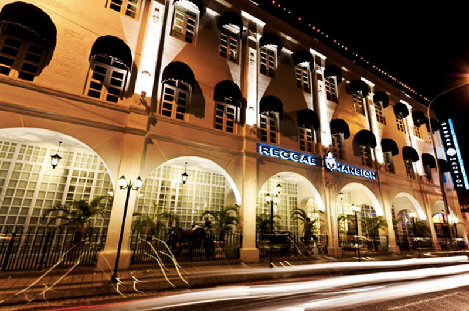
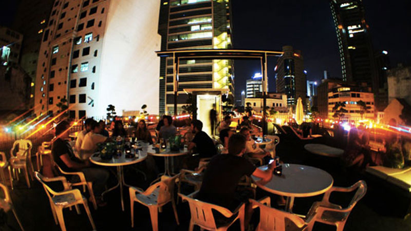

I was originally looking for a hostel on the internet that was central to Kuala Lumpur and also had a view of the Petronas Towers. Eventually I found the highly rated Reggae Mansion hostel, which had an amazing roof-top bar with views of the KL Tower and the Petronas.

Without a doubt, my stay at the hostel was the highlight of my trip to Kuala Lumpur. After the first night of drinking, most of us quickly became friends in the hostel, often eating together and heading out in the evenings together. Down the street from the establishment is an actual reggae bar, so most of us would head down there in the evenings for some drinks and dancing.

\[caption id="attachment\_10732" align="aligncenter" width="800"\] Outside view of the Reggae Mansion in Kuala Lumpur\[/caption\]

The hostel is massive - inside is a full restaurant, countless dorm rooms, hallways full of private rooms, laundry facilities, and even a 20-30 seat movie theatre which shows two movies a day. So there was definitely no shortage of things to do in the hostel.

The bar on the roof is also a place where people can congregate and share a few stories over some drinks. The bar isn't limited to people who are just staying at the hostel, but also seemed to be open to the patrons of other hostels as well. That made it really easy to meet other travellers in the area.

\[caption id="attachment\_10733" align="aligncenter" width="800"\] Roof-top Patio in the Reggae Mansion in Kuala Lumpur\[/caption\]

Out of all the places I have visited in the world in my nearly three years of travels, this was easily the best hostel experience I had. I highly recommend the Reggae Mansion Hostel.

You can read the reviews of the [Reggae Mansion Hostel on Hostel World](http://www.hostelworld.com/hosteldetails.php?HostelNumber=52782&affiliate=duanestorey), or [browse other hostels in Kuala Lumpur](http://www.hostelworld.com/findabed.php?ChosenCountry=Malaysia&ChosenCity=Kuala+Lumpur&affiliate=duanestorey).
