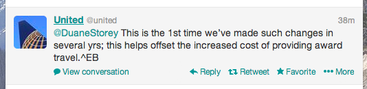
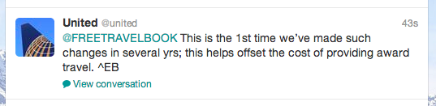
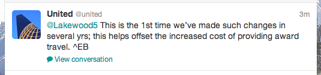
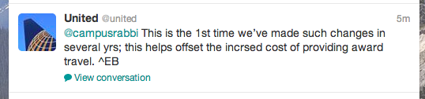

If you're a routine flyer around North America, you may have heard today that United Airlines dropped a bombshell on its loyalty program members. But chances are you didn't, because it seems that they chose to [release the information at night](http://milevalue.com/united-devalues-award-chart/?utm_source=rss&utm_medium=rss&utm_campaign=united-devalues-award-chart). You know, during Halloween, when everyone is reading the news.

The long and short of it is that many people with accumulated mileage, myself included, are facing a pretty severe devaluation of our mileage. On some international routes on other Star Alliance airlines, it will now take almost twice as many miles for the same flight. Their domestic routes fared much better, but anyone using United miles to fly on partner airlines is now facing a large increase on many routes.

I asked United about it on Twitter, and here was their response.

They further clarified the information they gave me with this information tweet to this guy.

Another helpful response here:

And so on:

I understand that managing the backlash from something like this can be pretty taxing on a Twitter team, but there really doesn't seem to be much sympathy from United over this. The Continental/United merger a few years ago was supposed to make things better for their travellers, but things just seem to getting worse for United customers as time passes.

I myself just spent all year trying to get Gold status on United, so I'm obviously a bit bummed that the program is getting progressively crappier. For example last week [United reduced the baggage allowances for gold](http://loyaltylobby.com/2013/10/23/united-airlines-reduces-star-alliance-gold-checked-baggage-allowance-on-domestic-flights/), which is yet another elite status perk that I was looking forward to.

I suspect that some of the competitors to United, such as American Airlines and Delta, are going to offer some great deals in the New Year to try and entice upset United customers to join them. Given how the hashtag [#UnitedUnfriendly](https://twitter.com/search?q=%23UnitedUnfriendly&src=tyah) is now trending on Twitter, I suspect that many United Mileageplus and elite members will happily be looking for a new home early next year.
