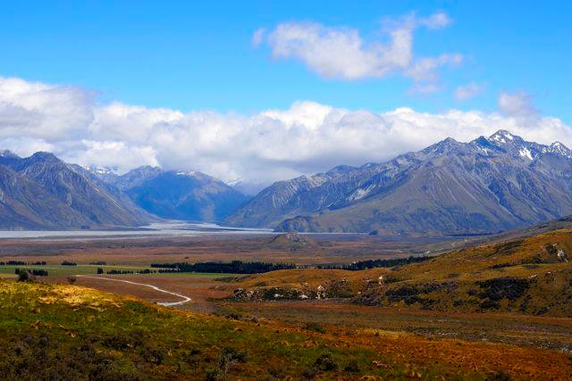
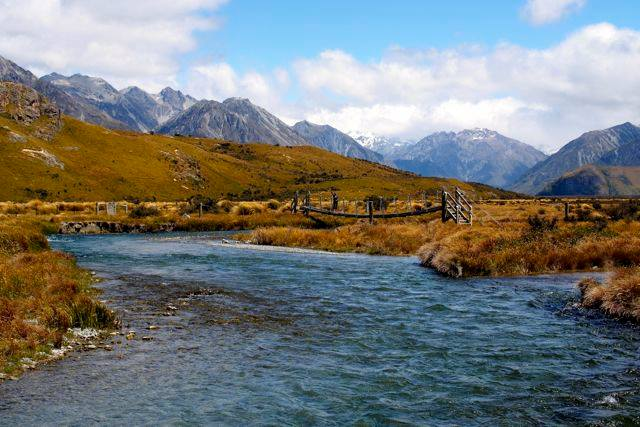
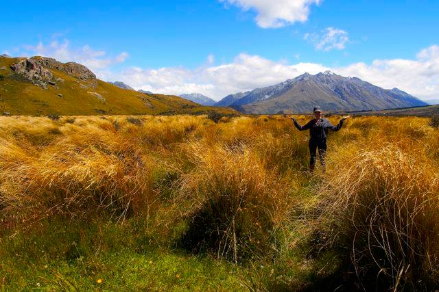
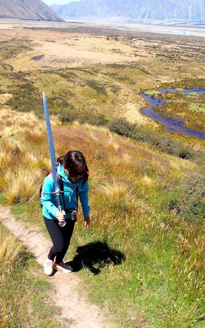
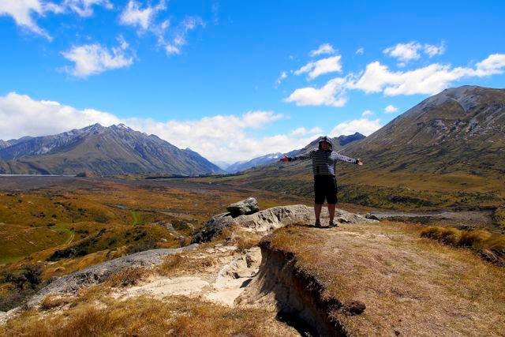

It's hard to be in New Zealand and not eventually stumble upon some of the filming locations from The Lord of the Rings trilogy. While most of the scenic areas from the films are on the South Island, there are plenty of opportunities on the North Island to take a visit to Middle Earth, most notable is of course [Hobbiton near Matamata](http://www.migratorynerd.com/destinations/oceania/new-zealand/my-tour-of-hobbiton/).

\[caption id="attachment\_12614" align="aligncenter" width="1024"\] Me on a camping chair Edoras\[/caption\]

During our two week campervan adventure on New Zealand's south island, we had an impromptu idea to visit Edoras, which was the primary filming location for the Lord of the Rings: The Two Towers. It's situated on private property, but the owners don't seem to have a problem with tour busses and individual tourists making the trek up to the top. The actual hill where the Golden Hall was located is known as Mount Sunday in New Zealand, and that's your destination.

To get to Mount Sunday \[[Google Maps](https://www.google.com/maps/place/43%C2%B034'51.1%22S+170%C2%B058'12.7%22E/@-43.580111,170.969968,4024m/data=!3m1!1e3!4m2!3m1!1s0x0:0x0?hl=en)\], head east along highway 72 and eventually take the Ashburton Gorge Road. Access to Mount Sunday can be made by driving up the approximately 40 kilometre gravel Hakatere Potts Rd. Most rental contracts have clauses in them which basically say you can't take the vehicles along gravel roads, so you may want to check your policy. We risked it anyways and just went really slow. It's definitely a bumpy ride and your vehicle will get really dusty, so make sure you'll be able to wash it down somewhere if you're going to take your vehicle there.

You'll pass two cute little lakes during your trip, as well as a little tiny town. Continue down the gravel road and you will eventually encounter a small gravel car-park on the left with likely a bus or a few cars in it. You can leave your vehicle there while you make the roughly 30 minute hike up to the top of Mount Sunday. It's an easy climb, but it'll likely be really windy so prepare for that. Like anything nature related, make sure you trek out with the same items you trek in with - nobody wants to visit a dirty, litter-filled Edoras!

\[caption id="attachment\_12616" align="aligncenter" width="640"\] Approaching Mount Sunday\[/caption\]

I wasn't worried about anyone stealing anything out of our campervan, but I would probably go out of the way to hide any valuables you might have in your vehicle. So just do a quick pass to make sure nothing is left out in the open.

\[caption id="attachment\_12618" align="aligncenter" width="640"\] Crossing the bridge to Edoras\[/caption\]

As you make your way up the trail to the top, you'll cross a bridge or two over some water and pass along some fields. If you use your imagination, you can easy place Theodin and Gandalf on the fields to the right of the trail fields for the funeral of Theodin's son.

\[caption id="attachment\_12622" align="aligncenter" width="640"\] Luciana in the fields next to Mount Sunday\[/caption\]

Once you get to the top of Mount Sunday, you'll probably be as surprised as to how small it is. There's hardly much room for the Golden Hall, let alone anyone else. I suspect most of the buildings here used during filming were just used as facades and the actual indoors shots were done back in Wellington.

Edoras is about a 10 in terms of cool-factor for those visiting Lord of the Rings locations. Since it's fairly remote, not many Lord of the Rings fans ever make it to the filming location. Because of that you'll likely see some hard-core Lord of the Rings fans during your hike. In our case we saw a few people in costume, and one girl carrying a two-handed sword all the way to the top.

\[caption id="attachment\_12620" align="aligncenter" width="400"\] Die-hard Lord of the Rings fans\[/caption\]

If you don't get blown off the edge of Mount Sunday due to the wind, you'll be presented with one of the most breathtaking 360 degree views you've probably ever experienced.

\[caption id="attachment\_12623" align="aligncenter" width="640"\] Me, standing near the site of the Golden Hall on the top of Mount Sunday\[/caption\]

All in all making the detour to Mount Sunday took us about two and a half hours, and it was well worth the trip. If you're looking for an afternoon trip to a great Lord of the Rings filming location, I definitely recommend visiting Edoras via Mount Sunday in New Zealand beautiful South Island.
