While I've done my fair share of hiking in my life, as I've gotten older I've gravitated more towards multi-day hikes rather than single day hikes. I certainly enjoy an afternoon hike on a weekend, but there's something magical (and inherently challenging) about hiking for days or weeks at a time.

In 2017 I did my longest hike yet - the Camino de Santiago in Spain. I spent 28 days walking from St. Jean Pied de Port, France, to Santiago de Compostela, Spain, a distance of roughly 800km. When it was over, as I hobbled around Santiago de Compostela letting my feet heal, I told myself that my days of doing multi-day hikes were over. But as the months went by I started to really miss the experiences I had on the Camino de Santiago, and the sheer simplicity of walking for days at a time in the outdoors.

So in 2018, I decided to plan another hike, and ultimately decided on the West Highland Way in Scotland. Unlike the Camino de Santiago though, where I walked mostly by myself, I decided to ask my friend Tony if he wanted to come along, which he did. So in June of 2018 I flew from Valencia, Spain to Glasgow, where my friend Tony met me after flying from Split, Croatia.

In terms of the logistics, it's pretty easy to just plan a day or two at a time on the Camino de Santiago as there's an entire infrastructure of accommodation and restaurants dedicated to people walking the trail. As the West Highland Way is somewhat remote, you really do need to plan ahead and pre-book accommodations. That normally would take some of the spontaneity out of a hike - you basically have to walk according to plan, regardless of the weather, and stop wherever your reservation is for the night. But there really isn't an alternative as in some locations there are literally only one or two places to stay, and usually are bed and breakfasts.

A friend of mine who walked this previously recommended I use [Mac's Adventure](https://www.macsadventure.com/) to book with, as they specialize on trips within the UK. Not only do they handle all the bookings and communication with the bed and breakfasts, but they also handle luggage transfer between the accommodations every day, which is great. It means you can actually pack like you are on vacation, but take a day pack on the actual trail with just the essentials for the hike.

#### Day 0: Glasgow, Scotland

I hadn't seen my friend Tony in a while, so it was great to find him in our accommodation in Glasgow. We didn't have a ton of time to see the city, but we did manage to hit a few pubs. Whenever I make it to the UK, I almost always have a Guinness when I arrive. And it was one of the first orders of business I got to once I was settled in the pub.

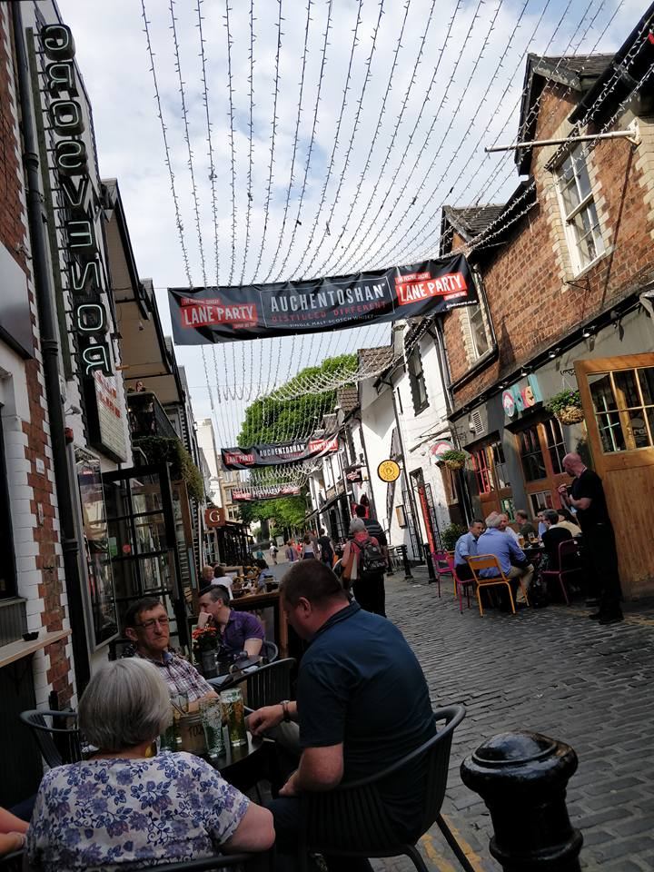

Afterwards we headed down to Ashton Lane in Glasgow and found a watering hole for some food and beers. The weather looked mostly great for the week, and Tony and I were pretty excited to get started in the morning. We called it an early night, and booked a train for the morning to take us to Milngavie.

#### Day 1: Milngavie to Drymen - 24km

The West Highland Way officially starts in the town of Milngavie, just a short train or a taxi ride from Glasgow. When we arrived, we found the Macs Adventure van waiting for us, and gave the van driver our luggage in exchange for our welcome packs with our full itinerary. After that, we grabbed a quick bite and a coffee, and got ready to head out on the trail.

\[caption id="attachment\_14082" align="aligncenter" width="960"\]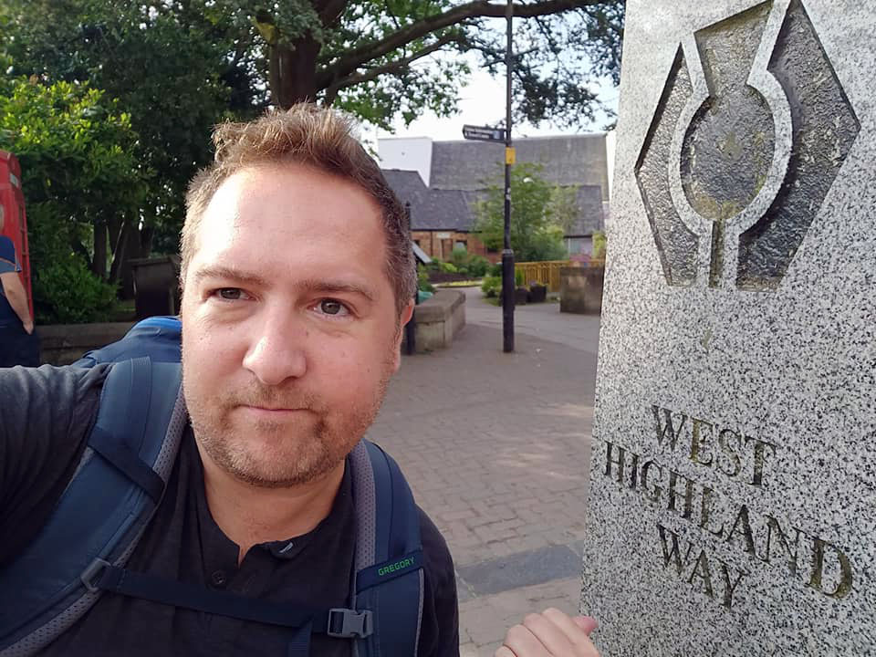 Marker in Milngavie\[/caption\]

This stage was relatively flat, and a great warm up for the rest of the trail. We had really great weather, and it felt amazing again to be walking through the wilderness.

\[caption id="attachment\_14084" align="aligncenter" width="960"\]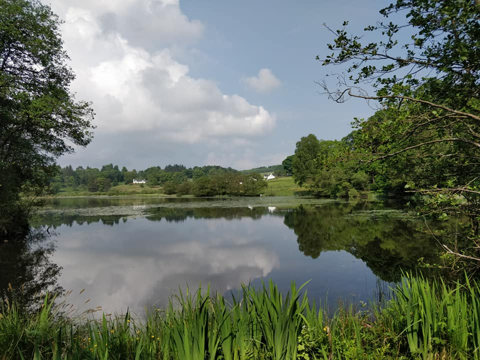 Passing by a loch\[/caption\]

In the end we walked for about six or seven hours, at which point we arrived in the town of Drymen for the night. We felt so elated after our first day that we proceeded to drink copious amounts of alcohol in one of the oldest pubs in Scotland during the evening. Unfortunately that meant day 2 would be a bit painful, at least for me, but that's part of the adventure.

#### Day 2: Drymen to Rowardennan - 26km

The second stage of the West Highland Way followed Loch Lomand, and it was a nice leisurely day of walking. Unfortunately I spent the morning a bit hungover, but thankfully that passed after the climb up to Conic Hill.

\[caption id="attachment\_14089" align="aligncenter" width="720"\]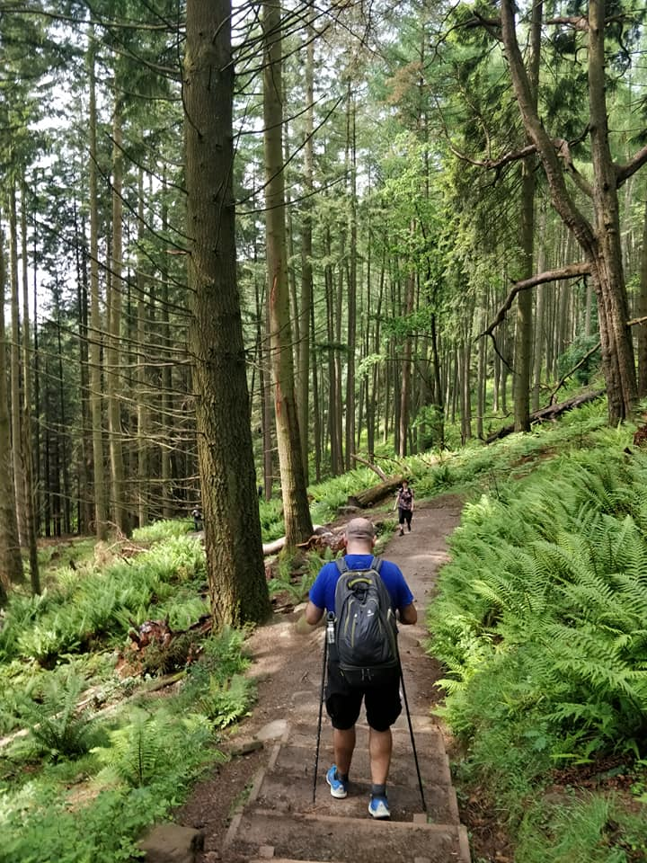 Tony in the trees\[/caption\]

One thing to mention about the West Highland Way at this point are midges - midges are tiny flies that swarm around hikers and generally make your life miserable. Their bites and pretty painful and cause itchy welts to appear. There's basically no way to avoid them on the trail, but most people carry some type of midge spray, although I'm not sure how much it really helps.

An unfortunate reality of midges is that they generally leave you alone while you are walking, but will quickly swarm you when you stop. So that means it can be challenging to stop for a rest, as after a minute or two in some areas you'll quickly find yourself being bitten by midges.

\[caption id="attachment\_14090" align="aligncenter" width="960"\]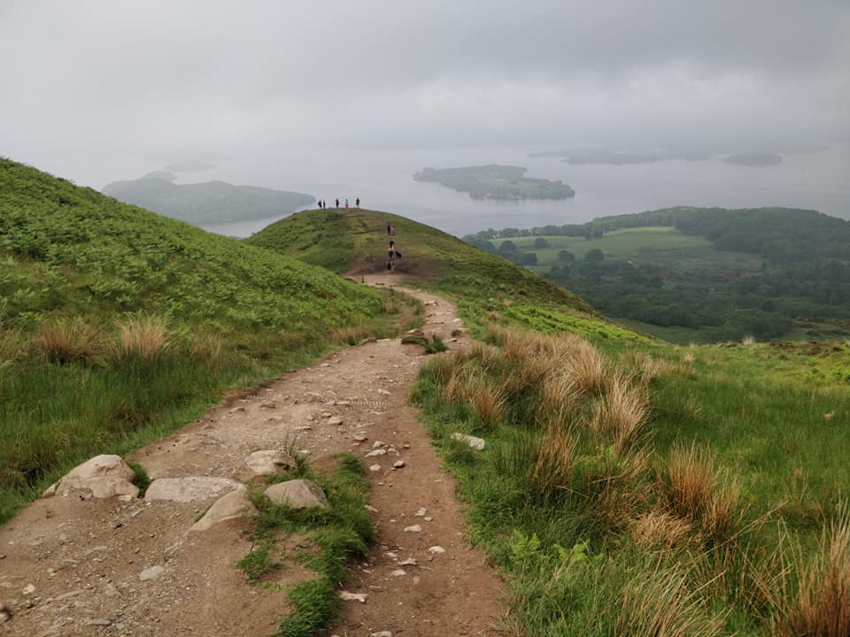 View over Conic Hill \[/caption\]

We hiked 26km this day, so were were pretty beat when we strolled into Rowardennan.

\[caption id="attachment\_14093" align="aligncenter" width="960"\]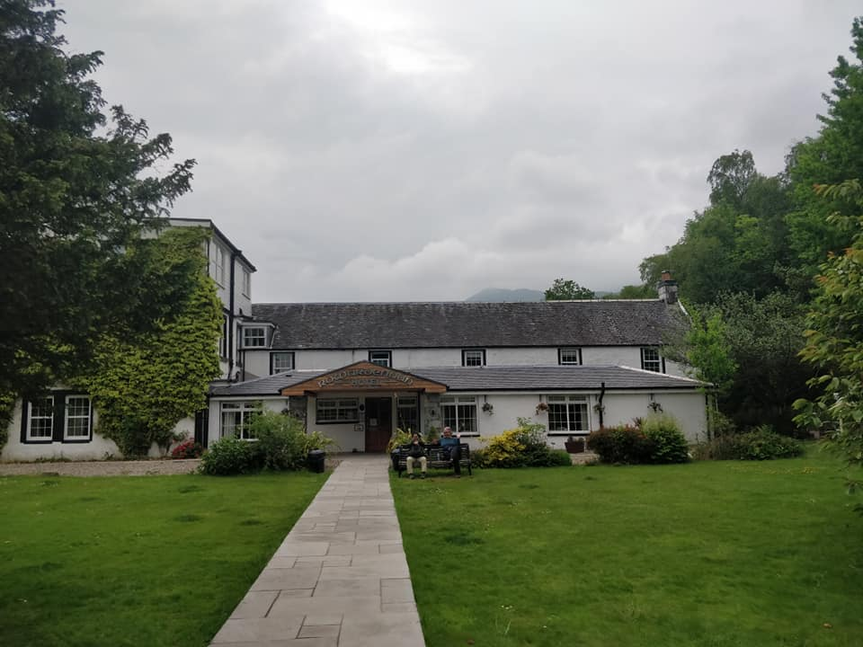 The Rowardennan Inn\[/caption\]

Our room was a bit tiny in this location, but the onsite pub/restaurant more than made up for it. Unfortunately this was midge area, so while there was a beautiful view outside, we didn't spend too much time outside due to the midges (and in fact there was a note in our room to keep the windows closed lest you want to be devoured).

\[caption id="attachment\_14105" align="aligncenter" width="720"\]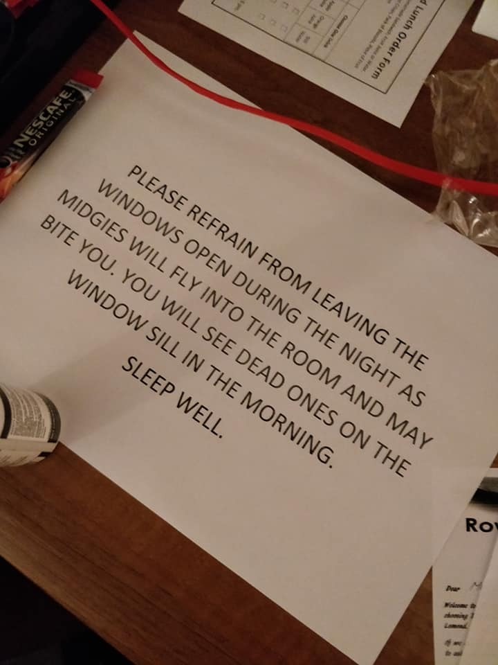 Sleep Well\[/caption\]

#### Day 3: Rowardennan to Inverarnan - 24km

One of the best parts about long distance hiking is that you honestly don't really need to worry too much about how much you are eating. On most days you are probably burning 1,000-2,000 calories by hiking, so it's nice to be able to eat big, hearty breakfasts or share a pitcher or two of beers in the evenings without any guilt.

\[caption id="attachment\_14101" align="aligncenter" width="720"\]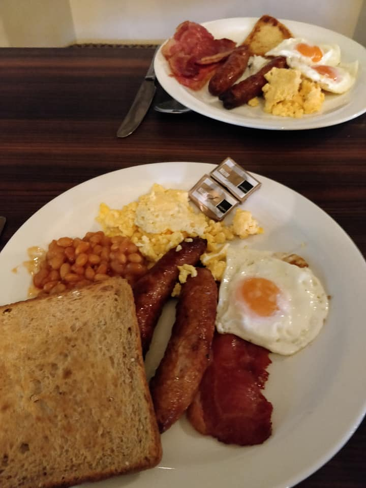 Typical Scottish Breakfast\[/caption\]

In most bed and breakfast establishments in Scotland you can almost always get a full Scottish breakfast. While some people opt to not eat the haggis, I quite like it and usually have it added to my plate whenever possible. After eating a big breakfast, we packed up our luggage, filled up our day packs, and hit the trail again.

This stage is one of the most difficult in my opinion, as for half of the day you are walking in a forest and constantly scrambling over roots and rocks. Despite using my hiking sticks all day, I did take a few spills when I lost my footing. I also got one hiking stick stuck in the mud, and had to sacrifice the rubber end cap on it since I couldn't find it after.

\[caption id="attachment\_14099" align="aligncenter" width="960"\]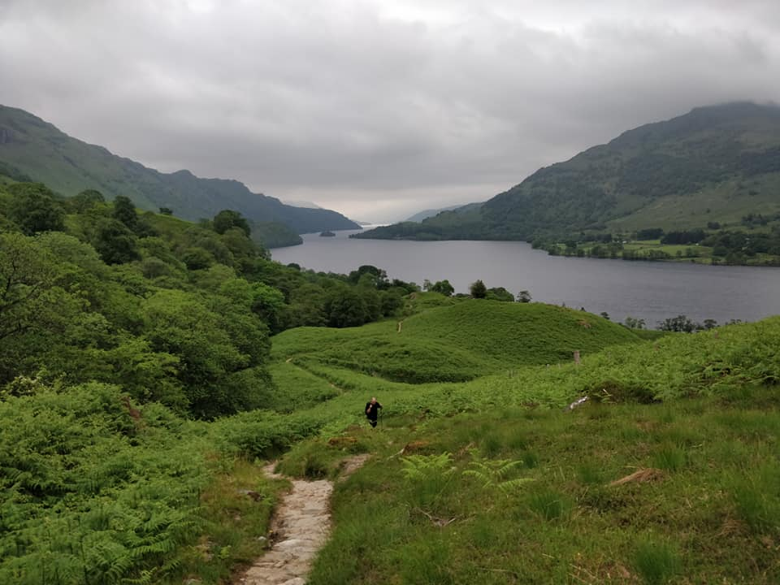 Tony on Day 3\[/caption\]

While the elevation profile so far along the trail had been relatively flat, the constant up and down and scrambling during the forest section was pretty hard on the legs.

\[caption id="attachment\_14107" align="aligncenter" width="960"\]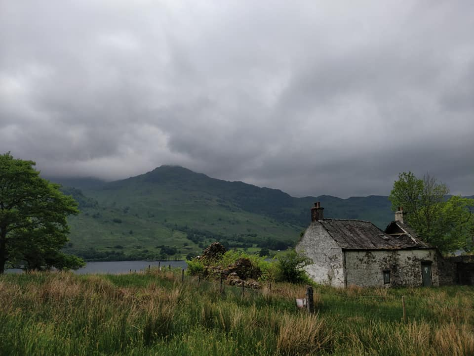 A Little House\[/caption\]

After a 24km day, we finally arrived in Inverarnan. While tired, we were definitely looking forward to the next few stages that would see us leaving the lake area and starting the journey into the Scottish Highlands.

#### Day 4: Inverarnan to Tyndrum - 21km

After another hearty breakfast, we packed up and hit the trail.

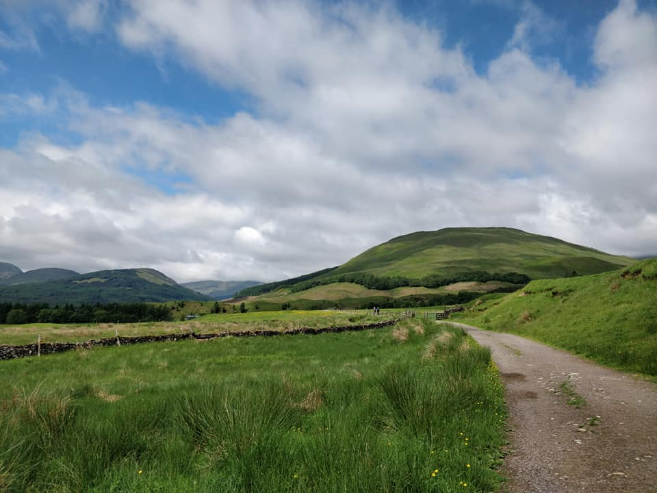

This was a pretty glorious day if I remember - great weather, and fairly easy walking.

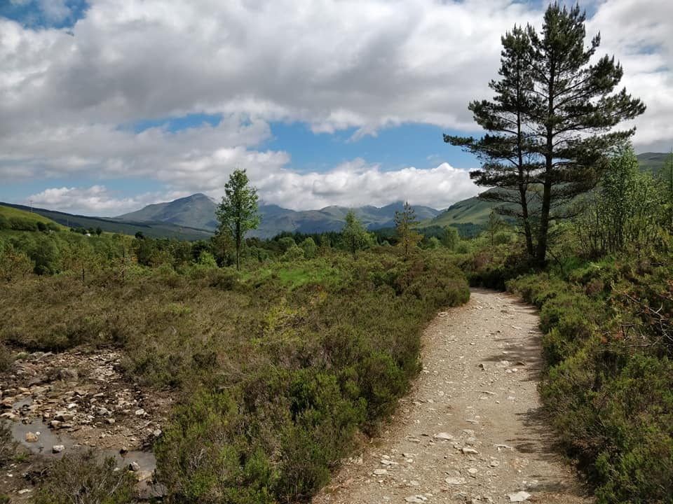

This was one of our shortest days on the trail, which gave our feet a nice break. As I mentioned, you can't really take a rest day at any point unless you schedule it ahead of time, so for the most part you have to wake up and go each day. So the shorter days are nice to rest up a bit.

#### Day 5: Tyndrum to Kingshouse - 31km

This is the longest day of the West Highland Way, so it's good to get a rest before hitting it. For some itineraries you can actually break this day up into two pieces, and we were sort of regretting at this point not doing that.

In terms of difficulty though, it's not the hardest day (more on that later), but the length, lack of places to stop, and occasional elevation gain definitely does make it challenging.

\[caption id="attachment\_14115" align="aligncenter" width="960"\]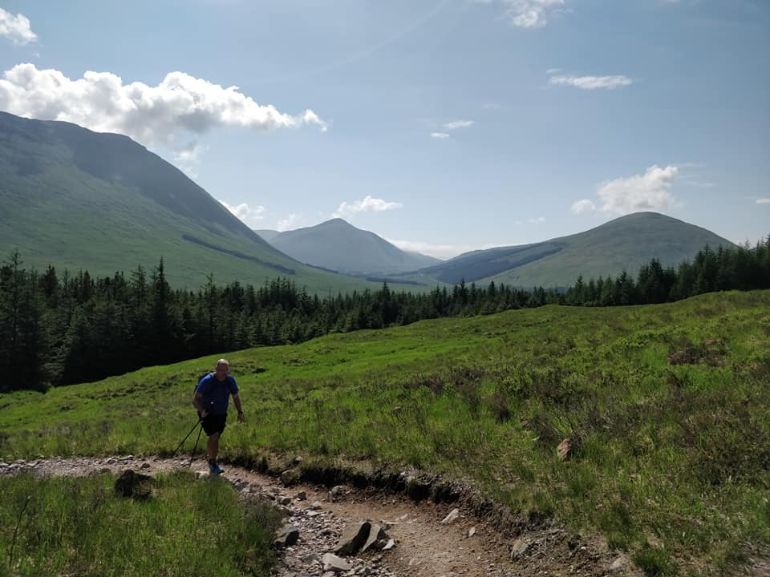 Tony in the Highlands\[/caption\]

Staying at Kingshouse, an accommodation in the highlands, is normally one of the highlights of this stage, but unfortunately during our hike they were renovating it and it was closed. That meant we had to take a little detour before Kingshouse and catch a bus to take us into Glencoe where we would sleep at night.

\[caption id="attachment\_14117" align="aligncenter" width="960"\]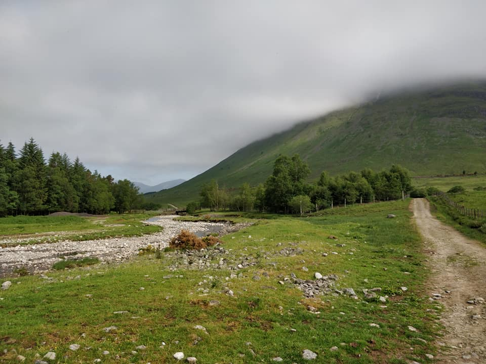 Day 5 Scenery\[/caption\]

Glencoe was a treat in that it's a really beautiful location in the heart of the highlands (much of the movie Braveheart was filmed around Glencoe). The downside to the detour though was that for me at least taking a bus between towns mid-way through the hike sort of messes with the flow. In addition, the buses were full and many groups had to wait several hours for the next one.

\[caption id="attachment\_14119" align="aligncenter" width="960"\]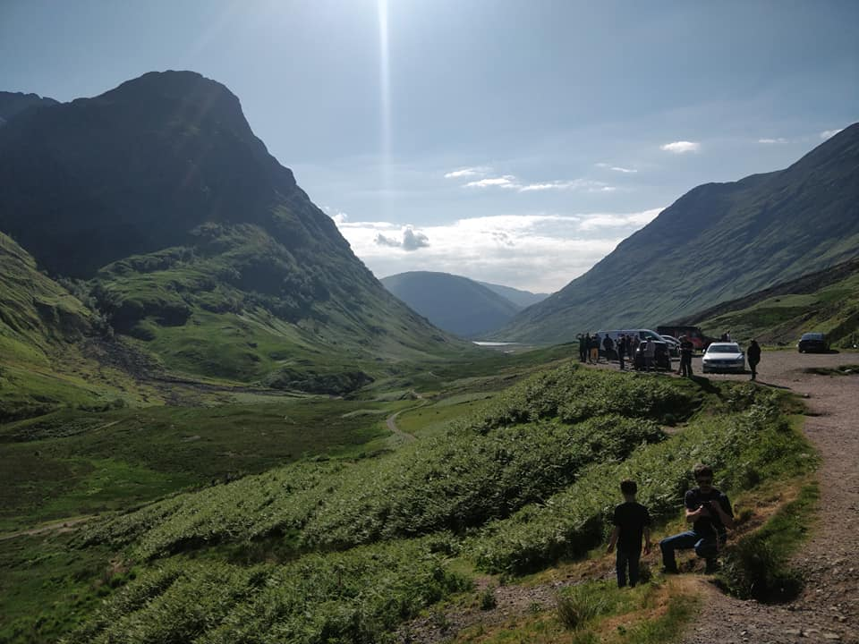 A quick stop near Glencoe\[/caption\]

That said, it was nice that they did arrange the buses and detour, so I'm not complaining. But it will be nice to actually stay at Kingshouse if I ever decide to walk the West Highland Way again.

#### Day 6: Glencoe (Kingshouse) to Kinlocklevin - 16km

We started in the morning with a big breakfast followed by a bus ride back towards Kingshouse. Once there, we carried on with our walk again.

\[caption id="attachment\_14122" align="aligncenter" width="960"\]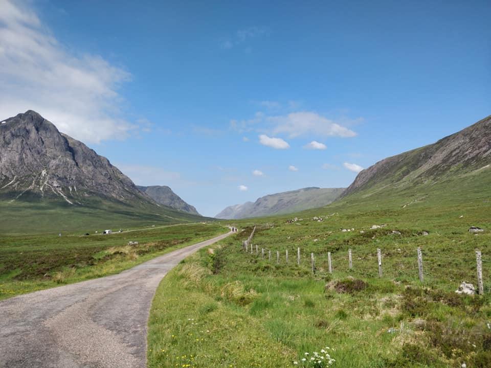 Walking Towards The Devil's Staircase\[/caption\]

Day 6 is arguably the hardest day of the West Highland Way for one simple reason - the Devil's Staircase. Yes, it's basically as bad as it sounds - about 400m of elevation gain in a zig-zag over less than a kilometer, so it's a pretty good workout. While it doesn't take too long, it's definitely tiring getting to the top.

\[caption id="attachment\_14124" align="aligncenter" width="960"\]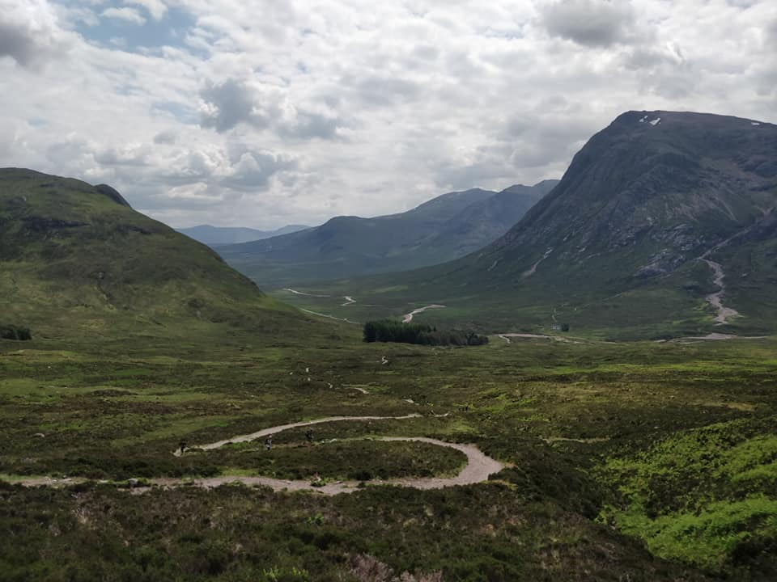 Looking Back While Climbing The Staircase\[/caption\]

We ended this stage in Kinlochleven, which is a town you can see for about two hours but never seem to get to.

\[caption id="attachment\_14125" align="aligncenter" width="960"\]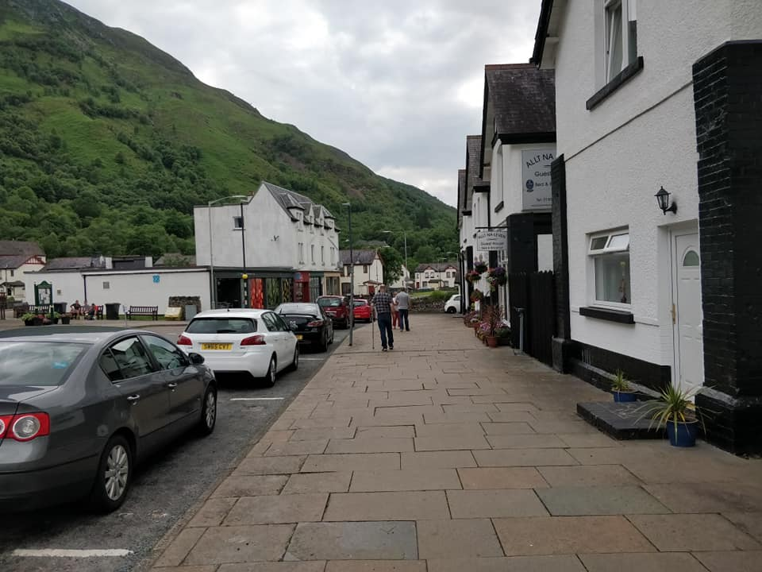 Arriving in Kinlochleven\[/caption\]

Macs Adventure did a great job with booking all of our accommodation. While we liked some better than others, in general they were all clean and comfortable. That said, Kinlochleven was our favourite bed and breakfast that we stayed in. As soon as we arrived the owners went out of their way to get us some beverages while we went and cleaned up. We also found a really great pub right around the corner where we casually drank beers throughout the evening and chatted with fellow hikers.

\[caption id="attachment\_14126" align="aligncenter" width="960"\]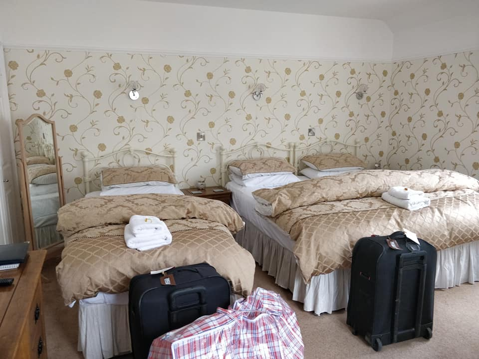 Our Room In The BnB\[/caption\]

We had such a good time in this little town that we were both a bit sad to leave it the next day. Had we had a more flexible itinerary I suspect we would have stayed here another night.

#### Day 7: Kinlochleven to Fort William - 24km

Compared to the Camino Frances, a 7 day hike isn't super long. That said, we were both looking forward to our final day and then switching into vacation mode for a while. The hiking for this stage isn't particularly amazing as you are leaving the majestic scenery behind and transitioning into a city with asphalt roads.

\[caption id="attachment\_14129" align="aligncenter" width="720"\]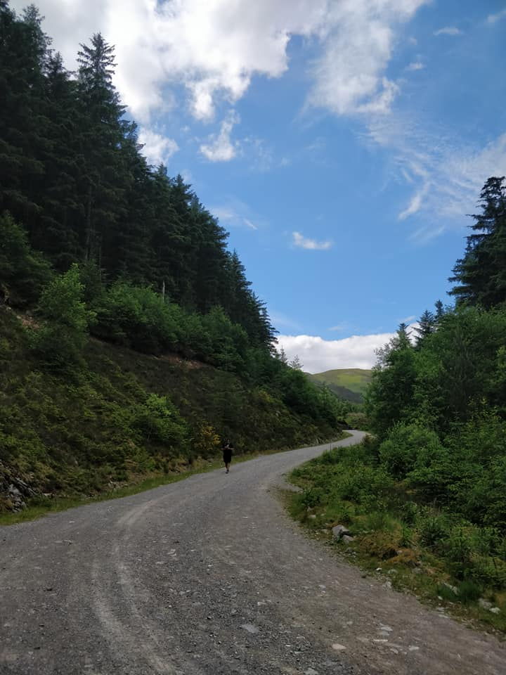 Approaching Fort William\[/caption\]

Just as you are entering Fort William you will pass the original end-point of the West Highland Way. It's near the marker, in the sports store, where you can get a certificate saying you completed the West Highland Way. Once done, you can walk through the actual town of Fort William and visit the new end-marker (which I suspect was moved to the other side of town to force people to walk through Fort William and spend some money).

\[caption id="attachment\_14131" align="aligncenter" width="1024"\]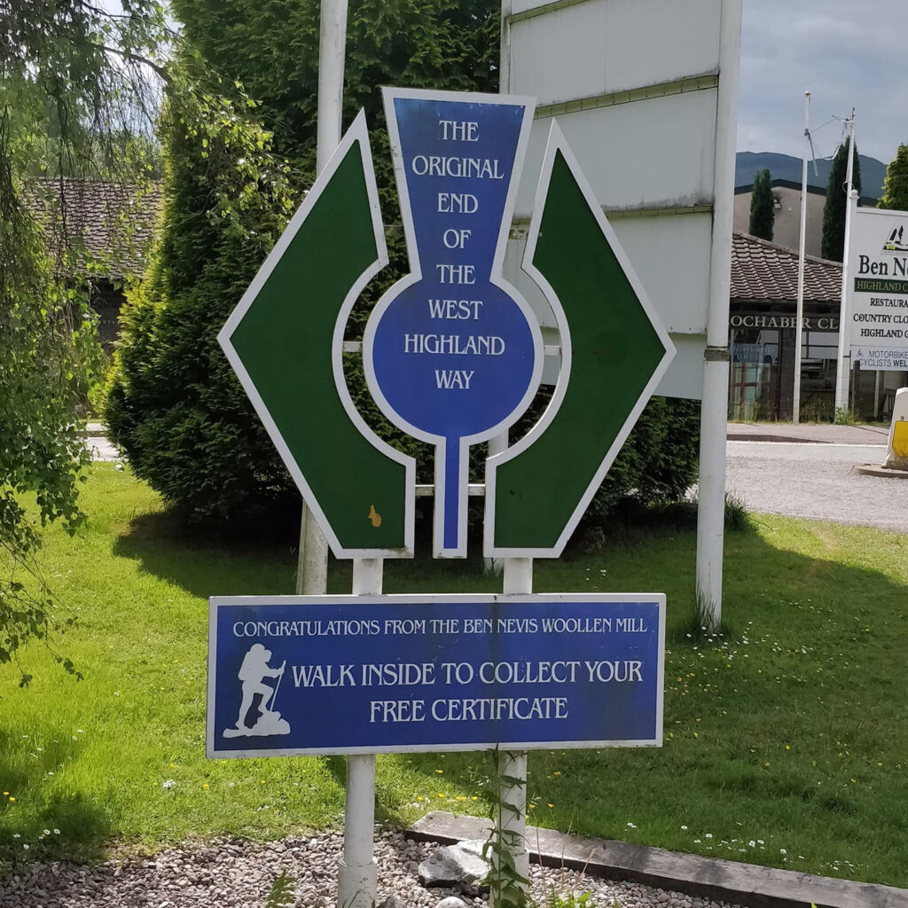 The End Of The West Highland Way\[/caption\]

#### Final Thoughts

I wrote this entry nearly three years after I walked the trail, so in truth I suspect I forgot many aspects of it. In general though it was a pretty amazing hike along lakes, within forests, and through the Scottish highlands. The food was pretty heavy at most restaurants during the evenings (curries, fish and chips, etc.), but after hiking all day neither of us complained.

This was the first time either of us had used Macs Adventure before, and we both had nothing but good things to say about them. Our luggage arrived safe and sound every day and was usually waiting in our rooms for us when we arrived. The accommodation they booked for us was comfortable everywhere we stayed, and the little welcome pack they provided us had lots of useful information about the trail and our custom itinerary.

I certainly don't mind planning hikes like this myself, but every once and a while it's nice to have someone else do all the hard work so that I can just show up and hike. And this was a perfect example of that.

In total we walked 154km in 7 days, which was definitely manageable. Both of us did pretty well on the hike in terms of blisters and general comfort, but we did wonder how the hike would have been if we extended it by another day. So if you want to go at a slightly slower pace and eliminate the long 31km day, it's definitely something to consider. While I have walked 40km plus days on various hikes before, 25km is sort of my sweet spot where I don't feel like I'm taxing my body too hard but still making good progress. So any day longer than that I usually end up feeling a bit sore the next day.

The West Highland Way was a great experience, and I'm happy I completed it. I definitely recommend this hike for anyone who wants to explore some of Scotland by embarking on a seven or eight day hike through the amazing Scottish highlands.

_Update: In August of 2020 I walked the Great Glen Way in Scotland, and once again used Macs Adventure. I had a conversation with a BnB owner on that route, and she had told me she cancelled all the guest bookings due to Covid, other than the ones made by Macs Adventure. She said Macs had always been good to her, and made sure she was paid promptly after each booking. So not only was Macs great for me, but it's also nice to hear that it's a good company to work with if you are a hotel owner as well._
