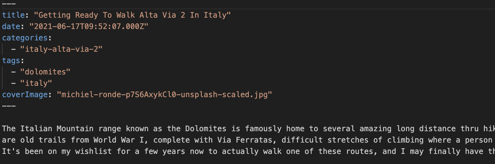

I posted the other day about how, after 18 years of WordPress, [I finally migrated this blog to another framework](/posts/wordpress-is-on-dangerous-ground.html). While I started evaluating various popular frameworks like Astro and Hugo, I had some initial problems handling the type of content I had added to my website over time. Eighteen years is a long time to be writing, and WordPress itself changed quite a bit over that period of time. For example, much of my older content has various short codes intermixed within it, which doesn’t really translate well to a new system.  

Considering I have a bit of time on my hands while I visit some family in Canada, I thought it would be a good learning exercise to try and code a complete static site generator from scratch to replace my WordPress website. Since Cloudflare Pages allows a static website to be hosted for free, I decided against using any sort of database for now, and instead decided to simply use the popular Markdown format for my website going forward.

### What Is Markdown 

If you’ve ever used Github or any similar tool, you’ve likely been exposed to Markdown files. Markdown files usually end in .md and provide a really simply way to edit content. For example, to do bold a sequence of text, instead of remembering what HTML tags you need, you can simply surround your text in two asterisks, like this \*\*this\*\*, which then turns into **this** when it’s rendered. Super simple. No HTML tags to remember, just a few simple text tricks to do what you need.

For a full list of markdown, [you can visit this site](https://www.markdownguide.org/basic-syntax/). 

### Generating an XML Export File

One of the main methods for taking content off of a WordPress site involves the use of the internal WordPress XML export file.  This file basically contains the majority of your website data, including blog posts, pages, comments, etc. While it’s not as exhaustive as a full site backup (which includes the entirety of the file system as well, including the images), for our purposes it’s good enough. 

To export an XML file, you simply need to go into the WordPress admin panel, choose *Tools*, and then *Export*. In terms of content, make sure you select *All Content*.  Once this is down, you’ll have a downloaded file representing the bulk of your WordPress site content, excluding images. 

### Converting The Content to Markdown

Once you have the WordPress content in the form of an XML file, you need a way to convert it into a series of Markdown files. Thankfully a few different tools exist, and I ended up using [the wordpress-export-to-markdown project code on Github](https://github.com/lonekorean/wordpress-export-to-markdown).  I cloned a copy of the repository locally, then copied my WordPress XML into the root directory of the repository as wordpress.xml.

After that, you can run the conversion script using *npm install && node index.js*. The Markdown converter will ask you a series of questions in terms of where your output will be located, and how it should be segmented. In my case I chose to use year-based folders, but not per-post folders (I figured this would be hard to manage when looking for old posts). Also didn’t add the date into my file names, as I’ll rely on the front matter (the text located at the start of the Markdown file) to handle this. The most important part of this process is to automatically have the tool download all the images in the XML file locally, so make sure you answer yes to these questions. This process takes a while as it’ll need to download a copy of each and every image file over the Internet to your local machine, but once it's done you’ll have a good snapshot of your content.

One thing to mention is that all your content will be pulled down and convertged, including drafts and private posts. My plan was to check all my posts into Github, so I went through my WordPress site prior to doing my export and permanently removed all my private posts just so they wouldn’t end up in Github. If this is a concern of yours as well, it’s something to be aware of before you generate your WordPress export file.

While this conversion tool is useful, it’s not an exhaustive capture of everything on your WordPress website.  Only a few of the post and page fields are transferred over, so if you have any custom meta data, it won’t be preserved. I imagine the tool could be expanded easily enough to get at some of the other data, but for my purposes it was good enough.

### An Example Post

Once it’s complete, you’ll have a series of folders representing all your posts and pages. In each directory should be a series of Markdown files ending in the .md prefix, along with an image directory containing all the downloaded images.  You can see an example of a blog post in Markdown format in the image below.   

The top section contains the post meta data and is called *front matter* within the Markdown. It contains the taxonomies in the form of categories and tags, the post publication date, the title, and the featured image from WordPress. The only piece that’s missing that I really need is the ability to add rich SEO description field on a per-post basis, so I’ll use a new front matter term called *description* going forward.

### Static Site Generators

If you’ve made it this far and followed along, you now have a pile of Markdown content to use. You can look into using popular static site generators like [Astro](https://astro.build/), [Hugo](https://gohugo.io/), or [Jekyll](https://jekyllrb.com/). 

For my purposes though, I decided to try and code my own as a learning exercise. If you’re reading this on my website, then you’re already seeing the end result of that effort, and this is a purely static site generated from my own code. So stay tuned for more posts in this series detailing this effort shortly, and what I learned.
  

