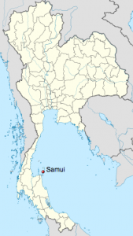

One of the main reasons I came back from my last trip was to take a bit of a breather in BC for a few months, and also to enjoy a bit of time camping in the outdoors. I've managed to do both since arriving back at the end of April, and so it's time to start thinking about moving on again.

I quite liked escaping some of Vancouver's dreary rainy/cold season last year in Argentina, and I thought I would head to the southern hemisphere again this year. With that in mind, I've been thinking about New Zealand for almost a year as a place I'd like to visit during North American fall/winter.

Around the same time as I was thinking about booking a flight to New Zealand, my friends [Scott](http://scotthadfield.ca/) and Samantha let me know they were going to be in Thailand for three months starting at the end of August. After a few promises of Thai beer by Samantha, I decided to start looking into meeting up to them in Thailand before heading to New Zealand.

I read a post about [some of the best locations in the world for expats](http://www.expatify.com/advice/10-most-suitable-countries-for-american-expatriates.html) well over a year ago, and Argentina and Thailand bost topped the list. Since I've already experienced Argentina, I thought it might be fun to visit Thailand this round as well, especially since it's sort of on the way (well, it's on the Pacific Rim at least).

\[caption id="attachment\_1405" align="alignright" width="169" caption="Ko Samui, Thailand"\]\[/caption\]

So last night I pulled out my dad's mobile stick and booked my flights for the fall from the comfort of their RV. I'll be leaving Vancouver on August 31st and heading to Bangkok, Thailand. I believe the initial plan is to head to Ko Samui, which is a little island off the east cost of Thailand. It's a small community near the beach, and it has all the amenities such as broadband and WiFi.

I spent most of my time in Argentina and Europe hanging out by myself. I don't mind that for the most part, but I'm definitely looking forward to exploring a new country with a few friends, and am looking forward to hanging out with Scott and Sam for a few months. Like me, they are also planning on working while they travel, so it'll be great doing a bit of work together.

I'm planning on staying in Thailand for two months and then heading to Auckland, New Zealand at the end of October. I'll wait until close to that point in time to make any plans, but right now I'm hoping to stay for three months: one month in Auckland and two months in Wellington. Last year we took things easy during the month of December, so I'll hopefully use some of that time to explore New Zealand's South Island, which is where many of the scenic shots from Lord of the Rings originated.

I still have about seven weeks left to enjoy BC and to catch up with friends and family. I'm also heading out to Toronto at the start of August to see my business partner and to plan out some strategy before I take off again. But everything is booked for the most part, and the count down is once again on.
