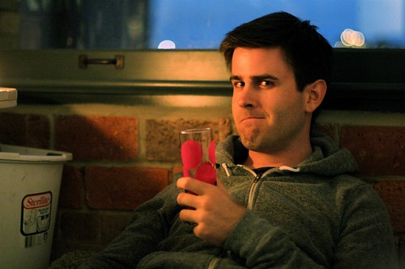

I'm nearly packed for my trip. Truthfully, I'm looking forward to getting away this weekend and relaxing a bit. The main reason I'm going is because [Dave and Lauren](http://www.daveandlauren.us) are getting married on Saturday.

That said, I'm hoping to meet up with a friend tomorrow night and maybe go catch a movie or go bowling or something. My friend Lynn is also coming along to the wedding on Saturday, which should be a lot of fun.

The wedding is in a really cool location called the [Herban Feast](http://www.herbanfeast.com/photo-gallery.html) near Sodo Park. It looks like a really amazing spot, and I'm looking forward to shooting some photos in the venue. Other than that, I don't know too much else about the area, but watching a couple of my friends tie the knot is undoubtedly going to be a good time.

I should be in Seattle sometime around 3pm tomorrow. I'm going to be heading down to a wine event at a nearby hotel around 5pm, and possibly playing a bit of guitar hero as well. Should be fun.

Anyways, I'm off to bed. I'm going to do a few hours of work in the morning, and then do a milk run throughout town here to pick up my dry-cleaning and also some jeans that are in the process of being hemmed.

I'll post photos over the course of the weekend.
