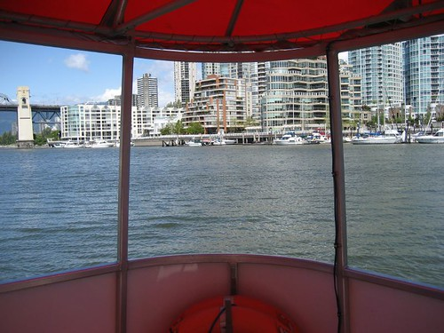

Well, I took a day off from CounterPath today to get caught up on sleep, and to catch up on all my errands. I spent the morning doing my taxes, and then had a nice lunch on Granville Island with my mom and Marty. After lunch, I headed back to my place via the little ferry, put on my walking shoes, and went for a long walk. I'm about half way through cooking up a nice BBQ chicken, and then I think I'm going to head to the gym. All in all, it's been a very relaxing day..

I also started thinking about what I want to do this summer for a vacation. I'm pretty sure I'd like to do the Oregon coast again, or possibly even an all inclusive trip to Mexico. I only have 2300 kms on my new car, and I think it would be awesome to take it out for a full week of adventuring. I haven't been to Alaska in a while, so that's always a possibility too On the other hand, I also have a free ticket to use in the US, so I'm not sure what I'm going to do there. Does anyone have any ideas?

