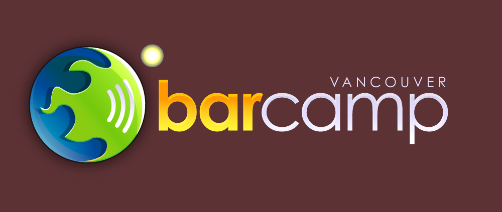

Tonight I'll be heading down to the Alibi room in gastown for the opening ceremonies of BarCamp Vancouver. For those of you who aren't aware what BarCamp is, it's essentially an "unconference" where the participants meet and generate their own discussions about things that interest them. The closest event to this that I've been a part of was the unconference at Northern Voice back in February, which had a really great turn out. Here's the official description from the BarCamp website:

> BarCamp is an ad-hoc un-conference born from the desire for people to share and learn in an open environment. It is an intense event with discussions, demos and interaction from attendees.
> 
> All attendees are encouraged to give a demo, a session, a presentation, or help with one. All attendees are expected to be participants. All presentations are scheduled the day they happen. Prepare in advance, but come early to get a slot on the wall.

I'm not entirely sure what to expect tomorrow, but tonight I've been told the liquor will be flowing-a-plenty. I'm gonna meet up with [Rebecca](http://www.miss604.com) and [Boris](http://www.bmannconsulting.com) tonight for a few drunks, and then I'm gonna hack away on a few personal side projects with Boris during the day tomorrow.

Should be a good time.
