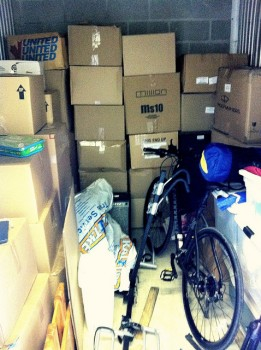

\[caption id="attachment\_2199" align="alignright" width="261" caption="Rebuilt Storage Locker"\]\[/caption\]

When I returned from Europe in April, I went down to my storage locker to grab a few items. Unfortunately, five months of boxes sitting on each other had taken its toll, and a few of them had shifted and fallen. Thankfully nothing was broken, but it was pretty clear that I needed to spend a bit of time rebuilding my locker at some point this summer.

Yesterday I went to the locker and spent about two hours rebuilding everything. Based on the experience, here are a few pointers I would give to anyone putting their stuff away into a storage locker for an extended trip:

- **Use high quality boxes**. It's easier and cheaper just to use whatever boxes you can find around, or that people bring you. But almost as a rule, all professional storage boxes I had in my locker were fine when I returned, and many of the cheaper boxes had started to buckle. Do yourself a favour and buy **only** high quality, packing boxes (available usually in two or four cubic feet). They are stronger and stackable.
- **Clearly mark the contents of each box**. I mostly did this, but missed a few. Yesterday I had to find certain items in my boxes, so I basically ended up opening every box and doing a check of what was in it. It's far better to simply take the time to mark the contents of each box on the top of each box using a black marker beforehand.
- **Make sure all boxes are packed full and tight**. If a box isn't entirely full and you put another box on it, it'll start to buckle. If you have a column of boxes that's more than two or three high, even a slight buckle can move the center of gravity to the point where it'll all tip over and fall. By packing boxes full and tight, the weight of each box can be transferred downwards, ultimately using the floor to support everything.
- **Put all heavy boxes on the ground, and lighter boxes near the top**. This seems intuitive, but it's really hard to keep track of what is heavy and what isn't once you're in the tight confines of a storage locker. I'd recommend writing directly on the box if it's heavy, medium or light. Put all heavy items on the ground, medium items on the second row, and light items on the top. You should probably try to have two lights boxes and two medium boxes for every heavy box you have, and that way you can stack your boxes five high (heavy on the bottom, two medium boxes on the heavy box, and the two light boxes on top of the two medium ones).

I ended up replacing about seven boxes yesterday, repacking them a bit more tightly in the process. I managed to shave an entire row of boxes off the top, which should make everything more stable in the long run.
