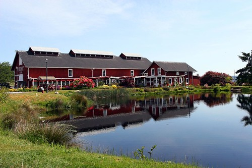

So, this weekend I decided to leave the city life behind and join my dad and Cathy for a few days in the wilderness down south.? The destination was a little place along the ocean called Fort Casey, near Deception Pass, Washington.? I had a great time, consuming an ample amount of alcoholic beverages, and sitting by the fire.

Unfortunately, the one major downside to travelling to the United States is having to go through customs on both sides.? No matter how many times I cross, or how many stamps I have in my passport, I always get grilled pretty hard.? It's gotten worse now that I have a decent car.? ? The way down wasn't that bad, although the border guy asked me "do you have anything in the car?", which I had no idea how to respond to.? "Uhh, yeah, I have stuff in the car."? ? The way back was even worse.? My dad gave me a Calvin Klein duffle bag that he got for free when shopping in the duty free shop.? I figured all I had to do was tell the border guy I got a free bag, and I would be on my way.? Here's how the conversation went:

- Border guy: "Can I see your ID"
- Me: I hand him my ID.
- Border guy: "No, I don't want to hold it.? I just want to see it."
- Me: "Uh, ok".? I open my passport and show it to him.
- Border guy: "Where you from?"
- Me: "Vancouver"
- Border guy: "Where were you?"
- Me: "Camping near Fort Casey."
- Border guy: "Why were you camping alone?"
- Me: "I was camping with my parents."
- Border guy: "Where are you parents?"
- Me: "Not with me."
- Border guy: "You bringing anything back?"
- Me: "Yeah, my dad gave me this free bag."
- Border guy: "What's it worth?"
- Me: "It was free."
- Border guy: "But what is it worth?"
- Me: Obviously confused.? "Zero.? It was a gift when they bought something else."
- Border guy: "Nothing is free.? What is it worth?"
- Me: Holding the bag up to the window, showing him the big sticker on it that says \*Free\*.? ? "It says free, I think that means it was free."
- Border guy: "Yeah, but what is it worth?"
- Me: "Uhh, $10."
- Border guy: "It looks like it's worth more than $10."
- Me: "How about $20."
- Border guy: "Ok.? Anything else you're bringing back?"
- Me: "No."
- Border guy: "What about alcohol? Any of that?"
- Me: "No."
- Border guy: "Any tabacco?"
- Me: "No."
- Border guy: "Any weapons?"
- Me: "Still no."
- Border guy: "Ok, go ahead then."

Needless to say, I hate crossing the border.? Ironically I always have more problems getting back into Canada than I do leaving it.? Oh well.

