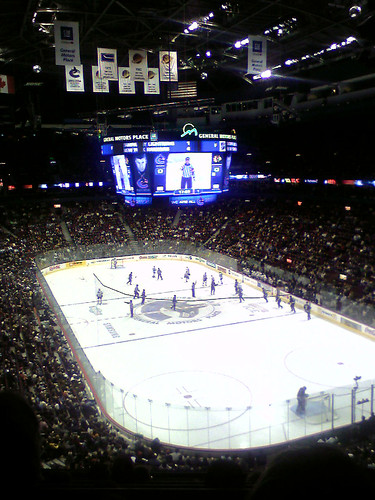

Andie and I went and saw the Vancouver Canucks play the Chicago Blackhawks last night down at GM Place. It's the first hockey game I've really watched in its entirety this season. The Canucks played pretty good, and eventually won with a final score of 2-1.

A couple cool things happened at the game. My old friend Mike from Ottawa was there (I found out on IM earlier in the day), so Mike and I managed to text msg each other on our phones until we finally found ourselves catching up in front of 322 between the first and second periods. I haven't seen Mike in about 3 years I guess. Mike was another product engineer at JDS Uniphase.

The other cool thing was that there was an older civil engineer sitting next to me that I was talking to. That's sort of the cool thing about being an engineer -- it's like a pseudo-secret society, and it's easy to pick out engineers thanks to the iron ring on their pinkies. I should really start wearing one again I guess. It's completely a habit in me now -- if it's a girl, I'm at that age where I usually cast a glance at her ring finger when she's not looking to see if she's married, and if it's a guy, I scan the pinky fingers to see if they are an engineer. Not that it really changes much, but I guess it just sort of allows you to immediately put forward geek talk without being worried if you're gonna offend someone.
