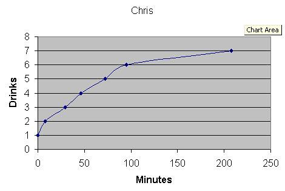

There's a little place in New Westminster called [The Thirsty Duck](http://www.dinehere.ca/restaurant.asp?r=1032 "The Thirsty Duck") (affectionately known to the locals as "The Duck") which has some of the worst tasting beer known to man. Derek and I went there a few years ago, and I distinctly remember putting my second drink down, knowing I wouldn't be able to finish it due to the horrid taste. So yesterday, Chris (aka The Kid) strolls up and starts bragging (a common occurrence in the office) about how he was going to go to the Duck and not leave until he had demolished ten beers. I told him it was a feat comparable to flying faster than a speeding bullet, and that it would ultimately end horribly, but he still wanted to attempt it.

I got Chris to text message me his progress during the night (since I chose not to participate in this barf-inducing event), so I decided to plot it here:

He did really good for the first two hours, then died at beer seven. Notice Chris entering phase 2 (also known as "oh my god, why in the hell did I drink this motor oil?") at his sixth drink. Also notice that between drinks 5 and 6 Chris accelerated slightly -- this corresponds to him receiving a text message from me saying: "you are slowing down."

Based on an online blood alcohol calculator, Chris was at 0.14, which equates to "Obvious Impairment, illegal in ALL states."

Good effort buddy. Good effort.
