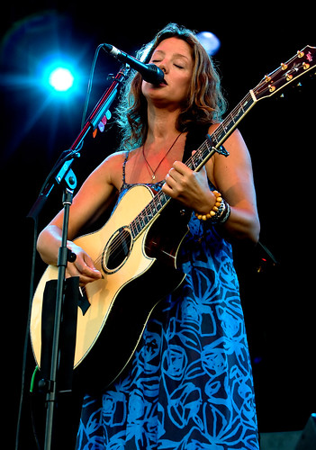

Without a doubt, shooting in low-light conditions is one of the most challenging aspects of taking photographs. I would still probably rate weddings a bit more challenging (since most weddings include some elements of low-light in addition to outdoor shots), but it's definitely near the top of my difficulty scale.

With the advent of digital cameras, most SLR bodies now have the ability to allow the user to arbitrarily increase the ISO setting on the camera in order to improve the low-light responsiveness. So obviously when a photographer encounters a low-light situation, he or she can simply increase the ISO sensitivity of the camera to compensate. I can actually handle random noise fairly well in my photographs, but there's another type of noise that I can't deal with, and that occurs as the ISO increases. Effectively what happens is that in high-light areas of the frame, the light ends up spilling over into adjacent pixels. This is known in some circles as _blooming_. In terms of a photograph, blooming generally results in a lack of detail in bright areas of the frame (such as the face when a spotlight is on a person). While my camera technically can go up to ISO 3200, blooming essentially limits me to at most ISO 1600, and ideally less than about ISO 1250. That was a hard lesson to learn for me, and something I've only figured out with trial and error.

Unfortunately, even at ISO 1600, it's relatively hard to hand-hold a shot in low-light conditions. Ideally you'll want to be using a really fast lens such as a prime. The obvious down-side of using a prime lens is that you'll have a fixed focus length, which in a concert scenario is extremely limiting. So for me, I usually try and use my Canon EF 70-200mm f/2.8L lens at concerts. Not only is a super sharp lens, but it's also relatively fast a f/2.8L.

Although the f/2.8L and a ISO 1600 setting will work in many scenarios, there are still many times at a concert when the light is low enough to make hand holding a shot at those settings nearly impossible. In that case, the only choice you really have is to lengthen the exposure and make due with a darker shot, one that hopefully can be brightened sufficiently in post-processing. In my case I usually dial back the exposure compensation setting using my thumb dial and put the exposure somewhere where I can hopefully hand hold the shot without blurring.
