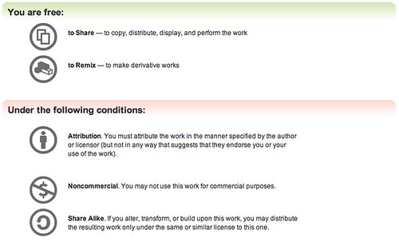

A while ago I attended a small function and snapped a pile of photos at it, putting most of them into a [Flickr](http://www.flickr.com) set so that others could view them and use them. While sitting at work today, I did a quick Google search to see if there were any other photos from the function, or any write-ups about it. After a few clicks, I came across one site, and immediately noticed that they had used a bunch of my photos in their blog entry. Unfortunately, not only did they not link back to the original photos, but they also did not mention the source at all. After looking at the image links in the HTML, it was apparent that the author of the website had saved the photos from Flickr, renamed them to something different entirely, and then moved them to their own web-server for use on their blog.

On all my photos on Flickr, I have added a [Creative Commons](http://www.creativecommons.org) license which basically defines the terms of use for the photo. If you click on the license information for the photo, you will see this:

In essence, I give permission on all my photos for people to to share or remix (i.e. create a new work from it) the photo under the constraints that they a) properly attribute the photo, b) don't use my photo for commercial purposes and c) if the photo is modified and redistributed, it must be done under a similar license. To me, the wording of that license is pretty straight-forward.

Unfortunately though, I have encountered situations like this involving my photos and other people's blog entries more times than I thought possible. For the most part, I have turned a blind eye to it and have tried to not let it bother me. Since photography is basically just a hobby for me, getting credit for the photos I take, while ethically (and due to the CC license, legally) the proper thing to do, is not really a huge concern for me. However, the website I viewed today not only did not give me credit for any of the photos, but I also strongly felt as though the presentation ultimately led the reader to believe that the author of the blog entry was in fact the person who took the photos, and that really bothered me.

I sent the author of the entry a politely worded email and asked them to correct the entry and do proper attribution, which they did without any fuss. But to be honest, it is an email I don't really think I should have had to write. To me, this act is really no different than plagiarism, and plagiarism isn't tolerated at all in the academic world these days. In fact, I was in several classes at the University of British Columbia where students were immediately dismissed from a class with a "F" for including text from another source in an assignment without properly attributing where it came from. Even in high-school people caught plagiarizing were firmly disciplined. In this day and age, I would think that most people would know better.

If you frequent my blog at all, you will know that I generally try to put a photo into most of my blog entries. To me, adding a photo often enhances the impact of a blog entry, or adds emotion to an entry that would otherwise lack it. While I usually try to use my own photographs, I have on occasion found suitable Flickr photos taken by others and used those. For anyone who has tried to do that, you will know that many photos nowadays on Flickr have no license associated with them, and instead show "All Rights Reserved", which obviously means that those photos cannot be used in any capacity. So I am very appreciative for the people who go out of their way to set the license on their photos in such a way that the rest of the world can freely use them in the context of the license they have chosen. I think as bloggers, we have a responsibility to not only respect these licenses, but to also make sure people are educated about them.

To that end, I contacted [Mike Linksvayer](http://creativecommons.org/about/people/#21), who is currently the Vice President of the Creative Commons organization, and asked him if he would mind doing a quick call to help sort a few things out for me (I apologize for the poor nature of the recording, but I had to set it up rather quickly):

 [or download the m4a file here](http://www.migratorynerd.com/podcasts/cc_call.m4a)

I also want to point out that Mike was nice enough to give his opinion and allow this call to be recorded for the benefit of the Internet community, but that Creative Commons and IANAL officially do not give legal advice.

To summarize, attribution, in the context of Flickr, requires at the bare minimum a link back to the original photo. To go one step further, linking back to the original photo is also [a requirement of the Flickr terms of use](http://www.flickr.com/guidelines.gne), so it should be done regardless:

> Do link back to Flickr when you post your photos elsewhere. The Flickr service makes it possible to post images hosted on Flickr to outside web sites. However, pages on other web sites that display images hosted on flickr.com **must provide a link from each photo back to its photo page on Flickr**.

What I also found interesting in the conversation with Mike is the information he shared in the area of machine-readable licenses. Ultimately it would be nice if you could apply a license via HTML on your blog, and have the major search engines understand it, and respect it when showing indexed photos and articles in search engine results. This might help the problem of people linking to images via Google images and not properly attributing, or ultimately may even lead to search engines providing HTML blobs that include the proper attributing tags automatically.

I want to thank Mike for taking the time out of his day to clarify those items for me, and I want to call on other members of the Internet community to help raise awareness of Creative Commons licensing so that everyone can continue to get along and play nice with each other.

\* the blog entry Mike talks about with regards to Business Week [can be found here.](http://joi.ito.com/archives/2007/07/13/my_picture_of_pierre_in_businessweek.html)
