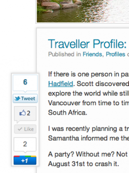

I've been working on revamping this website for about six weeks now. I've actually never really had a proper logo or header on any of my personal sites, and used to simply creatively use a few fonts to achieve some kind of clickable header.

It was a bit ghetto, but it worked.

Given that I enjoy travelling and writing about my experiences, I decided over a month ago that I needed to make this site a bit more professional and also focus the content a bit better. If you've been following along, you've noticed incremental updates over the past few weeks.

The logo was commissioned about six months ago by a company in Montreal that specializes in logos for personal and small business use. A friend of mine [recently used them for his car audio business](http://www.drivenaudio.ca), so I decided to give them a shot to see if we might be able to make more use of them via our own web company. The logo they came up with was pretty close to what I had in mind, so I was quite happy with them. I put the first version live over a week ago, and adjusted the branding on Facebook and Twitter as well.

### Colour Scheme

The colour scheme came directly from the logo for this site. When I had it created I said that I wanted warm colours that evoked the idea of beaches, sunsets and water. That's why the final colour scheme ended up being composed of blue, green and orange.

### Home Template

The main look and feel of this website has been basically the same for the last nine months. The general design of the front page, along with the sidebar, shadows, and positioning of elements was inspired by [CNN's](http://cnn.com) website in the fall of last year. I liked the functional layout with a lot of different options on the front page. I've made a few adjustments based on some data from [CrazyEgg](http://crazyegg.com), but the original inspiration was from a news site.

### Floating Sharing Widget

\[caption id="attachment\_1984" align="alignright" width="262" caption="Floating Sharing Widget"\]\[/caption\]

I struggled for quite a while trying to find a way to integrate sharing widgets into posts. It's fairly standard to float all of them to one side in a blog entry, but I personally think it looks a bit cumbersome from a visual perspective.

I've seen a few people use fixed positioning sharing widgets on their site, and I think it's the perfect solution to the problem. It basically gets them out of the way of your main content, but also keeps them on the page for the duration of the reader's experience in case they want to share it later. It's far better in my opinion than duplicating the share widgets on the top and button.

I couldn't find a plugin that did it the way I wanted, so I ended up rolling a custom jQuery solution to make it work here.

### Top Header

I tweeted last night that I was pretty impressed with [Flickr's new homepage layout](http://flickr.com). It looks far more professional and fresh than it used to. In particular, I liked the top header graphic on their site and thought I might be able to do something similar on my site to show off some of the photography I've done on my trips. Given that I was just watching movies last night, I decided to do a minor update on the header.

\[caption id="attachment\_1991" align="alignleft" width="350" caption="Header Photo"\]\[/caption\]

The end result is fairly similar to the TwentyTen and the TwentyEleven themes for WordPress, both of which are nice clean, modern designs that show off photos in the header. I was trying to preserve screen real-estate though, so I opted for a 980 x 220 pixel image, and ended up cropping ten or so of my travel photos to suit. Right now they are shown in order based on blocks of 15 seconds duration. So if you refresh the page in 15 seconds, you'll get the next header in line. I don't like elements that refresh on a page when you're viewing the page in real-time (other than the home page, where it often works) as I feel it distracts from the reading experience, so I opted not to have an real-time rotating header.

I didn't have a description of the photo in the first pass, but then I thought it wasn't really clear that they were photos from my trips instead of just stock photos I purchased off the internet. So I ended up adding a little caption on each photo along with the date, which I think helps inform the user that the photos were taken on my trips.

### Fonts

I was previously using Myriad Pro as the main font for this website, assuming (incorrectly it turns out) that it was installed on all Apple computers by default. I had fallback fonts for other OSes and browsers as well, but once I upgraded to Air I realized Myriad wasn't installed by default at all.

I've always liked Helvetica, and decided to switch all my fonts to that. Firefox doesn't really render it nicely for some reason, so I ended up using a fallback of Georgia in a few places for a few headers that didn't look that great in Firefox.

### Menu Structure

I previously restricted myself to a hierarchical menu that was only two levels deep. That meant, for example, that my Hawaii entries went into Travel/United States. I decided on the recent changes I did to make it a three level menu so I can better organize my content. So now Hawaii is located in Travel/United States/Hawaii. It'll allow me to better segment entries based on trips and cities going forward, and also help with search engines as well I imagine.

### Next Steps

Up until last night, I had a floating bar at the top that also had links to my social media sites. I ended up removing that for now, but it may make another appearance. I haven't quite found a way to put the social media links on the site without it looking a bit tacky, so I have to think more about that. I also am not completely happy with the font sizes and spacing in a few areas, so I'm going to adjust those further.
