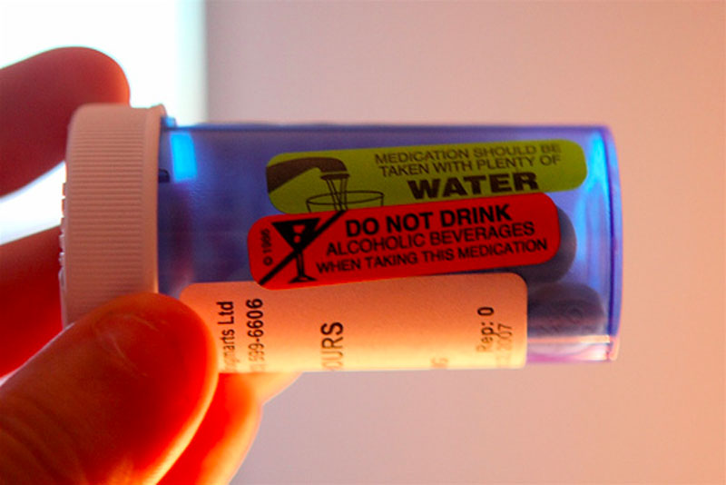

I finally got a hold of my doctor back in Vancouver today to try to figure out what's wrong with me and what I can do about it. It turns out that I have a fairly serious infection caused by a bacteria called "clostridium difficile." C. Difficile sometimes lives in the intestines and is normally kept in check by a range of good bacteria that also live there. Unfortunately, as a result of the antibiotic treament I had in the hospital (which was clindamycin I believe), a large portion of the good bacteria have died off, leaving a pile of bad stuff to proliferate:

> Clostridium Difficile Infection (CDI), can range in severity from asymptomatic to severe and life threatening, and many deaths have been reported, especially amongst the aged. People are most often infected in hospitals, nursing homes, or institutions, although C. difficile infection in the community, outpatient setting is increasing. Clostridium difficile associated diarrhea (aka CDAD) has been linked to use of broad-spectrum antibiotics such as cephalosporins and clindamycin, though the use of quinolones is now probably the most likely culprit, which are frequently used in hospital settings. Frequency and severity of C. difficile colitis remains high and seems to be associated with increased death rates. Immunocompromised status and delayed diagnosis appear to result in elevated risk of death. Early intervention and aggressive management are key factors to recovery.

While I have several symptoms associated with the infection, overall I still feel fairly healthy, which is a good sign. Having figured that I had this already, I made sure I had all my bases covered by reading lots of material about it before today's call. As it turns out, that was a really good thing.

After learning from my doctor that I was infected with this bacteria, he immediately said he was going to put me on the antibiotic cipro. Having read lots of web sites this week about treating this infection, I was pretty sure cipro was not recommended, and I told my doctor that. In fact, I told him that in the hospital I was on something related to cipro, and that was what caused it. Thankfully, my doctor said he would do some investigating and call me back.

A few hours later I got the call, and sure enough, after talking to St. Paul's hospital, my doctor learned that I was indeed on an antibiotic related to cipro during my stay there, and that prescribing it would most likely do more harm than good.

Unfortunately, there are really only two antibiotics effective against this type of bacteria. The first is [vancomycin](http://en.wikipedia.org/wiki/Vancomycin), which if you're not familiar with antibiotics, is one of the most powerful antibiotics available today. It's use is usually fairly restricted since improper use leads to bacteria that are resistant to it, and it is pretty much the last line of defense for really sick people where nothing else works.

The other is an antibiotic called [flagyl](http://www.medicinenet.com/metronidazole/article.htm). I just got back from the pharmacy where I picked up a 10 day supply of flagyl, and have already taken my first pill.

\[caption id="attachment\_11604" align="aligncenter" width="800"\] Flagyl for a Clostridium Difficiile Infection\[/caption\]

The good news is that I should be on the way to recovery now. The bad news is that flagyl and alcohol do not play well together. In fact, some very serious side effects can occur if one were to drink while taking it. So, unfortunately, I will be unable to join in on all the drunken debachery occuring next weekend in Toronto. I will of course attend and lend my wit and charm to the round table. But unfortunately, I will not be able to drink a single beer all weekend.

### 2013 Update

I'm mostly recovered from my c. diff. infection, but it took me years. Here is a detailed post talking about [life after a clostridium difficile (c. diff.) infection](/journal/health/recovering-from-c-diff-clostridium-difficile-infection/).
