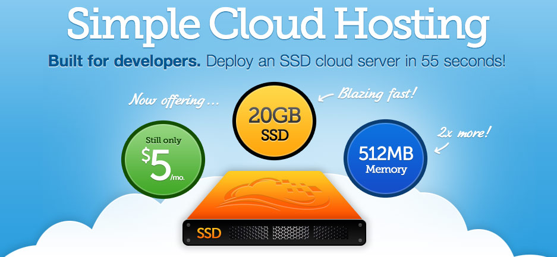
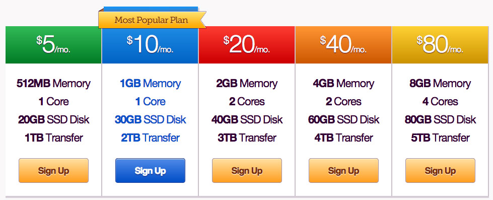
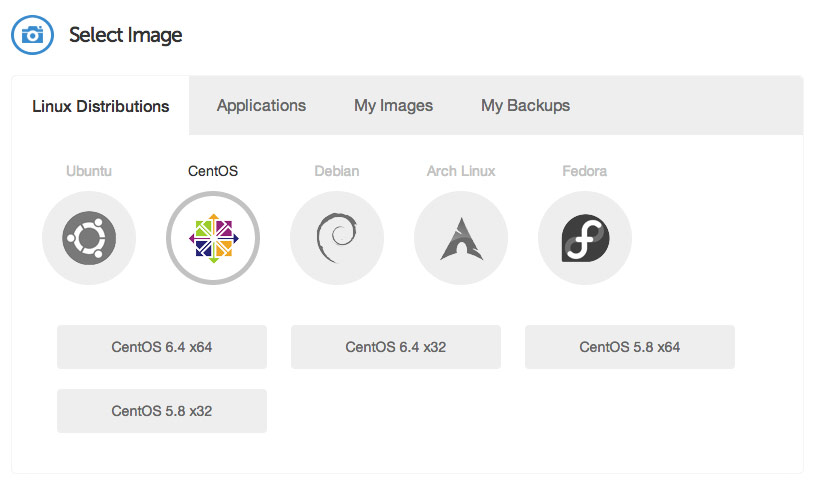
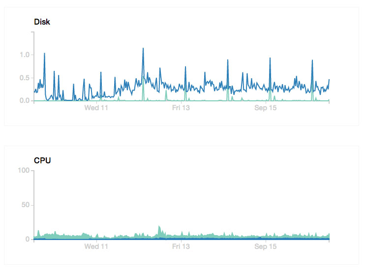

I was recently looking for a decently priced VPS where I could host a couple of small to medium sized websites. I actually signed up for a few random ones that I found on Google and tried them for a few days, but they didn't strike me as working very well. One of them actually crashed after about an hour, and it took about eight hours for support to finally restart it for me.

Eventually I started looking around the internet a bit more, and ran into a relatively new company called [Digital Ocean](https://www.digitalocean.com/?refcode=c62a4d3586fc).

\[caption id="attachment\_11511" align="aligncenter" width="937"\] Digital Ocean VPS\[/caption\]

I realize that not all web companies have nice looking web pages, but whenever I encounter one that does it immediately makes me feel more comfortable about trying it out. One of the claims on the front page really stood out to me: Deploy a SSD Cloud Server in 55 seconds. I had to test it out just to test that claim. Here is my Digital Ocean review of their VPS after using it for about a ten days.

### Signing-up

To get your first Droplet going (Digital Ocean's name for a VPS deployment) you have to enter your billing details as well as hand over your credit card. Digital Ocean actually offers per-hour billing for all their VPS offerings, so the credit card information is taken just to ensure they can bill you at the end of the month.

\[caption id="attachment\_11517" align="aligncenter" width="979"\] Digital Ocean Pricing\[/caption\]

Their introductory Droplet configuration has 512MB of RAM, 1 CPU core, 20 GB on a SSD drive, and includes 1TB of transfer. I think it's a pretty impressive offering, and is more than enough to run a basic web server. As I mostly deal with WordPress websites, I rarely ever hit my disk space limits. But I personally find RAM and the number of cores makes a big difference in the responsiveness of a webserver.

That's why I eventually opted to test out the $20/month plan. While it has more storage space and more bandwidth, I really wanted it for the additional CPU core and RAM, both of which I believe helps with hosting websites.

When you create your Droplet, you have the option to configure a few different aspects of your VPN:

- Your Droplet hostname
- Your Droplet size and configuration
- The region your Droplet will be deployed to. Right now there are two regions in New York City, one in San Francisco and one in Amsterdam.
- The initial operating system and application set to be installed on your Droplet. In terms of operating systems you can choose from Centos, Ubuntu, Debian, Arch Linux, and Fedora.

\[caption id="attachment\_11519" align="aligncenter" width="823"\] Digital Ocean Operating Systems\[/caption\]

As soon as you choose these options, your Droplet will begin being deployed. There is a little progress bar to show you the progress, but it's not amazingly helpful since it seems to jump in stages. But as promised my Droplet was ready to go in less than 60 seconds, and I received an email with my server's IP address and the root password for the system.

I was originally going to install cPanel on the server so I could easily administer some websites for friends and family, but I actually couldn't find a license anywhere on the Internet for less than $15 per month. I don't mind paying $20 per month for a VPS to host a few websites, but tack on another $15 per month (bringing the total to $35 per month) and it's just a bit too much money to spend monthly.

Eventually I decided to install ISP Config 3 which is a free, albeit less refined, alternative for cPanel. It took a bit of getting used to, but it lets you easily manage a web server environment without having to modify configuration files manually all the time.

\[caption id="attachment\_11521" align="aligncenter" width="744"\] Digital Ocean Performance\[/caption\]

\[adblock type="hosting"\]

I've been really happy with the performance so far of my VPS Droplet. While my personal website doesn't generate a huge amount of traffic, it's enough that a typical shared hosting provider tends to not work that great for me. In terms of system load, I'm usually hovering around 0.10 during most times of the day, which is quite low for having two CPU cores available. As you can see in the performance graphs shown above (which you can review for each Droplet you have running), the CPU is pretty stable and definitely has some room to spare.

I was actually interested in downsizing to the $10 per month Droplet to see what kind of difference it makes for hosting my website, but that operating currently isn't supported. However the option most people would probably want to use, increasing the size of their Droplet, is supported and can be performed in about a minute or so.

I think being able to deploy a new Droplet in less than 60 seconds is an amazingly useful feature, as it means developers can easily add resources whenever they need them. Plus the pricing is more enticing that Amazon EC2, and I think it would be fairly trivial to use the Digital Ocean API to create an expandable web or cloud service that could scale as needed, similar to Amazon EC2 and Amazon's Simple Queue Service.

All in all I've been really happy with my new [Digital Ocean VPS](https://www.digitalocean.com/?refcode=c62a4d3586fc). It's currently running this website, as well as my girlfriend's and my dad's. I still have some room to spare, which is great because I like to tinker on various things from time to time.

### June 2014 Update

I'm still on Digital Ocean, and still loving them. A few of my friends have migrated their websites (and their client's websites as well) and they love it.
