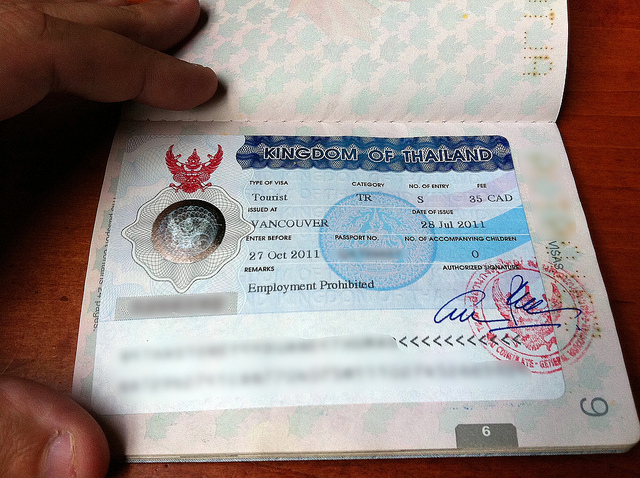

Canadians who just show up in Thailand are usually given a 30 day tourist visa without any hassles, or so I'm told. But given how I'm heading there for two months, I require a visa that is valid for a longer than normal duration.

Generally people in my scenario can simply do a _visa run_, where basically you exit the country and return a short while later. In Buenos Aires most people would simply head over to Uruguay for the day and obtain a new 90 day visa upon return.

But truthfully, I didn't really want to have to worry about that while in Thailand, so I decided to get it all done beforehand. In most major cities visas can be acquired at each country's respective consolate. So I went down to the Thai Consulate in Vancouver the other day and started the process.

To apply for a visa to Thailand, you need the following:

- Two passport sized photos
- Proof of travel to and from Thailand
- A passport that extends at least six months past your departure from Thailand
- Proof that you'll be able to fund yourself while in the country (usually a bank statement showing your name and funds available
- A completed visa application
- The application fee ($35 CAD in my case)

The lady at the counter at the Thai consolate in Vancouver was really nice, and the process was completely painless. I actually didn't print physical proof of funds available, but I had a PDF available on my phone of a recent bank statement and figured I could simply head down to Staples and print it out if in a bind. Thankfully they never asked for it though.

They were unable to process debit or credit cards at the consolate, so make sure you bring cash to pay the application fee. I had to run across the street to a 7-11 to use a bank machine so that I could pay for mine.

They'll do a quick spot check on the information, and then give you a receipt and ask that you come back the next day (or up to three days later I believe). I just got back from the Thai consulate in Vancouver, and am now the proud owner of a Thai visa which I assume is valid for 60 days (which is what was supposed to happen).

\[caption id="attachment\_2080" align="aligncenter" width="640" caption="Thai Visa"\]\[/caption\]

So I should be covered in the event that I spend my entire time in Thailand without leaving the country at any point. I could have also applied for a visa extension while in Thailand, but given how I have a bit of time and live close to the consolate, I just figured it was worth sorting out beforehand.
