The last time I was down in the Caribbean, I took a real shine to eating guacamole. Truthfully, I had always sort of stayed away from it because I thought I wouldn't like the avocados in it. But really good guacamole is addictive, and I was eating it like it was going out of style in the Caribbean. In fact, I was putting it on hamburgers, hot dogs, chips -- you name it.

I've made about ten batches of guacamole in the last year, each time refining it a bit. It's actually getting to be pretty good, as evidenced by the number of people who want me to keep making it. So, I thought I'd do up a little post explaining how to make it.

Here's my guacamole recipe, enjoy!

### Ingredients

Guacamole can be complicated, or it can be simple. I prefer simple.

- 3 ripe avocados - they should be slightly soft when you press on them ($4.00)
- 3 ripe roma tomatoes ($1.50)
- 1 medium - large jalapeno pepper ($0.30)
- 0.5 (half) or a large red onion (must be red) ($0.75)
- 1 bunch of fresh cilantro ($0.50)
- 1.5 tablespoons of coarse sea-salt
- 1 ripe lime (should be all green) ($0.33)
- 1 clove of fresh garlic ($0.05)

Get yourself a large bowl, a fork, a nice sharp knife, a cutting board, and let's get to work!

### Avocados

When you pick the avocados, make sure you get ripe ones. If you press on the sides of the avocado and they don't really give, it's not ripe yet. Likewise, if it feels really mushy inside, it's probably over-ripe, which means it'll have started turning brown. You're going to eventually need to mash what's inside with a fork, so try to gauge in your head how hard it would be to mash. If you think it would be pretty hard to mash it, chances are it's not ripe enough.

The goal is to get all the green stuff in the middle of the avocado into our bowl. The easiest way to do that is to use your knife and slice lengthwise into the avocado. You'll hit the seed, at which point you can simply rotate the knife around the avocado until it's cut in two. The easiest way to get the seed out is to (carefully) whack the knife into it. Once the knife is embedded in the seed, you can simply rotate the knife 90 degrees (which will spin the seed by 90 degrees), and it usually pops out. Be careful removing the seed from the knife at this point.

When you're done, you'll end up with this:

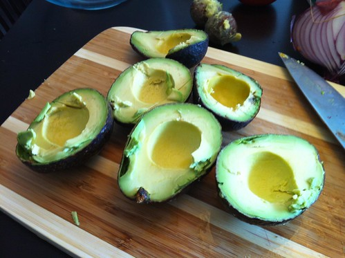

I usually cut the avocados halves in two at this point (widthwise), and then peel off all the skin. When you've done that, toss those tasty treats into your bowl.

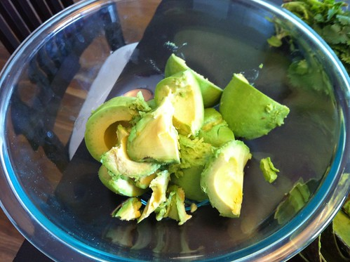

### Red Onion

Red onion has a really unique taste, and it can't easily be replicated by another onion. So don't try and use a sweet onion or anything like that -- it won't turn out. My dad and I actually had to go on a field trip to find a red onion last time I made this, and it was well worth it in the end.

The goal is to dice half of the red onion, and add it to our bowl. Most people actually have a hard time dicing onions, so I thought I'd share my technique here.

When you start with the full onion, cut it in half length wise. The trick to dicing an onion is to leave the side with the root (which usually has a bulb on the end) completely in-tact. When dicing the onion, the root will act like a third hand and help hold everything together.

To dice an onion, you have to cut in all three directions. The first cuts I usually make are (for lack of a better name) the right to left cuts. So, I put my left hand over the bulb side, and slowly make cuts from the right to the left, being careful to not cut through the end with the bulb on it (that needs to hold everything together), and also not to cut my hand.

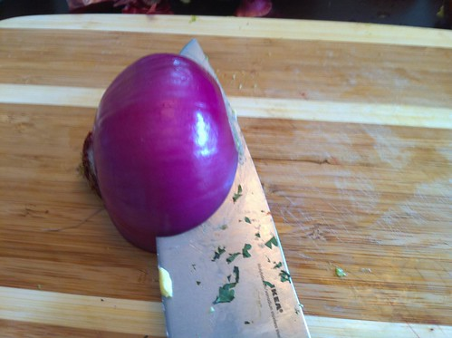

Once that's done, the next cuts I make are the top to bottom cuts as shown in the photo. Once again, make sure you don't cut through the root end -- it's holding the diced slices in place while you do this.

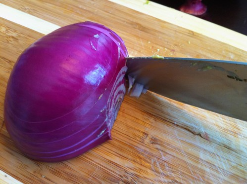

At this point you've cut in two out of the three directions. As soon as you make the final cuts, the onion will be diced. So simply dice in the forward to back direction, and tada, you'll have a diced onion in only about 15 seconds.

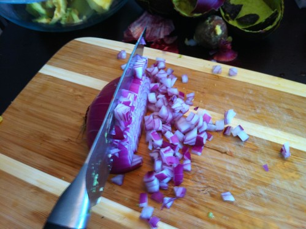

Simply toss what's left of the root end away when you're done, and put the diced onion into your bowl along with the avocado.

### Roma Tomatoes

I prefer roma tomatoes in my guacamole, but conceivably you could probably use any type.

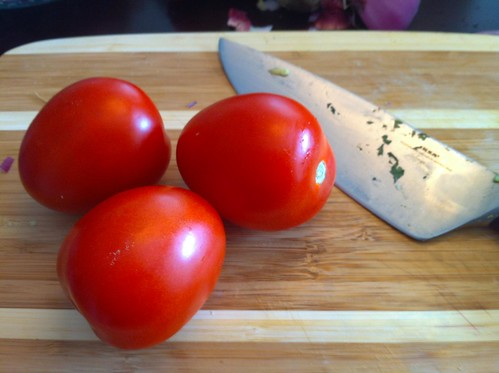

The goal is to dice all three of these tomatoes. I usually cut them in half lengthwise, remove the middle section, and then scoop out all the seeds with the knife or a spoon. That'll leave you with the skin and all the meat of the tomato. Cutting through tomato skin requires a sharp knife, so make sure yours is up to the task.

Once diced, it'll look like a sharper version of this:

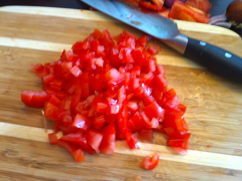

Add it to the bowl, and then grab the jalapeno.

### Jalapeno

The jalapeno adds a bit of heat to the guacamole that a lot of people like. I could probably stand having 1.5 jalapenos in mine, but I think one jalapeno is probably good for most people.

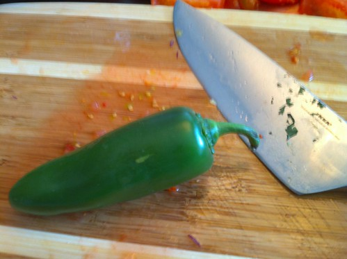

Most of what makes jalapenos hot is actually contained in the seeds. So when you dice up the jalapeno, you can leave a few more seeds in for some added heat, or remove them all if you don't like much heat. If you cut up a jalapeno and then rub your eye with your hand, chances are it's going to hurt. So be careful what you touch after cutting one of these up.

I usually cut them open lengthwise, and then cut out some of the seeds inside. I usually leave a few in there for some added heat, similar to this:

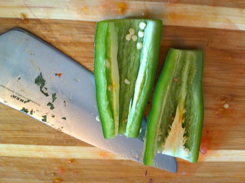

At this point, simply mince up the jalapeno and add it to the bowl. I try to get my jalapeno pretty small such that there are no huge obvious pieces in your mouth when you're eating it, and also so there's a bit of jalapeno in every bite.

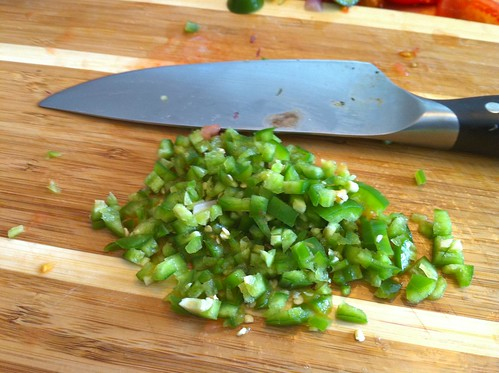

### Cilantro

While you can use dried cilantro just fine, I highly recommend buying a bunch of fresh cilantro and using it. Ultimately we're trying to obtain about 3 tablespoons of cilantro, so pick off enough leaves onto your cutting board to roughly give you that amount.

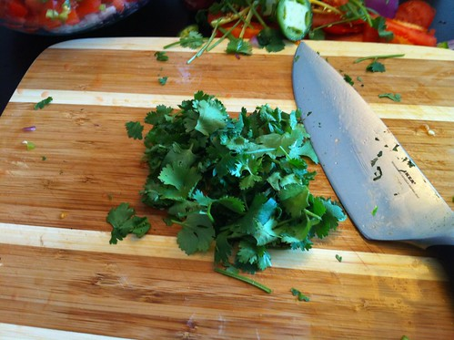

Now minced the cilantro with your knife, and then add it to the bowl.

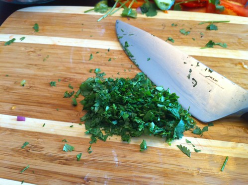

### The Mash

At this point, you'll have a bowl full of avocados, cilantro, tomato, red onion and jalapenos. Grab yourself a sturdy fork, and start mashing it all together. The goal isn't to produce a silky smooth guacamole, but to product a consistent mash that still has a bit of chunky avocado here and there.

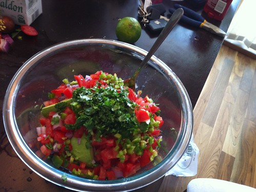

Whatever you do, don't put this in a food processor at this point. Yes, it'll blend everything together, but you'll end up with the Mexican equivalent of baby food, and it'll lose all the nice textures that come out when you eat it. Save that $200 appliance for another day.

When it's all mashed up, it'll look something like this.

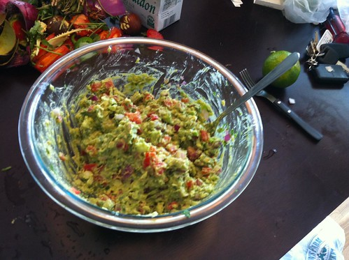

### Lime

Strangely enough, a lot of recipes call for lemon for guacamole, which I find fairly odd. Whenever I've see traditional guacamole made, it's always been with limes. You wouldn't put a lemon in your Corona (at least, not at my place), so I wouldn't recommend putting a lemon in your guacamole.

Make sure you have a lime that's nice and ripe. If it's not ripe, it'll be sour, and your guacamole will taste pretty gross. A ripe lime is usually a nice dark green on the outside, without any spots of yellow.

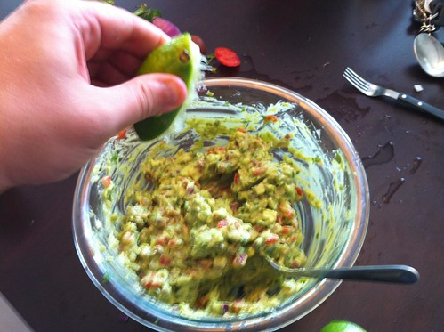

Cut the lime in half, and squeeze all the juice from both halves into your guacamole. Grab your knife and stir it all up. The lime not only adds a nice flavour, but it also makes the final guacamole have a nice smooth texture.

### Sea Salt

I actually think salt is the most important ingredient for a good guacamole. If you use too little, the guacamole tastes kind of bland. If you use table salt, you don't get that nice salt texture which adds to the deliciousness of the guacamole. So only use a coarse sea salt in guacamole.

The salt I used for this batch was Maldon Sea Salt from France. It's more of a finishing salt, but it still works quite well. Pretty much every supermarket I've ever been to has some form of sea salt, so just grab whatever they have.

I'd recommend starting at one tablespoon of salt, and then going from there. Simply add it to the bowl, give it a few stirs, and have a taste. If it's not to your liking, add a bit more.

### All Done

If you've done everything properly, you'll have a nice batch of guacamole to eat. Some people also put a bit of cumin in at this point, but I don't really like the taste or the concept (since it makes it taste more like taco seasoning). As Dave suggested below in the comments, a clove of fresh garlic is a nice addition as well, so feel free to add one of those as well.

Enjoy the simpleness of what you've made, especially since you know all the ingredients that went into it. I find it's great on hamburgers, tacos, fajitas, and of course, to dip tortillas into.

Enjoy!

Makes about 5 servings.

Nutritional Info per serving: 191 Calories, 15.4 g of fat (85% good fats), 14.3 g of carbs (8.4 g of fibre, 5.9 g net carbs), 3.1 g of protein
