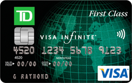
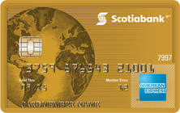
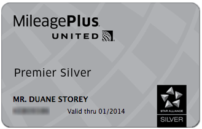

I started my long-term travel adventures in January of 2011, almost 2.5 years ago. Looking back, I really had no idea how the airline systems worked: I wasn't really collecting any sort of air-miles, didn't know how to fly for free, nor was I trying to get to any type of elite status (I didn't even really know how to be honest).

\[caption id="attachment\_10301" align="aligncenter" width="800"\] Iguazu Falls, on my first trip to Argentina in 2011\[/caption\]

After 2.5 years though, I've finally hit my travel groove. So lately I've been dedicating efforts towards taking advantage of some of the cracks in the system to make the most of my travel adventures and to fly for free around the world as much as I can going forward. Here are some of the tricks I'm using.

### Using Rewards Cards To Earn Free Flights Or Vacations

Everyone who travels often should also have at least one travel rewards card - not only do these also let you accumulate additional mileage to obtain free flights and hotel rooms, but they also come with a lot of great insurance products such as travel health insurance, flight cancellation insurance, and car rental insurance. The fastest and most simple way to earn a free flight or vacation is to simply charge most of your day to day purchases to a rewards cards. If you are going to spend money anyways, you might as well earn something free in the process.

If you're in the United States, the best travel reward card that every traveller should have is the [Barclaycard Arrival World Elite MasterCard®](http://track.linkoffers.net/a.aspx?foid=22907635&fot=9999&foc=2&foc2=587057). It gives you 20,000 miles upon signing up (after spending $1,000 in 3 months), which is the equivalent of around $200 of free travel. You also get 2x the points of other cards, which means for every dollar you spend you typically get 2 points to use for travel. And while some travel cards make you use their own crappy websites to book award flights, with the Barclaycard Arrival World Elite MasterCard® you can simply call them and apply your points to any flight you purchase on your own. In addition, there are no foreign exchange fees with this credit card, meaning that if you use it in other countries you won't have any extra fees (that many credit cards silently add on) waiting for you. It also comes with $200,000 of travel accident insurance, and a free membership to TripIt Pro ($49 value) which I use to plan my trips.

This is without a doubt the best travel card on the market now, so go grab the [for free.

If you're looking to get more points on sign-up, check out the version of the Barclaycard Arrival Plus™ World Elite MasterCard® with the annual fee (that is waived in the first year, so it's free for a year) - that amounts to $400 worth of free travel just for signing up and spending $3,000 in the first 90 days. You can find more info about the fee-based](http://track.linkoffers.net/a.aspx?foid=22907635&fot=9999&foc=2&foc2=587057) [Barclaycard Arrival Plus™ World Elite MasterCard®](http://track.linkoffers.net/a.aspx?foid=22907634&fot=9999&foc=2&foc2=586983).

Most of these travel credit cards give you a sign-up bonus that you can use for free travel. For example last year I signed up for TD's First Class Infinite Visa which gives 20,000 miles upon signing up, and recently I signed up for [Capital One's Aspire credit card](/tips/tips-for-traveling-for-a-year-or-longer/) which gives you 35,000 miles for signing up. That's 55,000 miles, or roughly $550 worth of free travel, just for signing-up and making your first purchase. Both cards also let you accumulate additional mileage whenever charge items to your credit card, so if you use a credit card often and pay it off on time each month, it's another great way to accumulate mileage for free travel.

Last year I cashed in my mileage for the TD card and booked a free return trip from Vancouver, Canada to Cusco, Peru for a visit to Machu Picchu. Because that TD card is free for premiere TD members, that trip to Peru didn't really cost me anything. The Capital One Aspire card on the other hand has a fee of $120/year, but in only three months I've already accumulated 65,101 miles, enough for $651 worth of free travel - if you subtract the $120 I paid, I've basically earned $531 worth of free travel this year, and the year is still far from over.

I recently wrote a post on the two [best travel reward cards](/tips/travel/best-travel-reward-card-2014/) for 2014. I have the Capital One aspire card I talked about, and also the TD First Class Travel Visa Infinite Card. A few days ago I also decided a few days ago to sign-up for Scotiabank Gold American Express Card, which is also highly rated. As soon as I receive that card, I'll have another 20,000 miles to use for free travel, simply for signing up for the card and using it for a few purchases.

I've earned roughly 160,000 miles on my TD credit card, 65,000 miles on my Capital One credit card, and will soon receive 20,000 miles on my new American Express Gold card - taken together that's probably around $2,000 worth of travel, simply for signing up and using these card for most of my day to day expenses.

It's obviously to your advantage to adjust your life to charge as much as you can onto your credit card as possible if the goal is to travel for free. Every month I check my bank account for anything recurring that I can put on my card in the future. I recently set up automatic credit card payments for my Canadian health insurance, as well as my cell phone, hydro (power), cable internet, and all my food expenses. In general I spend about $2,000 a month on my credit card, which is almost 50,000 mileage points a year on my Capital One card, equivalent to $500 worth of travel (in addition to my sign-up bonuses).

While most people who use this strategy for accumulating miles end up with more than one credit card, I think it's advantageous to favour the credit card that gives the most points per transaction, or one that doesn't charge any foreign exchange fees. Which card is 'best' for each person will vary, but for the most part I think with some simple napkin scribbling each person can determine the one that will result in the most benefit for the bulk of the day to day spending.

Since most of these credit cards only give the sign-up mileage bonus at the start of the first year, many people recommend cancelling these cards after the first year and starting over with a new card that has a bonus. That's definitely a good strategy if you can find cards that you are eligible for each year. Otherwise stick with at least one card that gives you a recurring annual bonus, such as the Capital One aspire card - it gives each holder a 10,000 mile anniversary bonus each year, which almost pays for the annual fee associated with it and still lets the holder accumulate mileage while spending.

### Elite Status

A few of my business friends used to have elite status on airlines due to all the business travel they used to do. I thought it was cool, but never thought in a million years I would ever have any type of status. I came really close last year - I missed Star Alliance Silver by a few thousand points. When January of 2013 rolled around though, I made it one of this year's goals to finally have status on an airline.

\[caption id="attachment\_10275" align="alignleft" width="329"\] Silver Mileage Plus\[/caption\]

About 24 hours after my plane landed in Sao Paulo, Brazil, a few weeks ago, I logged into my United Mileage Plus account and was happy to see I finally had silver status on the Star Alliance network.

Silver on Star Alliance in itself isn't all that exciting - I'll get priority boarding on all Star Alliance airlines, and the ability to check another bag for free on many of them as well. But the real advantage of Silver is that it's one stepping stone closer to Gold, which is where the cool stuff (such as complimentary upgrades to business class occur). In addition Silver also gives you the ability to accumulate mileage faster, which can lead to more free travel in the future.

\[caption id="attachment\_10282" align="alignright" width="364"\] Miles on United Mileage Plus\[/caption\]

Even if being an elite member doesn't really appeal to you, being a mileage program member allows you to accumulate airline mileage to exchange for flights and hotels on almost every flight you'll likely take. In this case the airlines are basically giving you something for free, so there's no reason not to take advantage of it. All you need is to give your mileage program number to the airlines when you reserve or check-in and you'll start accumulating mileage.

I didn't realize you could accumulate mileage on most flights when I first started traveling, so I left a lot of free miles on the table during my first year of travel. But now I try my best to always fly on airlines that are part of the Star Alliance or One World networks so I can accumulate mileage and trade them for some free flights. I currently have roughly 60,000 miles that I've accumulated on my United Mileage Plus account - that's nearly enough for a free round-trip flight from Vancouver to Tokyo.

There are three main global airline networks in the world - [Star Alliance](http://www.staralliance.com/en/), [SkyTeam, and](http://www.skyteam.com/) [One World](http://www.oneworld.com/). You can accumulate mileage on any airline within either of those alliances. It's to your advantage to use \*only one\* airline in each network though since that maximizes your chances to get elite status. I personally recommend using [United Mileage Plus](https://www.united.com/web/en-us/apps/account/enroll.aspx) for Star Alliance and [British Airways Executive Club](http://www.britishairways.com/travel/execcr/public/en_gb) for One World, since both of those airlines fly to many destinations which will help when you actually redeem your mileage later on.

You can use your United Mileage Plus program number on \*any\* Star Alliance member's airline to accumulate miles, not just on United. This is something most people don't realize I think. That means when I fly Air Canada (which is part of Star Alliance), I can give them my United Mileage Plus number and still accumulate mileage towards my elite status and also for future free flights. Also if you achieve elite status on any airline, you essentially have elite status on any airline within that network - since I have Premier Silver on United now, I effectively have Silver status on all Star Alliance member airlines.

One piece of advice for everyone who is trying to get elite status: keep all your boarding passes until you are sure you have been credited with the mileage for that flight. I've had a few cases of my mileage now being properly accounted for, and in almost all cases the person trying to sort it out will want to see a copy of your boarding pass before they credit you the miles. I think it's redundant and that they don't really need it, but it seems to be an easy way for them to deny you the mileage. So hold onto them for at least a few weeks until you see the mileage show up on your account.

In the last two years I've accumulated roughly 60,000 miles on my United Mileage Plus account and about 22,000 miles on my British Airways Executive Club account - between the two of them that's enough for one free flight within Europe and one round-trip international flight from the US or Canada to Europe or Asia. That's not bad for simply spending roughly 10 minutes signing up for both programs and using my numbers whenever I fly Star Alliance or One World.

### In Summary

As you can see, it doesn't take much effort to earn a lot of free miles that you can use for free travel. Other than changing my spending habits slightly, most of this free mileage was accomplished with about 15 minutes of effort over the last two years. That effort directly led to a free round-trip flight from Canada to Peru, and I have about $2,000 worth of free rewards waiting for whenever I want to use them.

Here is what I recommended that everyone do to make the most of the flights they take and to ensure they don't lose any mileage.

1. The two major airline networks in the world are [Star Alliance](http://www.staralliance.com/en/) and [One World](http://www.oneworld.com/). I recommend everyone sign-up for a mileage account on one airline (and only one) in each of these networks. I personally recommend using [United Mileage Plus](https://www.united.com/web/en-us/apps/account/enroll.aspx) for Star Alliance and [British Airways Executive Club](http://www.britishairways.com/travel/execcr/public/en_gb) for One World. One reason I like United is that they fly internationally and they often upgrade their Silver members to business class, even though that's not a requirement for Star Alliance Silver.
2. Sign up for one or two travel rewards cards - the premium versions if you have good credit and satisfy the yearly income requirements, otherwise the free versions (which aren't as good, but still usually offer free sign-up bonuses).
3. Analyze your spending habits and adjust your lifestyle so that the majority of your expenses are paid using your credit card. In the words of George Clooney from 'Up In The Air' - I don't do anything that doesn't directly benefit my mileage account. Learn to start thinking like that with regards to your travel miles, and you'll be surprised how fast the mileage will accumulate.

Also, if you're heading out on a trip, it's always a good idea to [buy travel insurance](/tips/travel/buy-travel-health-insurance/ "Buy Travel Health Insurance") in case you get into an accident or get sick while abroad.

### Learn How To Fly For Free

I just finished my new e-Book, _The Beginner's Guide to Long-Term Travel and Lifestyle Design_, and it's available NOW for FREE. It is filled with 47 pages of tips similar to these. Grab your copy of [The Beginner's Guide to Long-Term Travel and Lifestyle Design](http://mignerd.com/book/) today and learn great tips and tricks for how to travel for free and take advantage of the travel system.
