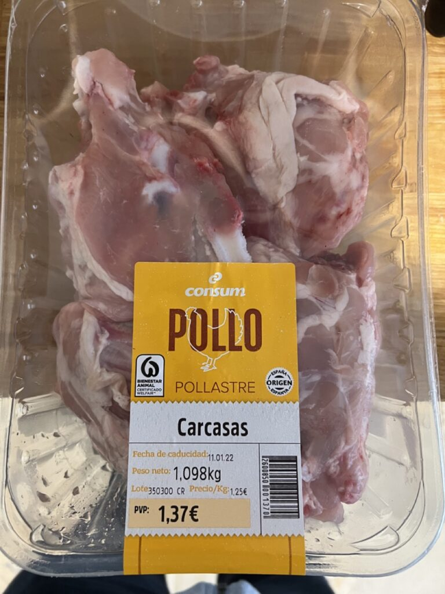
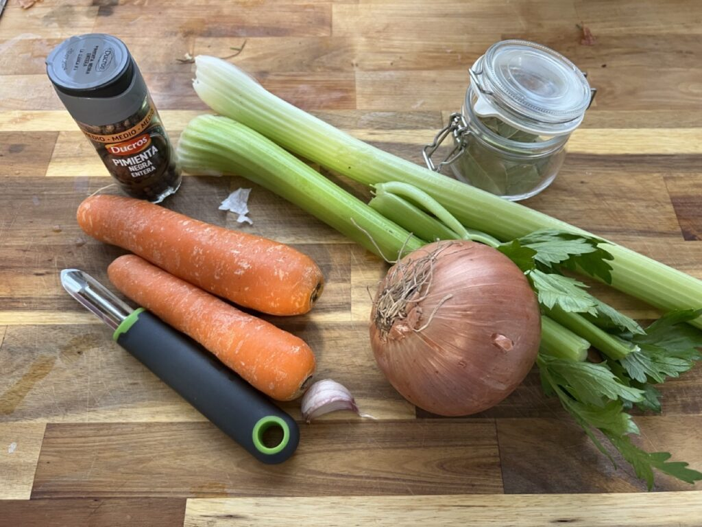
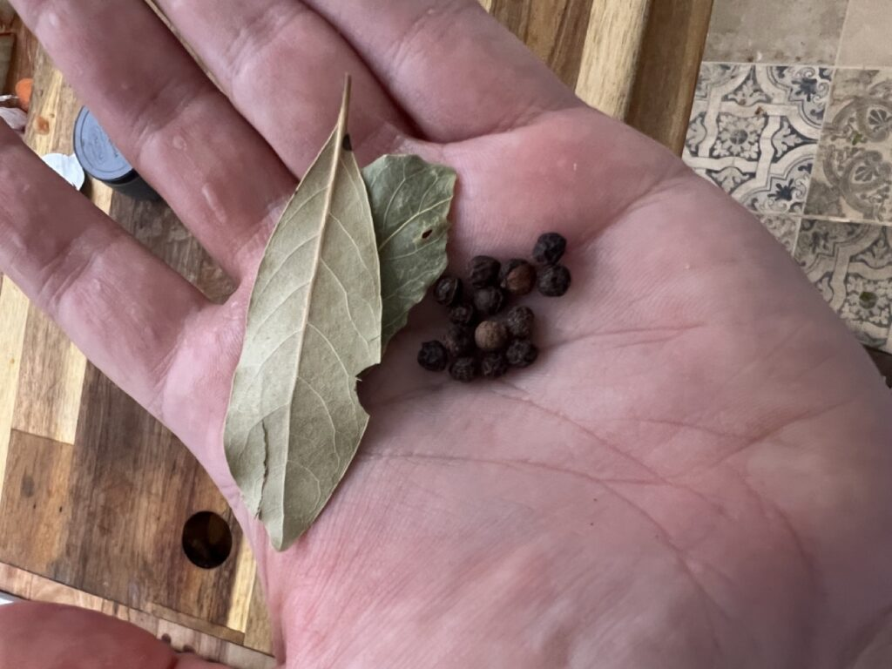
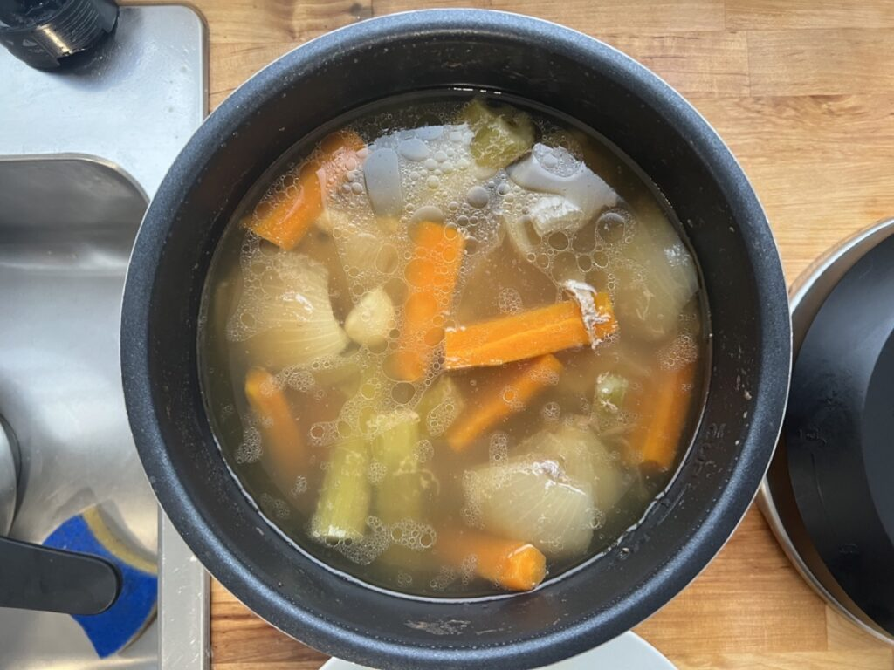
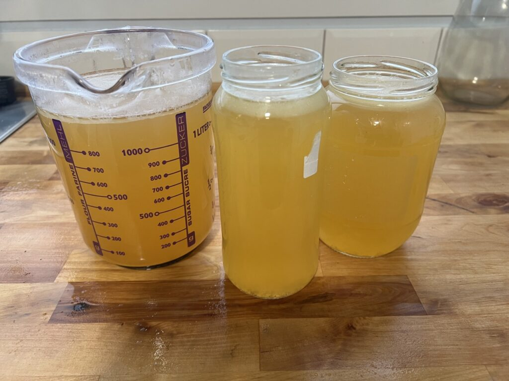

Stock is one of those things that seemed magical before I made it. I had purchased a few cooking books, and many recipes said to use 'vegetable stock', 'chicken stock', 'beef stock', or 'fish stock'. At that time I was used to buying bouillon cubes to take the place of stock, but decided at some point to try making a homemade stock.

Not only is making stock at home easy, but it's a simple way to use up leftover pieces of vegetables and bones. I've grown accustomed now to making a chicken dinner on the weekend, and immediately afterwards putting the left over pieces into the pressure cooker to make a nice tasty stock for a week's worth of soups and dishes.

### Ingredients

- Chicken carcasses, or left over bones from a chicken meal
- One yellow onion
- Several stalks of celery
- Several carrots
- Whole peppercorns
- Several bay leaves
- One or two cloves of garlic
- Optional: parsley, thyme, rosemary

If you make a chicken dinner at home, simply take all the left over bits and set them aside for later. While it's nice to have a bit of meat left on the bones, most of the flavour comes from the bones and cartilage, so those are the important bits. I often toss in bones with meat on them, and even some left over bits of cooked skin - these will add flavour to the stock, and the fat contribution to the liquid can simply be skimmed off later.

Often your local butcher or grocery store will have chicken carcasses for sale, so you often don't even have to start with a cooked chicken - here in Spain I picked up a package of four chicken carcasses for €1.37.

You're going to need a big pot, at least 4 litres. You generally want the water level to come above all the ingredients, but only just slightly. So a good way to choose your pot is to adjust the size of it based on the ingredients. But with what I have listed here, a 4 litre pot will likely work fine.

Next step is to prepare all the vegetables.

For the onion, simply cut the ends off, remove the outer skin, and cut it into roughly four equal pieces (i.e. quarter it).

For the celery, cut the top and the bottom off (and these are often bitter), and chop up each stalk into 3-4 roughly equal pieces.

For the garlic, cut the ends off each clove and remove the outer skin.

I like to add a few bay leaves (laurel) to the pot, as well as some whole peppercorns. Some people like to add thyme, parsley, or rosemary to the stock. There's nothing wrong with that, but I prefer to add those herbs when I use the stock in another dish, so I tend to leave them out of my stock.

Next step is just to toss it all into the pot, stand back, and admire your work.

Add enough water so that the water level is above all the chicken pieces and vegetables. If you are using a pressure cooker, make sure that the water is below the indicated "max" level on the pot if it's written.

You may be tempted at this point to add salt to the pot, but you really shouldn't. Once you have your stock you can literally use it in practically anything (soups, stir fries, ramen, gravies), and you won't know how it should be seasoned until you make that particular dish. It's best to look at the stock you are making as simply a base that you can build upon, depending on the dish you end up making. If you add salt to it now, you may find that when you add the stock to a dish that already has seasoning later that the end result is simply too salty.

### Cooking The Stock

If you are cooking the stock on the stove, you'll need to turn the heat on and simmer it for roughly four to six hours. Check on it every 30-60 minutes and continue adding cold water to the pot so that all the ingredients are below the water. You'll get a layer of proteins on the surface while cooking that will resemble a transparent skin - feel free to skim these off as you go as it will make a clearer stock, but you don't have to if you don't want.

I tend to use a pressure cooker for my stock as it takes a fraction of the time, and seems to extract more flavour and gelatin from the bones. You can either use a stove-top pressure cooker, or an electric one like the InstantPot. In both cases you will need to cook the stock for roughly 60 minutes, and then let it cool naturally until it's safe to open.

\[caption id="attachment\_14390" align="aligncenter" width="1024"\] Cooked Stock\[/caption\]

When it's done, you'll want to collect all the liquid while discarding all the vegetables and carcasses. You can do this with a large pot or bowl, and some type of mesh or colander.

\[caption id="attachment\_14391" align="aligncenter" width="1024"\] Preparing to Strain The Stock\[/caption\]

When it done, let it cool slightly on the counter, and then transfer the liquid into some fridge-safe containers to cool it further. As it cools in the fridge, the gelatin that was extracted from the bones will make the liquid become slightly solid - a proper stock tends to wiggle like jam or jello when shaken in the fridge after it is cool. If there was fat in the stock (i.e. from chicken skin or bones), it'll often solidify on the surface of the stock as a white layer, and can be safely scraped away and discarded.

\[caption id="attachment\_14389" align="aligncenter" width="1024"\] Completed Stock\[/caption\]

If you're looking to make a vegetable stock, you can simply omit the chicken carcasses and add double or triple the amount of vegetables. As the stock cooks, it'll extract all the flavour from the contents and make an extremely tasty liquid base for a variety of dishes.

### Variations

If you want to make a more flavourful stock, you can oven-roast the chicken carcasses and vegetables first. As the vegetables and carcasses caramelize, the flavour will be enhanced. Just make sure nothing burns, otherwise it'll make the stock bitter.
