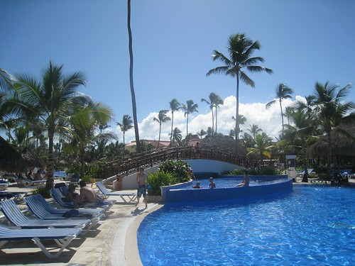

What else can you say, really? It's quite gorgeous here. Strangely enough, I'm sort of adverse to massive amounts of heat, but for some reason the temperature here seems about perfect. Sure, it gets a bit hot during the day, but nothing a few beers and a dip in the pool can't fix. And in the evenings the temperature drops enough to toss on a pair of jeans and chill in the lobby bar for a few hours.

I've been going easy on the alcohol since I arrived, partially because I haven't been feeling 100%, and partially because I'm not 22 any more. But today was a fairly fun, alcohol involved day, mostly played out by the pool and the ocean. I'm a fairly nice shade of lobster red now, which is fine by me. I still have another 10 or 11 days here (who's counting, really?), so I imagine I'll be fairly Cuban looking before I return home.

The beach here is this amazing white sand, and now I understand just what the appeal of Punta Cana is. Despite our problems with the wireless here (which seem trivial now, but will be a massive pain in the ass next week when Dale and I are trying to get a bit of work done), I'd easily come back here again. The people are super friendly, the beaches are super awesome, and the beer is super cold.

We're heading out for Mexican food tonight, and then another night in the lobby casually sipping on a few drinks amongst friends, so that should be fun. I've been trying to get up early and hit the gym at 8am, which worked well today and will hopefully continue to work well. With any luck I'll be able to continue on with that routine when I return back home to rain-ville and float my Ark back to Chilliwack.
