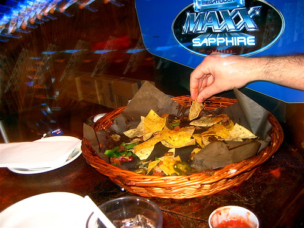

For those people that know me, I'm pretty serious about nachos. I'm the only person I know with a complete lack of a sweet tooth. Chocolate, pies, cakes, candy, gummy bears, sugar -- you could starve me for a week and put that stuff in front of me and I wouldn't crave it at all. But put a plate of gooey, cheesy nachos in front of me and that's a different story.

I've slowly honed my nacho-making ability over the years to the point where I'm pretty much a nacho snob now. When I was down in Portland I went out of my way to find some nachos, only to be served a batch where the cheese was microwaved. Horrible.

In fact, I'm always amazed when a pub or a restaurant fucks up nachos. I mean, how hard is it to put cheese on some tortilla chips and make it taste good? The number one problem is cheese that hasn't been completely melted. Number two problem is soggy nachos, usually because or some beef or tomatoes that have leaked all over everything. If you can not screw those two points up, usually they are not bad.

I remember one time I ordered nachos in Ottawa, only to be served a batch of nachos with potato all over them. When I asked the waitress why there was potato on the nachos, she replied that the beef came from the beef stew, so sometimes potato and carrots made it onto the nachos as well. Like WTF?

Anyways, October 21st is officially [The International Day Of The Nacho](http://en.wikipedia.org/wiki/Nachos), which means everyone who reads this needs to have nachos on that day. If you do, make sure you [send me a photo](/contact) and I'll post it after the fact. Undoubtedly I'll be making the world's best batch of nachos in the comfort of my own home that night.

So put it in your calendar, and enjoy all the sweet love that nachos can give you.
