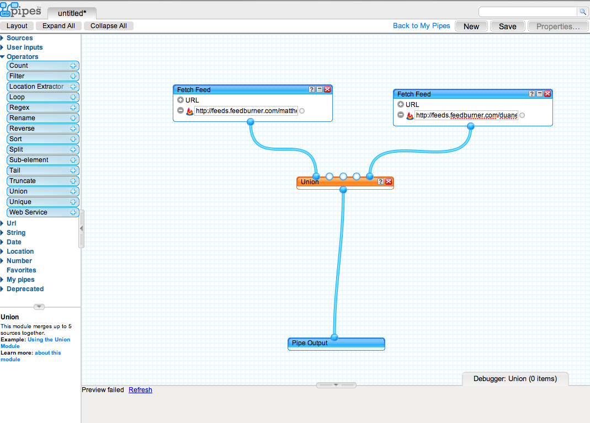

So tonight I was trying to figure out just how in the world I was going to go about merging multiple RSS feeds together. The end result I was trying to achieve was so my RSS feed on this site would actually have my entries from duanestorey.com as well as those from matthewgood.org. I sort of assumed that feedburner would do that for me, but it turns out you can't combine your own RSS feeds using it.

The solution? [Yahoo Pipes](http://pipes.yahoo.com). I had never heard of it, but after doing a quick search, I learned it's the tool to use. And man oh man, is it cool.

You can pick and choose different source elements, filters, operators and outputs, and make your own custom output, RSS or otherwise. Took me about 2 minutes to figure out how to merge two streams (using the Union Operator), and then output a sorted list (using the Sort Element by publication date). And Tada -- I know have a combined RSS feed on this site.

Which unfortunately means all you guys should re-subscribe to it. If I would have been smart, I would have put the link on here and done the redirection myself, but my current RSS feed pointer is directly at feedburner, so all you guys have to update manually to the new one.

The address is [here if you want](http://feeds.feedburner.com/duanestorey), or up above on the friendly RSS icon.

\*\* Update - Boris showed me the folly of my ways. I've changed my feedburner link, so everyone should still be good to go. So don't change anything over.
