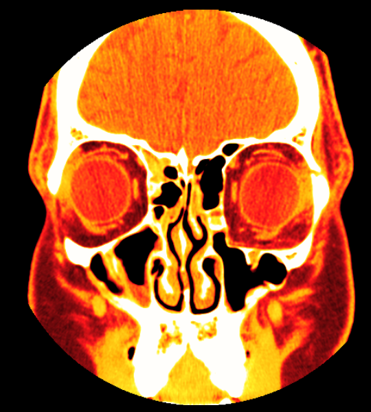
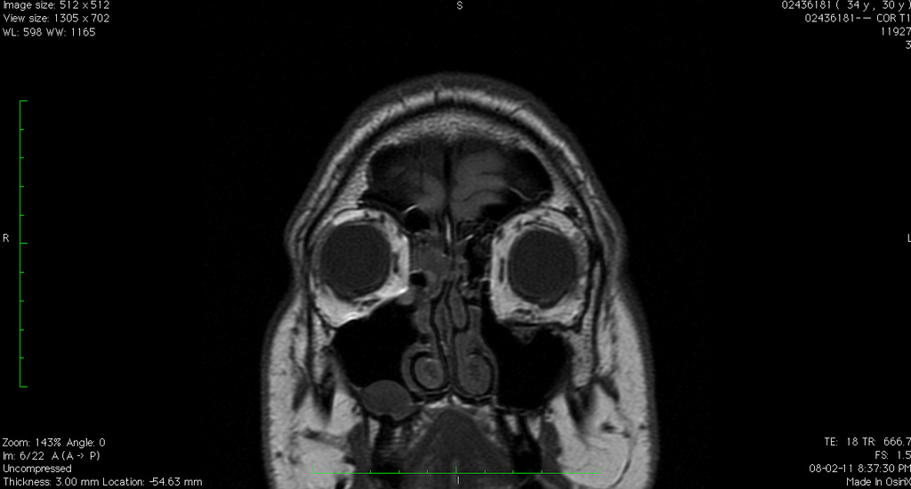
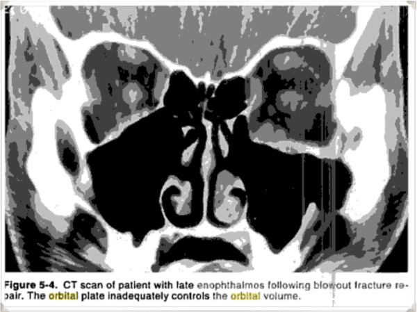

As many people know, I suffered a few facial fractures back in 2006. The primary result of that incident was to put my cheekbone slightly out of alignment, as well as the complete destruction of the bone under my left eye (other than maybe a 1mm ledge on one side, there's literally nothing there any more).

I had one surgery back in 2006 to put my eye back in the right place. It improved things slightly, but still left me with a droopy eye and some residual double vision. About six months later the surgeon did a CT scan, which ultimately looked like this:

The surgeon concluded at the time that the reason my eye was still droopy was because the orbital shape on the left side (which appears on the right in the CT image above) didn't match the shape on the left. Effectively that leads to an increase in volume inside the eye socket which causes the eye to sink further in. Technically these effects goes by the names enophthalmos (sinking backwards into the eye socket) and hypoglobus (sinking downwards towards the sinus).

It was decided at the time that a second surgery would be performed, and the orbital implant would be raised upwards and then fixated (using a few screws) into the orbital rim. This would effectively anchor the implant in the right position, theoretically restoring the proper volume of my eye.

Unfortunately due to a last minute scheduling conflict, the surgeon who was originally going to operate on me couldn't perform the surgery at the scheduled time. Instead another surgeon filled in and proceeded to attempt to correct the problem. After the surgery it was explained to me that the original implant was removed, and two new ones were inserted that were slightly thicker and ultimately more resistant to sagging or bending. I was also told that no fixation was used, and instead the implants were placed on what was left of my bony ledges (which is normally how it's done, but I have a fairly large fracture).

Things were great after the surgery for a week or two, but once the swelling went away my eye slowly started sagging again. I set up another meeting with the surgeon, and after waiting months, we eventually met up.

At this point the surgeon wasn't really concerned about the cosmetic outcome even though I still was. Rather the focus shifted from the look of my eye to the function of my eye (since I still had double vision when I looked up). As a result, the surgeon ordered an MRI to see if there was any damage to my eye muscles that may be causing issues for me.

When I met with him to go over the results, I caught a brief look at my MRI on the screen. At least to me it looked extremely similar to the end result of the first surgery, which wasn't all that successful. The surgeon looked at my MRI and my eye, and then basically said he didn't think he could improve upon the cosmetic or the functional outcome.

At that point in time I asked for a second opinion, and was referred to an eye specialist in Vancouver. A few weeks prior to that meeting I called down to his office and asked the receptionist to ensure that my CT and MRI imagery would be there for my meeting, and I was assured it would be. So you can imagine my surprise that day when the first thing the specialist asked me was whether or not I brought any of my imagery in on CD so he could look at it.

Since the office didn't have it ready and I didn't bring it, the only document that was used during the meeting was the final report from the second surgeon, who concluded that it wasn't possible to improve upon the situation. So instead of a second opinion, I really felt like I just got my first opinion reiterated to me - I was told that the final result was basically "decent, but not great", and that I should go home and try to get used to it.

And that's basically what I have been doing for the last four years, getting used to it.

But the truth is I have never really been satisfied with that final opinion, primarily because it seemed to me to simply be a rehashing of the first opinion. Having seen my MRI over the shoulder of the surgeon, it looked to me like there was still quite a lot of room for improvement. So when I got back from New Zealand, I decided after being upset about this for four years I was going to make another effort at getting an opinion and possibly trying to improve the outcome.

The first order of business for me was obtaining that final MRI on CD so I could take a close look at it. So a few weeks ago I went down to Vancouver General Hospital, paid $60, and left with my data on CD. I fired up the viewer on my laptop, and got the first real glimpse (other than an over-the-shoulder glance) of what my eye looks like on the inside. And here it is:

What should be obvious to most people, as it was obvious to me, is that the shape of my left eye isn't really much better than how it was after my first surgery. This is what I thought I saw over the shoulder of the second surgeon, and ultimately confirmed a few weeks ago when I picked up the CD from VGH.

I've read a lot of material over the years regarding my injury, and even the relevant sections of a few textbooks. In particular is this passage which I wrote down recently from a book called "Orbital Surgery: a conceptual approach". I've emphasized the relevant sections in my case.

> Surgery **must restore the orbital volume** and requires careful isolation of stable bone on all sides of the fracture and adequate fixation of appropriately sized alloplastic or autogenous implants. **If inadequate stable bone is identified, the use of rigid fixation systems can provide the necessary stabilization to control the position of the implants**. **A common mistake** is to fail to realize that the normal inferomedial orbit, rather than being concave away from the orbit is actually convex towards the orbit; **this postequatorial convexity must be re-created to avoid expansion of the orbital volume**. This problem is demonstrated by the CT scan and clinical outcome in a 21-year old patient referred with persistent enophthalmos following a blowout repair. \[...\] The CT scan demonstrated that the orbital plate rested on the floor **but failed to recreate the postequatorial convexity, so that the orbit had the shape of a box instead of a triangle. The orbit was expanded, resulting in postoperative enophthalmos**.

And the relevant image that the textbook refers to:

That passage says the following basically with regards to my own situation:

- I'm missing stable bone to place the implant on. That's most likely why it refuses to sit in the proper position. As the textbook indicates, rigid fixation (screws) should be used in that case to prevent any movement of the implant.
- If the orbital volume isn't properly restored (by making sure the new geometry matches the old, uninjured geometry, it's likely that enophthalmos (sinking of the eye) will result, which is what has happened to me
- A common mistake is to fail to recreate the proper contour of the orbital floor. If it looks like a box instead of a triangle, it's not right. And that's what both my CT and MRI show from both surgeries.

Since I was now armed with some real strong data regarding my case, I decided to contact several doctors in the United States and ask for an opinion. In the process, several of them asked me if I had contacted a certain expert in the field that lives in Vancouver, and I said that I had not. In truth, it turns out that I tried to contact this individual in 2008, but never received any response. The passage I quoted above is actually from a textbook written by this expert in Vancouver.

I contacted that person about two weeks ago, and thankfully received a response this time. The doctor suggested I send him all the relevant information, along with the scans from both CTs and my MRI, and he would take a look for me. So I packed everything up about two weeks ago and mailed it off, and for the next 14 days basically waited for a response.

The response came yesterday.

In short, the doctor agreed with my assessment. Not only that, but he also pointed out that my scans show that one of my muscles appears to be displaced at the back of my eye socket, which may be contributing to some of my ongoing problems. The next step is to meet up and discuss options, of which thankfully there finally appear to be some.

As of right now, that's all I have. Originally the doctor was going to refer me to another person in Vancouver if the scans warranted, but instead he has asked to see me himself (which is great, because he's very knowledgable in this field and has written several textbooks and many papers regarding these types of injuries). I probably won't be able to see him until April or May, but I'm happy there is once again some forward momentum.

A few people have sort of questioned my desire to have this fixed over the years, since the current result isn't "that bad" as a few people have pointed out, and it "could be worse". The truth is though, it's simply not that good, especially since I had spent 29 years getting used to how I used to look. Had I ever looked at my CT or MRI scan and saw things that looked pretty much the same, I imagine I would have resolved myself to just accept it. But when I first looked at my CT, and recently at my MRI, it seems pretty obvious to me that there is still room for improvement.

I have a long way to go before I have another surgery, and that may not even be an option once things are discussed in detail. But it may be an option, and if it is an option and the likelihood of an improvement is pretty high, I will probably take it.

But until then, I just have to wait. And after almost six years, I'm pretty good at waiting.
