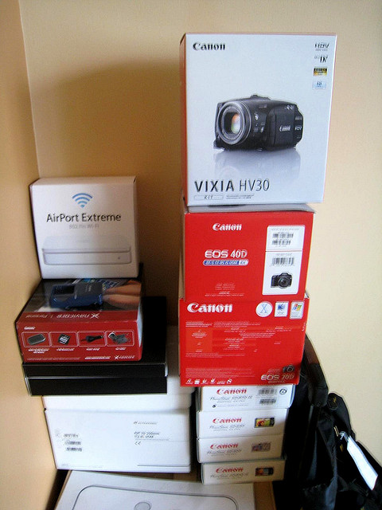

Take a look at the photo on the right. If you notice, there are four boxes for Canon Digital Elphs, two boxes for Digital SLRs, and one box for a HD camcorder. That photo was taken almost three years ago now, and since then I believe I've had at least one more Canon point and shoot camera.

The thing is though, I'm all Canon'ed out. At least in the Point and Shoot realm, I have found myself continually disappointed with the performance of the cameras. Every Digital Elph I've owned has suffered from the exact same pixel bleeding issue when exposed to bright lights, such as those in a club. I recently picked up a Canon S90 camera for my trip abroad, and sure enough, it exhibits the exact same problems as every one of its predecessors (despite being one of Canon's more expensive point and shoots). If you add it up, that's at least five cameras I've owned that have had the exact same issues with the camera - you would think in that amount of time they would have spent the time to fix it.

Part of it is my own fault. For the last three point and shoot iterations I've been disappointed, and I've told myself that it was time to try something new. But unfortunately I haven't taken it upon myself to abandon it completely, maybe due to nostalgia.

I've had better luck with Canon's digital SLRs. I've owned the 20D and currently have the 40D with me. Granted the 40D is a bit old now, but it's been a pretty good camera to me. That said, newer cameras perform quite a bit better in terms of noise and features, so I'm definitely looking to try something new.

I'm probably going to toss the S90 onto Craigslist prior to hitting New York, and possibly even eBay. I'm not using it, and truthfully I haven't been all that happy with it, so I might as well recoup some costs and put it into something new. In my perfect world I would abandon my Canon SLR as well, but the costs with buying all new gear and lenses is a bit too much coin to spend right now. Other than one or two people, almost everyone I know who is into professional photography has switched to Nikon. Not wanting to be the lone sucker in the room with the dunce cap, I don't think I'm far behind, especially since I purged most of my fancy gear earlier this year.

\[caption id="attachment\_7616" align="alignleft" width="300" caption="Panasonic G2 Micro Four Thirds"\]\[/caption\]

I've actually been looking a bit at the micro four thirds format. It's a camera system that came out a few years ago that's meant to bridge the large gap between consumer point and shoot cameras and high end digital SLRs. They are advertised as DSLR image quality in compact point and shoot form factors, so they have the potential to offer the best of both worlds. In addition, all micro four thirds lenses are designed to work on all micro four thirds bodies, a methodology which is in stark contrast to the likes of Canon and Nikon who lock you into their systems for as long as possible.

While I suspect a high-end DSLR will always have a place, I know from first hand experience that walking around town carrying more than one pro-series lens is a big pain in the ass, mainly for the weight factor. So having a smaller camera that can take great photos and is nearly as flexible would be great.

I think one of the best write-ups I've seen on a happy micro four thirds user was this guy who left the DSLR at home and took a [system on a trip for 16 days](http://craigmod.com/journal/gf1-fieldtest/). As you can see, the photos are high quality and the camera stood up well in the field.

To buy a basic zoom lens that will keep me modestly happy for the remainder of the trip would cost me around $1,100. For that price I can pick up one of the nicer micro four thirds cameras, the kit lens (which is probably around the same quality as the $1,100 EF-S lens that I would need for my current camera), and also the highly regarded 20mm f/1.7 lens for the micro four thirds system. Unlike the EF-S lens, which I would probably be looking to offload whenever I got back to the Vancouver area, I could definitely see myself holding onto the micro four thirds camera due to the fact that's it's easy to pack, light to carry, has really great image quality, and reportedly is very fun to use. So, right now I'm leaning in that direction for a purchase.

Ultimately I'll decide when I get to New York City, but those are some of the options I'm toying with. Thankfully B&H Photo is right around the corner from the hotel we're at, so I'm hoping to head down there and drop some coin on some new gear before hitting Ireland.
