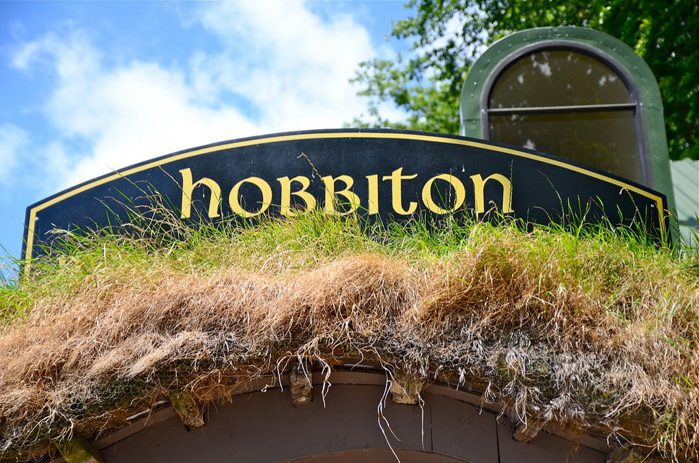
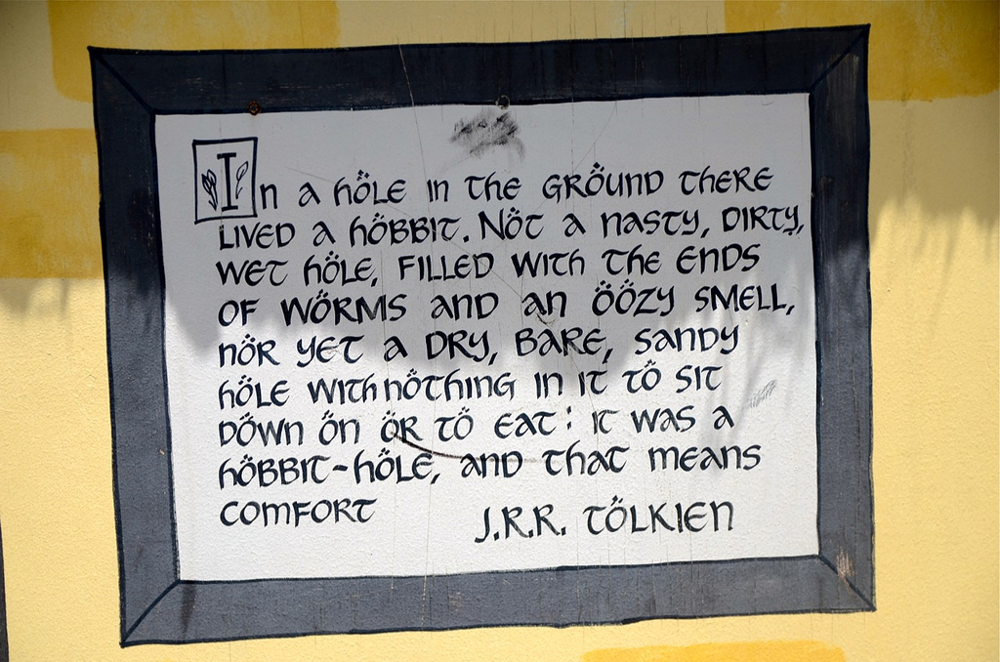
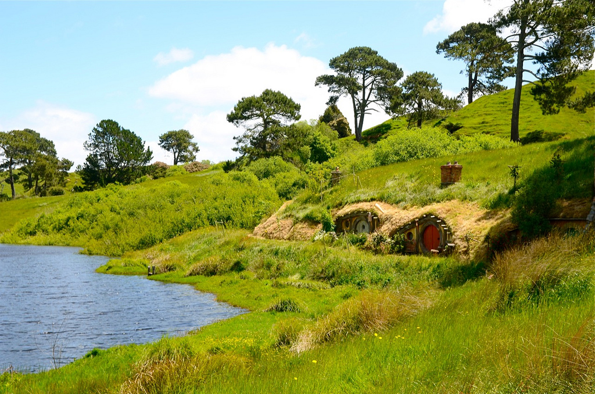
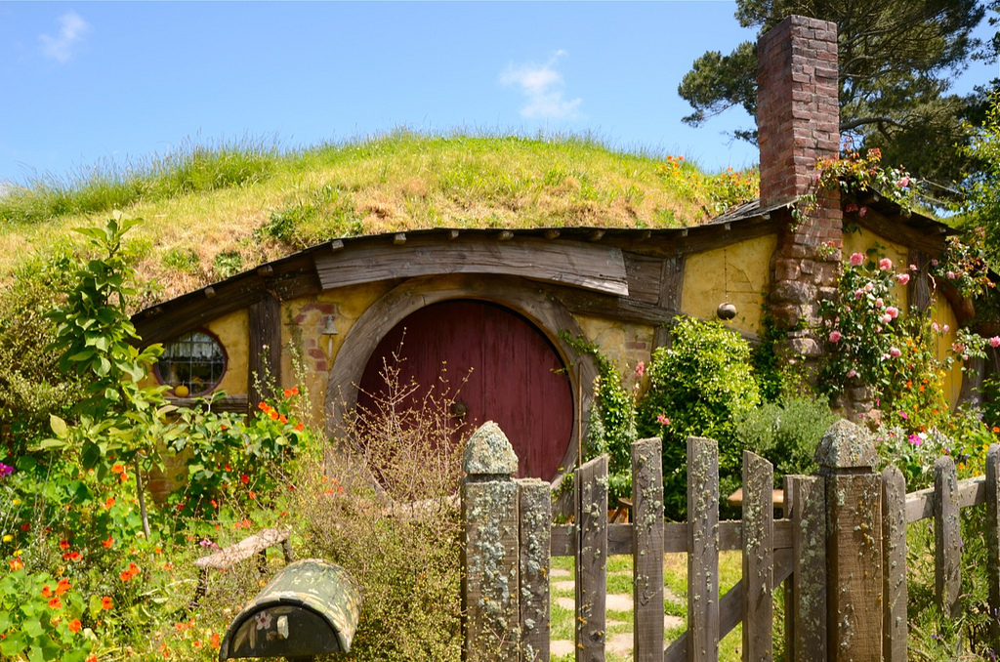
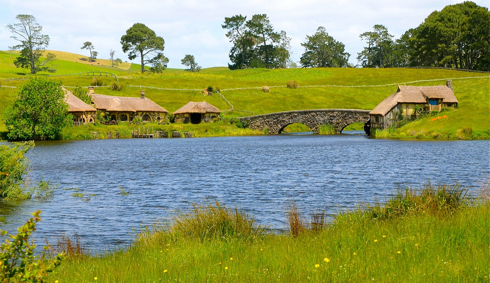
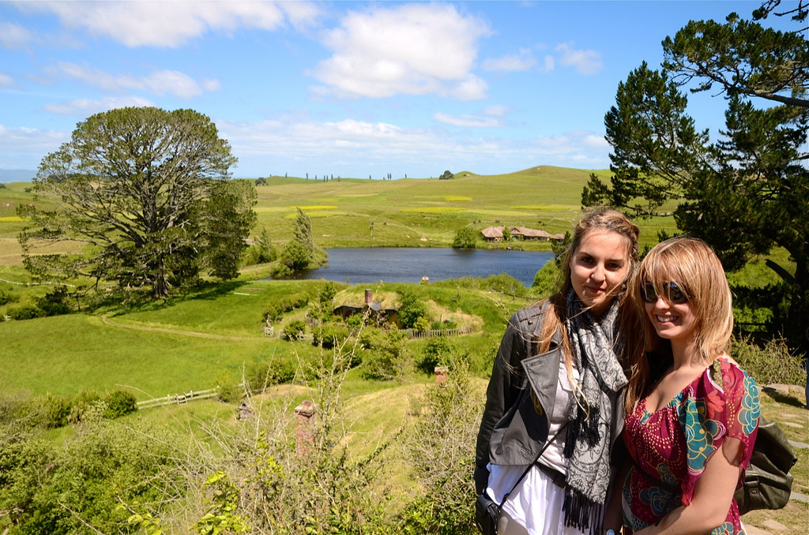
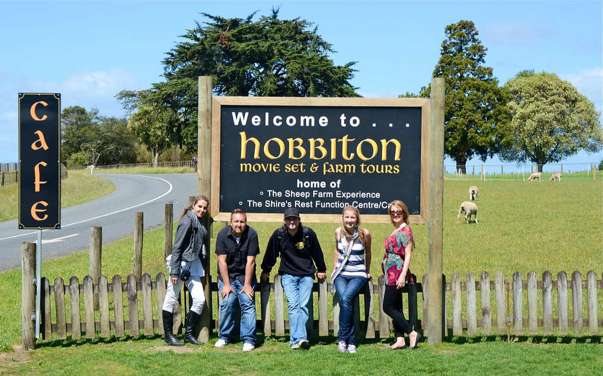

Almost exactly a year ago I visited Matamata, New Zealand to take part in an official tour of Hobbiton, the actual set where the Hobbits lived in The Lord of the Rings and The Hobbit. Prior to the visit my friends and I all had to sign papers saying we wouldn't publicize any photos prior to the release of the Hobbit (since the newly reconstructed Hobbiton set contained some elements not visible in The Lord of the Rings trilogy). Since the world premiere of The Hobbit is today in Wellington, I figure at this point in time there's no problem finally publishing the photos from that day.

We were actually quite fortunate: had you visited Hobbiton in the 10 years since The Lord of the Rings you would have just seen a few Hobbit-hole façades. The actual set was mostly destroyed after the original trilogy, with only a few items remaining. But when filming of The Hobbit was finally announced they were forced to rebuild the entire set from scratch. The month prior to my visit the set was actually shut down to the public as Elijah Wood was in the city and filming was ongoing for The Hobbit. When we visited the site it was about a week after Elijah had left, and the set was exactly as it was for filming - we were some of the first people to see The Hobbit set in all its glory.

\[caption id="attachment\_9821" align="aligncenter" width="1024"\] At the Matamata visitor's centre\[/caption\]

\[caption id="attachment\_9822" align="aligncenter" width="1024"\] Tolkien Quote at the Visitor's Centre\[/caption\]

\[caption id="attachment\_9824" align="aligncenter" width="1024"\] One of many hobbit-holes\[/caption\]

\[caption id="attachment\_9825" align="aligncenter" width="1024"\] The road to Hobbiton\[/caption\]

\[caption id="attachment\_9826" align="aligncenter" width="1024"\] Sign-post for drunk hobbits\[/caption\]

\[caption id="attachment\_9827" align="aligncenter" width="1024"\] Hobbit-holes on the edge of the lake\[/caption\]

\[caption id="attachment\_9828" align="aligncenter" width="1024"\] Hobbiton. Bag-end is at the top under the tree on the left.\[/caption\]

\[caption id="attachment\_9829" align="aligncenter" width="1024"\] Sam's House\[/caption\]

\[caption id="attachment\_9831" align="aligncenter" width="1024"\] Road up to Bag End\[/caption\]

\[caption id="attachment\_9832" align="aligncenter" width="1024"\][")](http://www.migratorynerd.com/wordpress/wp-content/uploads/2012/11/hobbiton13.jpg) Bag-End (Where Bilbo lived)\[/caption\]

\[caption id="attachment\_9833" align="aligncenter" width="1024"\][")](http://www.migratorynerd.com/wordpress/wp-content/uploads/2012/11/hobbiton14.jpg) The Party Tree and the Green Dragon Pub (in the distance)\[/caption\]

\[caption id="attachment\_9841" align="aligncenter" width="1024"\] The Green Dragon Pub\[/caption\]

\[caption id="attachment\_9840" align="aligncenter" width="1024"\] Vanesa and Helen in Hobbiton\[/caption\]

\[caption id="attachment\_9834" align="aligncenter" width="1024"\] Team Hobbit: Vanesa, Me, Moritz, Julie, and Helen\[/caption\]

My visit to Hobbiton was one of the highlights of the time I spent in New Zealand. If you're in the Auckland area, then I definitely recommend heading down to Matamata for a visit. While the set was destroyed after the filming of the Lord of the Rings, the plan this time is to leave the set completely intact for tourism. So if you go, you'll see the set exactly as it was for the movies. In addition, I recently read that people will be able to have a few pints of beer down at the Green Dragon pub, something I'm definitely envious of!

If you make it down to the area, drop a comment here and let everyone know what you thought. The North American premiere of The Hobbit is only a few weeks away - I can't wait!
