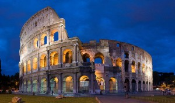

\[caption id="attachment\_601" align="alignright" width="300" caption="The Colosseum, Photo by David Iliff"\]\[/caption\]

I went looking tonight to find out what the new 7 Wonders of the World were. I remember as a kid hearing that phrase a few times, and I thought there would be some straightforward list somewhere that simply listed them off in order. Unfortunately I've now come to the realization that there are many different variants of the list, all of which were undoubtedly influenced by different countries trying to be on the list such that their tourism industries would benefit. In fact, if you browse through the Wikipedia entries for Wonders Of The World, you'll find around six or seven different variants, all leading to different countries and attractions.

The original Seven Wonders Of The World are now called the [Seven Wonders Of The Ancient World](http://en.wikipedia.org/wiki/Wonders_of_the_World), and those were:

- Great Pyramid of Giza
- Hanging Gardens of Babylon
- Statue of Zeus at Olympia
- Temple of Artemis at Ephesus
- Mausoleum of Maussollos at Halicarnassus
- Colossus of Rhodes
- Lighthouse of Alexandria

Unfortunately the only location from the original list that still exists today is the [Great Pyramid of Giza](http://en.wikipedia.org/wiki/Great_Pyramid_of_Giza).

That's why in 2001 a modern list of wonders was created by tabulating more than 100 million votes. While there is some controversy about the non-scientific nature of the project, the final list was announced in 2007 and includes:

- The Great Wall Of China - China
- Petra - Jordon
- Christ The Redeemer - Brazil
- Machu Picchu - Peru
- Chichen Itza - Mexico
- Colosseum - Italy
- Taj Mahal - India
- Great Pyramid of Giza - Egypt (Honorary)

The Great Pyramid of Giza wasn't officially on the list, which made Egypt kind of pissy since the Great Pyramid was one of the original wonders. So, it was added to the list as a honorary selection.

I visited Chichen Itza in Mexico in 2009 and it was an awesome sight. While I'm in no rush, it would be great to see them all at some point in my life.

\[caption id="attachment\_599" align="alignleft" width="300" caption="Machu Picchu, Photo by Martin St-Amant - Wikipedia"\]\[/caption\]

If I had to pick only one that I would like to see from that entire list, it would most definitely be Machu Picchu. Part of why it appeals to me is that getting to Machu Picchu involves a four day hike along the ancient [Inca Trail](http://en.wikipedia.org/wiki/Inca_road_system), starting from the city of Cuzco and eventually climbing to a height of 12,800 feet above sea level. That it takes four days of effort to reach the site seems like it would make the journey that much more rewarding.

From Argentina, two wonders from the list are definitely within striking distance: Christ the Redeemer and Machu Picchu. I doubt I will get the time to visit Machu Picchu on this trip (since it requires several days to acclimatize to the altitude before attempting the journey and also four days worth of hiking), but it's quite possible that I'll make it to Rio de Janeiro for a week or so.
