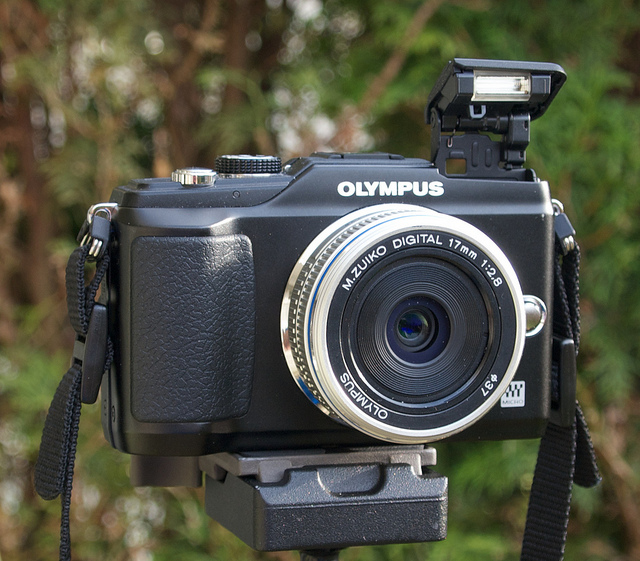

I'm in the process of checking myself out of my apartment in Buenos Aires, and will be shortly heading to New York City for a few days of feasting and sight-seeing. One of the first items on the agenda though is to head to B&H camera to pick up my first micro four-thirds system camera.

\[caption id="attachment\_7756" align="aligncenter" width="640" caption="E-PL2, Photo by John Biehler"\]\[/caption\]

I've decided on the Olympus E-PL2 camera, which is one of the newest, highly reviewed micro four-thirds bodies available. [John Biehler](http://johnbiehler.com/2011/03/27/hands-on-with-the-olympus-pen-system/) just did a great write-up on the same camera, so definitely check it out.

While John used the 17mm lens, I'll probably be buying the 20mm f/1.7 lens, simply because it's a bit faster and the reviews say a bit sharper. I may also pick up the 17mm shortly afterwards (since I think it's a very usable field of view), but I'll start with the 20mm.

If I can, I'm going to sell the rest of my gear in New York City. That would include my Canon 40D DSLR body, battery pack, and Canon S90 system. I'll probably buy a new SLR at some point, but given that I plan to make my E-PL2 my prime camera in Europe, I see no point in lugging my old DSLR around in my backpack if I can get rid of it. Plus, the sale will hopefully offset the purchase by a good deal.

If you've been following along with [my travel blog](http://themigratorynerd.com), you'll know that I'm heading to Europe shortly as well. In the month of April I'll be hitting Shannon, Limerick, Edinburgh, Dublin, London and Paris most likely, so it's going to be a whirlwind adventure. While I'll have my small suitcase with me, I'm hoping to mail some stuff back home from New York City, mainly clothes I brought along that I have yet to wear.

I'm definitely looking forward to a smaller camera with high image quality. I love using an SLR, but it's a pain in the butt to carry around, especially when you're trying to travel light.
