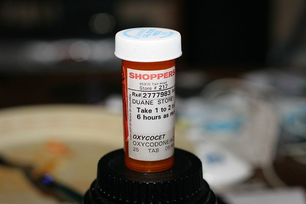

I went out today and picked up a little Christmas present for myself - the Canon 430EX Speedlight. I've never really had a chance to get into flash photography, so I'm looking forward to messing around with it. The nice thing is that the internal flash on my 20D really sucks. For some reason they never included a focus assist lamp for low light conditions. Canon's way around this was the fire the internal flash several times in a row to try and do a focus in low light. However, this usually scares whoever you're trying to take a photo of, and causes all the epileptics in the room to go into synchronized seizures. With the speedlight, there's a focus assist lamp there fires a subtle red light to help focus. It's a much better system.

Here's a shot I took with the flash a few minutes ago:

 **Painkillers, taken with my 50mm f/1.4**
