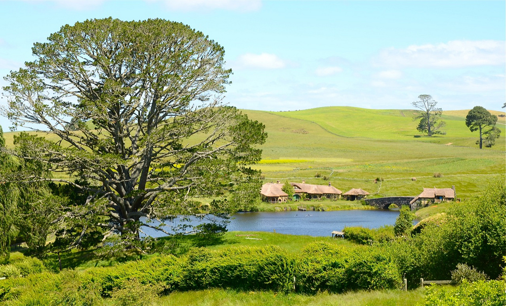
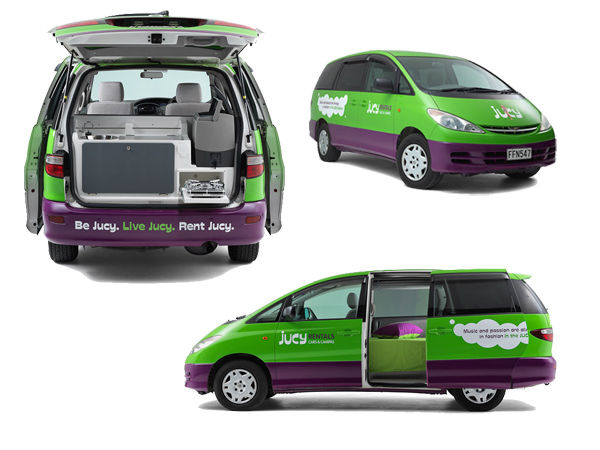

A few years ago I visited New Zealand and fulfilled one of my lifelong dreams. The highlight of the trip for me was undoubtedly my trip to Matamata, New Zealand to visit the actual, real-life set of Hobbiton from the Lord of the Rings movies.

\[caption id="attachment\_12039" align="aligncenter" width="1024"\] Hobbiton, in Matamata, New Zealand\[/caption\]

Due to time constraints, I only spent one month there and only saw the North Island. I had wanted to head down to the South Island at the time and possibly rent a campervan, but it didn't really seem like something that would be that fun by myself. So I decided at the time to head back to Canada and enjoy Christmas with my family.

### A New Trip

Luciana and I were recently trying to figure out something to do for New Year's eve, and found a 'cheap' (all flights to New Zealand are relatively expensive) flight to New Zealand for around the same time. So we decided on a whim to spend New Year's Eve in New Zealand, and a few weeks exploring the South Island.

I'm a huge fan of camping, and love the idea of just driving a few hours every day and seeing something new. Many people who visit the South Island in New Zealand actually rent campervans and simply drive around visiting various sites and campgrounds, so there are tons of businesses that help with that. Luciana and I decided it would be a good way to spend some vacation time, and decided to put in a request to book a campervan and see if we would be able to reserve one. Because it is summer down there and there is lots of competition for campervans, we weren't originally guaranteed a reservation. But we received confirmation this morning that our campervan was reserved, so we'll be spending two weeks in January bouncing around New Zealand's South Island.

\[caption id="attachment\_12036" align="aligncenter" width="600"\] Jucy 'Cabana', Our Chariot For Two Weeks\[/caption\]

We looked around various websites before booking, and eventually settled on the [Jucy 'Cabana' Campervan](http://www.jucy.co.nz/vehicles/jucy-cabana.aspx), as it is a good balance between affordability and features. You can get some vehicles that are much cheaper, but they are often extremely old. Gas prices in New Zealand are around $2 per litre, so going anywhere in a vehicle already costs a ton of money, even more so if you're driving an old, inefficient vehicle. So while we're paying more for the Cabana, I think it is a good investment due to gas efficiency and comfort. For example, the Cabana has a built in DVD player, so we can sit in the back and watch movies while relaxing.

We're both really looking forward to our New Zealand campervan adventure, and for seeing some of the more beautiful locations from The Lord of the Rings in January. I love sleeping in a tent, so I think a campervan will be a great experience for us both. They've included a picnic table in our purchase as well as a few chairs, and we'll likely pick up a basic BBQ while we are down there and enjoy a few weeks of BBQ-only food.

We fly back to Canada in December to spend a few weeks back at my apartment, and then will leave for New Zealand a few days before New Year's eve. Thanks to the international date line, we'll basically arrive just in time for the New Year's celebrations. Then it'll be business as usual around Auckland for a week, and then off to the South Island for a little R&R. I can't wait!
