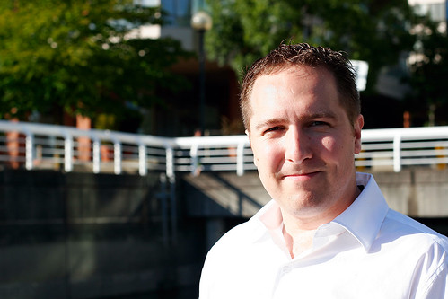

Well, it's official -- I passed my master's exam with a whopping mark of 84% (A-) -- good enough for me. So, all that's left to do is get a few pieces of paper signed, print off a nice copy of my thesis, and hand it into the library for processing. And then it's done.

The guys from CounterPath took me out for a few free rounds of drinking last night. We started at Nevermind in Kits for a few beers after my defense. Then Des and I went for dinner on Granville Island (Bridges) and met up with everyone at 8pm for some drinks at the Yaletown Brew Pub.

Here's a photo of me waiting to catch the ferry to Granville Island (a few hours after defending my thesis).

