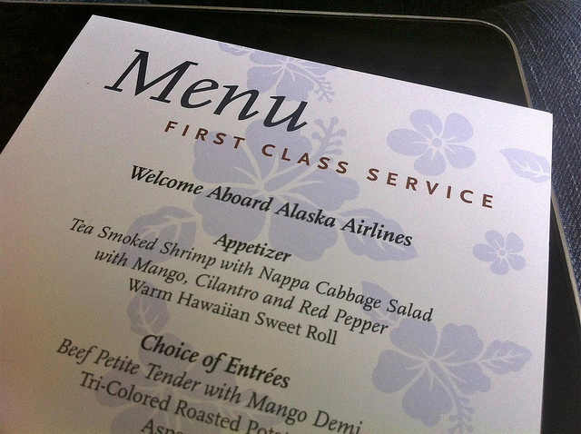

Alaska Airlines recent announced that they were starting service from Bellingham International Airport to Honolulu, Hawaii. Last week I managed to find a cheap $400 return flight on that same route, so I decided to book it and finally get around to seeing Hawaii.

I've looked at going to Hawaii before, but the costs have always been rather high when compared to Mexico. Hawaii is an American state, so not only does it have American prices which are in line with the rest of North America, but it also has a hefty surcharge for being somewhere warm and beautiful.

That said, at $400 return my flight was a pretty great bargain.

Parking at Bellingham airport was almost completely full. I'm not sure if it's because they are flying more traffic in and out of Bellingham, or if a lot of people had plans similar to mine that involved leaving a car at the airport for a week. But it was rather difficult to find parking, and it involved taking a shuttle from the parking lot back to the airport (which is a bit strange, given how small of an airport it is).

Inside the terminal it wasn't much better, with lines snaking around through the front door. Thankfully I wasn't checking any bags, so I made use of the Alaska Airlines check-in kiosk and saved myself probably a 30 minute wait in line.

Immediately prior to boarding they announced that they had six upgrades to first class available for a reasonable fee. Since I had somehow been stuck in an aisle seat (which I hate - I always fly window if I can so I can sleep without being disturbed), I decided to take the upgrade and treat myself.

\[caption id="attachment\_1576" align="aligncenter" width="640" caption="First Class Menu on Alaska Air"\]\[/caption\]

The food and service in First Class was quite stellar. Not only were the drinks flowing steady, but the meal was served in stages over the course of about an hour, and it was definitely a nice treat. We also got to use Alaska Air's DigePlayers, which are personal entertainment units loaded up with movies and TV shows.

\[caption id="attachment\_1579" align="aligncenter" width="640" caption="Appetizer and the DigePlayer"\]\[/caption\]

Before I knew it the sun had gone down and the plane had touched down at Honolulu airport. Since I didn't have any bags, I was able to walk right outside and hop on a shuttle to the hotel. After checking in at the Outrigger Luana hotel, I went for a quick walk and found a nice little Thai restaurant to have a final meal before calling it a night.

I woke up this morning and went to sit out on my lanai. The room I'm in has a nice view of the ocean beside Waikiki beach.

\[caption id="attachment\_1584" align="aligncenter" width="640" caption="View From My Hotel"\]\[/caption\]

I grabbed my camera and went for walk down to Waikiki beach, stopping briefly at a local coffee shop to try out some Kona coffee, which was actually really tasty.

\[caption id="attachment\_1585" align="aligncenter" width="640" caption="Waikiki Beach, Looking towards Diamond Head"\]\[/caption\]

The beach is really gorgeous, as is the backdrop of the Diamond Head on the one side. I'm probably going to hang out around the pool today, but I'll spend a bit more time later or in the next few days walking down the beach and taking some more shots.

\[caption id="attachment\_1586" align="aligncenter" width="640" caption="Waikiki Beach"\]\[/caption\]

I haven't even been here 24 hours yet, but I'm definitely enjoying a nice break from the rain, as well as the nice tropical climate. I was thinking to myself on the plane last night how good it felt to be off to see something new again. The whole process has made me excited again for my trip to Thailand in the fall as well.

I'm off to do a bit more exploring, and to soak up some sun in front of the pool downstairs here.
