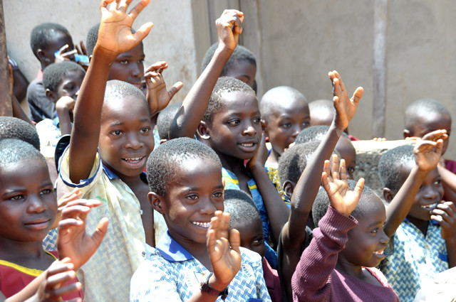
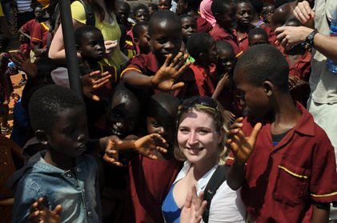
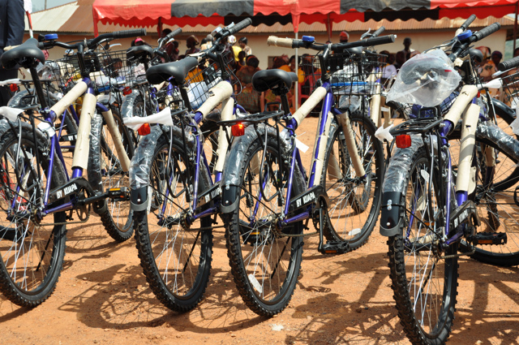

Traveling the world for leisure is obviously a great adventure. While I get to enjoy the weekends and the evenings, I'm also working as I travel, so most of my days are spent building plugins for WordPress and helping keep things afloat. But I do get to venture out from time to time free of computers and cell phones and enjoy some of what the world has to offer, for example, this weekend's trip to the famous Iguazu Falls.

But other types of travel are for more nobler causes. As an example, a good friend of mine from the Vancouver area, Rebecca Bollwitt, recently got asked to participate in a trip to Ghana, West Africa, to give some bicycles to school children there. This trip is part of Cadbury's [Bicycle Factory](http://thebicyclefactory.ca/Landing.aspx) campaign, an effort to give the kids in Ghana bicycles that they can enjoy.

From the Bicycle Factory website:

> For kids in rural Ghana, bicycles represent more than just transportation and fun. They also represent mobility, freedom and change. That’s why we named the specially-designed bicycles that we’re sending to Ghana† “Nframa”, the Ghanaian word for “wind.” Check out how bikes like these can affect the lives of the kids who receive them.

Ghana is obviously a very long way from Vancouver, and Rebecca had to fly through Heathrow and then down to Ghana. I'm sure she's obviously a bit jet-lagged, and has a busy schedule. But ultimately the kids are the ones who benefit from this trip, something that I'm sure is important to Rebecca and everyone else who participated in the adventure. It's really the trip of a lifetime, and it's great that she has been invited to be a part of something that's life changing for all involved.

To find out more about Rebecca's trip, check out her [blog at miss604.com](http://www.miss604.com/tag/africa), or follow along with her [on Twitter as @miss604](http://twitter.com/miss604).

All photos by [Rebecca Bollwitt](http://www.flickr.com/photos/miss604/) - [@miss604](http://twitter.com/miss604)
