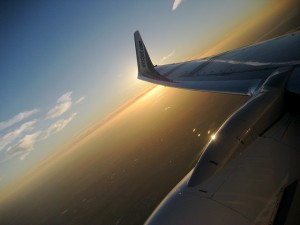

I'm one month into what could very well be a one year travel adventure, potentially longer, depending on how things go (don't worry mom, I'll come home for a visit). My plan has always been to give monthly updates on costs to help those people budgeting for trips such as these.

I've been told that one of the greatest myths about world travel is the belief that it's only within reach of those who are very rich. My goal over the next year is to help dispel some of those myths. While I'm not expecting to always save a pile of money while traveling (although I expect in some destinations I probably will), I am interested to see just how different a full year of exotic travel is in terms of costs from my lifestyle back in North America.

In terms of flights, I've decided to only include the one-way fare, and I'll amortize it over the length of the trip. So even though my flight to Buenos Aires cost $1200, I'm only going to include half of it ($600), and am going to count only $200 for each month I'm here (since I'm here for three months). The other half of the flight I'll include in the outbound leg for the next destination I go to (which will be New York City and Ireland).

Without further ado, here's a rough breakdown of the what I've spent so far to visit Buenos Aires (I haven't been keeping all my receipts, so these are rough numbers, but fairly accurate I'm sure).

| Description | Monthly Cost | Daily Cost |
| --- | --- | --- |
| Flight to Buenos Aires | $200.00 | $6.66 |
| Storage Locker in Canada | $90.00 | $3.00 |
| Travel Health Insurance | $50.00 | $1.67 |
| Rent: 1 Bedroom in Palermo Soho | $1100.00 | $36.00 |
| Cell Phone | $30.00 | $1.00 |
| Food (Restaurants) | $125.00 | $4.16 |
| Food (Grocery Stores) | $100.00 | $3.33 |
| Entertainment/Bars | $200.00 | $6.00 |
| Day Trip To Montevideo | $180.00 | $6.00 |
| Spanish Lessons | $360.00 | $12.00 |
|   | Monthly Total | Daily Total |
|   | $2,435.00 | $81.17 |

So, roughly $81 a day, which includes my flight, eating fancy meals like Argentine steak, a day trip over to Montevideo, all my storage costs back home as well as travel insurance. Bear in mind that I'm staying in a very nice apartment in one of the nicest areas of Buenos Aires and living relatively large (eating a few expensive meals a week, plus drinks at a pub or two during the week). In addition, the Spanish lessons are only temporarily and will hopefully make my trip to Spain more enjoyable, so I look at that as an investment with a future return. If you factor those out, my daily cost comes down to around $69 a day, including accommodation.

Whether or not that's comparable to your budget back home, only you know. But as for me, I'm about on track with what I was spending back home, with some notable differences. My grocery bill back home was about $300 a month, and my car cost me around $300 if I include gas and insurance. My cell phone back home cost me around $120 a month, while drinking a few beers in the pub is obviously far more expensive back home.

So while the total dollar amount is probably similar (and bear in mind that I was living about an hour out of Vancouver, where costs are significantly cheaper), I'm getting to see the world, learn a new language thanks to private lessons, and visit countries such as Uruguay on the weekends.

Next month I'll probably venture over to Iguaza Falls, which will probably cost me $500 or so, and the following month I may attempt to visit Machu Picchu. We'll see what the final costs are once I factor in all of that, but so far I'm on par with my expenses back home, possibly even a bit cheaper.

And on that note, I'm off to a little house party and will be bringing along a litre of Stella Artois beer, which cost me the back-breaking sum of $1.75 CAD in a Buenos Aires supermarket. I've also just set up a [Facebook page for The Migratory Nerd](http://www.facebook.com/pages/The-Migratory-Nerd/183851948305060) - follow along for more travel updates and additional travel tips.
