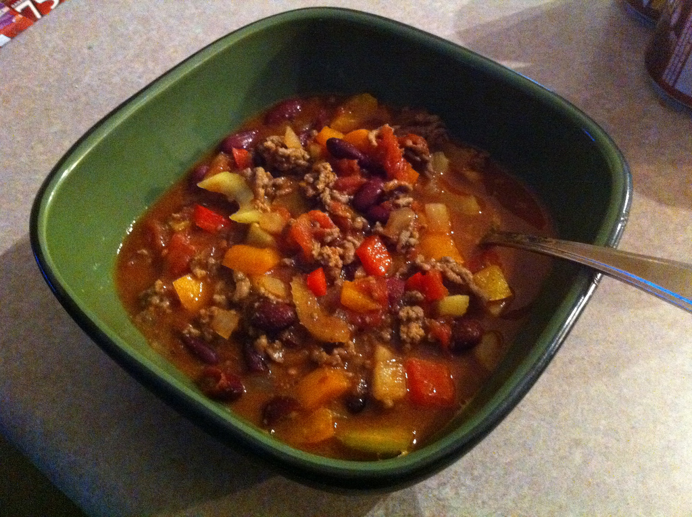

Many people have heard the phrase _low-carb_ before - basically a low-carb food implies food with a minimal amount of carbohydrates in it. I would say that any particular low-carb meal should probably have less than 10 grams of digestible carbs in it if it is be classified as a low-carb meal. The motivation for doing so is to limit the amount of insulin that gets produced after the meal. Since insulin directly influences the accumulation of fat, a low-carb diet/meal minimizes the amount of fat that can be stored after a meal, and often leads to more stable blood sugar.

A slow-carb meal on the other hand doesn't aim to minimize all carbs, just ones that have a big impact on insulin and blood sugar. Carbohydrates in that category would be potatoes, carrots, sugar, flour, and anything else that's fairly starchy. A slow-carb diet is generally recommended over a low-carb diet if a person wants to eat healthy (by minimizing unrefined carbohydrates) but also might be doing physical activity that would require carbohydrates. A slow-carb diet is the type of diet that Tim Ferris recommends in [The Four Hour Body](http://www.amazon.com/gp/product/030746363X/ref=as_li_qf_sp_asin_il_tl?ie=UTF8&tag=duanstor-20&linkCode=as2&camp=1789&creative=9325&creativeASIN=030746363X), since he does a lot of sports training. But for physically inactive people a low-carb diet would probably produce a higher degree of weight loss in a shorter amount of time.

\[caption id="attachment\_8533" align="aligncenter" width="1024" caption="Slow-Carb Chilli"\]\[/caption\]

It would be pretty difficult to make a low-carb chilli, mainly since chilli implies some types of beans in a tomato-based sauce. So to make a slow-carb recipe we can limit the types of beans and also scale back on the sauce used.

I ended up tweaking my old high carb recipe from before and made a slow-carb recipe the other day. It actually turned out quite well, and I think I much prefer it to the thicker high-carb varient I used to eat.

### The Ingredients

- One pound of lean ground beef
- One medium sized yellow onion, diced
- Three small peppers, orange, yellow and red, diced
- Three stalks of celery, chopped
- One can of diced tomatoes (approximately 800 ml)
- One 500ml can of red kidney beans
- Two tablespoons of chilli powder
- Two tablespoons of cumin
- One tablespoon of oregano
- One cup of water (approximately)
- Two tablespoons of sugar substitute (if you use real sugar, add 6 grams of carbs per serving
- Optional: 1/2 - 1 finely chopped habanero pepper (if you like it hot like I do)

I used a slow cooker to cook this, but browned the beef on the stove first to speed things up. So basically brown the beef and then toss in the onion and cook that as well. If you're using grain-fed beef (which would be what you bought if you went to a typical supermarket), then I would drain out the fat before adding to the slow cooker. If it's grass-fed beef (usually what you get when you buy organic), then I'd be inclined to leave it in (since the fat in grass-fed beef is mostly of the unsaturated, i.e. good, variety).

Combine everything above into the slow cooker and mix it all up. I actually added enough water such that all the ingredients were soaked in liquid (roughly one cup). After being cooked some of it will evaporate causing it to thicken up a bit.

Turn the slow cooker on high and let it cook for three or four hours. Add salt and pepper to taste.

### Results

This actually turned out really well. My normal high-carb recipe would also have some puréed tomato paste in it as well as some pork and beans. Both of those have higher glycemic indices, which would cause a larger spike in insulin. The lack of tomato paste makes the sauce a bit runnier, but it just seems a lot healthier when you're eating it, and the subtleties of the spices come out. You can also mix up the types of spices you use, substituting smoked chilli powder instead of normal chilli powder, and possibly fresh oregano (if you use that, you should probably put it in right at the end to preserve it's flavour). I'm also tempted to use a bay leaf next time, since I love the complex flavour that a bay leaf adds.

### Nutritional Information

Using FitDay.com I came up with the following nutritional content for the entire batch: 2,171 calories, 115.2 grams of fat, 159.9 grams of carbs (includes 15.3 grams of fibre), and 131 grams of protein.

Splitting this into five servings gives the following nutritional content per serving: 434 calories, 23 grams of fat, 32 grams of carbs (includes 3 grams of fibre), and 26.2 grams of protein.
