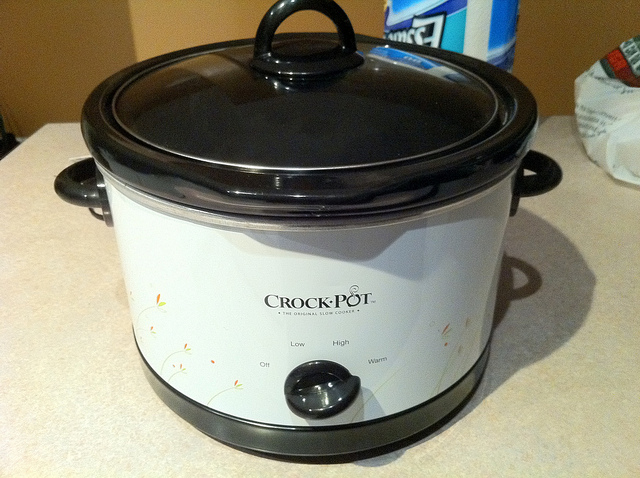

I moved into my summer home yesterday with John and have slowly started getting settled. Most of my bedding is stuck in the back of my storage locker, but considering that I only have a duvet and some sheets stored I decided to simply buy a new bed set. So yesterday I went out and bought a bed in a bag from the new Walmart out in Chilliwack.

Since then I've dropped about $250 on both groceries and a few new kitchen toys, including a slow cooker. I had a slow cooker a long time ago but never used it, mostly because I had no idea what to do in the kitchen at the time. I still have a lot to learn, but I'm far more adventurous than I used to be. I purchased a highly rated book on how to make Indian cuisine using a slow cooker (which actually is a lot like traditional Indian food is prepared), so I'm anxious to start trying a few dishes out.

\[caption id="attachment\_8401" align="aligncenter" width="640" caption="My New Crock Pot"\]\[/caption\]

In fact, if you look up in the top menu you'll now see a "Food" category. I'm going to make as many home cooked meals as I can this summer, and will do my best to document them as I go. A few friends are coming over tomorrow night to watch the hockey game, so I'm going to try slow cooking a [Chicken Tikka Masala](http://en.wikipedia.org/wiki/Chicken_tikka_masala) during the day tomorrow.

Most of the recipes that I have involve the use of a food processor. I have one in storage but it's way out in Chilliwack, so I don't want to buy a new one. Which means I'm going to have to improvise tomorrow as see how close I can get. I'll probably head back to Chilliwack at some point during the week and grab my queen bed from storage, at which point I'll grab some of my kitchen items and bring them out to the city.

So, if you're a foodie then make sure you follow along with this summer's adventures. I'd like nothing more than to share some great recipes with some like-minded eaters, possibly even meeting up from time to time for some good eats. I already have some great ideas with how to supercharge my nachos with some slow cooked ground beef or possibly even pulled meat.
