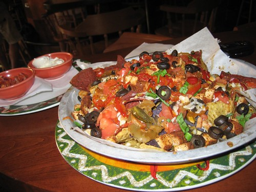

As most people know, I'm quite fond of nachos. I haven't had them in quite a while now (which is a relative scale, equal to a few weeks or so), but it's the one treat I really enjoy. You'll rarely see me eating a cookie or a chocolate bar (in fact, I don't really have a sweet tooth at all), but nachos are my weakness.

I have to say, I make a pretty mean batch of nachos. But like most things, my nacho making ability has slowly evolved over time, and is still evolving. Given that my birthday is coming up shortly, I've decided to attempt to outdo myself in the nacho department that night. To that end, I've started experimenting with different meats and cheeses. I few weeks ago I tried making grass fed beef into nachos, which turned out fairly decent. In my fridge right now is a rib-eye steak that I had ground into hamburger meat for the sole purpose of making nachos with. So I'll break out that bad boy shortly and test it out.

I didn't make nachos tonight, but I decided I'd make a taco salad which of course necessitates the cooking and seasoning of meat. Instead of using a store bought taco seasoning packet, I decided to try and come up the ideal seasoning using a few recipes on the internet as a start and my overflowing spice basket here at home.

On a scale on one to ten, I'd say I hit about a 6 or 7 with the seasoning, which isn't bad for the first attempt. I'm keeping track of the recipes, so I'll post them as I work out the kinks. But I'm quite looking forward to nacho fest sometime in the near future.
