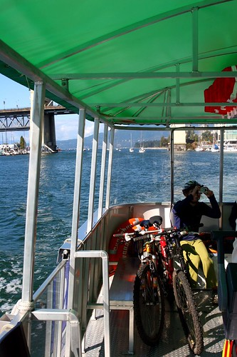
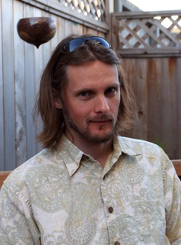
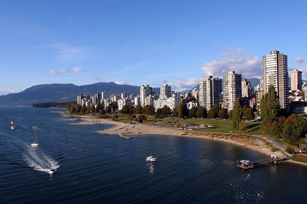

Last night, I decided I was way too lazy to drag my butt from the couch into my bedroom, so I just grabbed a blanket and slept there. And let me tell you -- what a refreshing sleep. I sometimes forget just how comfy my couch really is. I woke up at like noon, with the sounds of birds chirping and the fresh air blowing through my apartment (ok, maybe no birds were chirping, but you get the idea). I decided that it was a really good day to go for a walk, and what better destination than to head to Kits to see Dustin and Dori.

I grabbed my iPod and my camera and walked down to the little ferry to Granville Island (hey, I had to walk \*onto\* the ferry). I learned an interesting little piece of information -- due to weird transportation rules, bikes count as people on boats. So even though the boat I was on could hold 16 people, only 7 could go due to the bikes (since everyone but me had a bike, the rest of the people standing on the shore looking at the half-empty boat weren't too impressed with having to wait yet another ferry). Oh well. At least I got on.

Next, I slowly made my way through Granville Island and up 4th ave to Dustin and Dori's place, snapping a few photos on the way. On that part of the walk, I realized how upbeat I've been lately. Maybe it's giving up caffeine, or maybe it's just the new attitude that comes with a new season, but I feel really good lately, almost like I've been sleeping for the last year or so and am just waking up now. I don't know how to explain it.

Dustin, Dori and I went down to their local coffee shop and sat around talking for a while. They had a really amazing trip, and are super happy to be back in Vancouver enjoying the sunshine. I went back to their place and went through all their photos from their trip (I'm jealous -- I can't wait to go somewhere new again).

Afterwards, I slowly made my way back home, stopping for a sandwich on Cornwall near the water. It was such a great day, and it's sad knowing that the sunshine will soon be replaced with the rain. I'd really like to get in one more camping trip before the sun goes away completely, so maybe in the next week or two I'll be able to pull it off (my car is loaded, so I can literally go camping anywhere in about 10 minutes). If the weather is nice for the long weekend, maybe I'll organize something along the river in Chilliwack (I'll be there anyways for thanksgiving) for a few nights.

