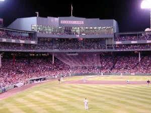

I've always been fascinated with baseball. Back when I was a kid, my dad and step-mom took me to a few Mariners games in Seattle. While prices have changed, back then you could get VIP tickets for around $30. While it's not as popular in Canada, I do appreciate the game, the stadiums, the hot dogs, the peanuts and the entire atmosphere that goes around with watching a live baseball game.

James Earl Jones' speech in Field Of Dreams regarding baseball is a great one. Throughout all the turmoil in the states, the Great Depression, the multiple recessions, the shanty towns, there was one constant - baseball. It was the game that united people, that gave people hope in bad times, and allowed families to bond in the stadiums and back home during a leisurely game of catch.

<iframe title="YouTube video player" width="600" height="430" src="http://www.youtube.com/embed/hU3a1PDtTYk" frameborder="0" allowfullscreen></iframe>

On a whim, I decided to check when this year's baseball season starts. Sure enough, opening weekend is the weekend that I'm in New York City. Since I've never seen a game in New York, I thought it would be great to catch a baseball game while in town.

I emailed my friend [Tony](http://www.busblog.com) in Los Angeles, who likes baseball, and asked for a few recommendations. He recommended purchasing tickets through [StubHub](http://stubhub.com), and also trying to check out the Yankees and opposed to the Mets.

\[caption id="attachment\_1245" align="alignright" width="300" caption="September 2001, Near Perfect Game, Yankees vs Red Sox"\]\[/caption\]

I've actually seen the Yankees play once before. In fact, it was nearly an historic game. I was in Boston back in 2001, which was the 100th year anniversary for the Red Sox. My friend Mike was a big baseball fan, and he suggested we stroll on down to Fenway park and try and get scalped tickets. We grabbed a pair for about $90 USD, and then walked into the stadium. Unfortunately for us we didn't do due diligence, and the tickets weren't even close to each other. But no matter, we each took our seats and watched the New York Yankees take on the Boston Red Sox in Fenway Park.

That game was within one out of being the [16th perfect game ever in Major League history](http://www.highbeam.com/doc/1G1-77787578.html), and the crowd was going wild. Given the 100 year anniversary of the Red Sox, the New York Yankees being in town, and the shear joy of watching a game in Fenway Park, it's one of my best memories from that period of time.

A few minutes ago I bought two tickets for Saturday's game on April 2nd against the Detroit Tigers. Tickets were crazy expensive (more than $120 USD per ticket) for anything in the infield, so I grabbed some outfield tickets that were fairly close to the infield in the 200 section. So, not amazing tickets, but definitely not too shabby either. Even so, the final price for two tickets is $150 USD, but I'm sure it'll be a great experience and money well spent.

So Saturday afternoon Dale and I will head down to Bronx to catch a game in Yankee Stadium. I'm looking forward to buying one of those big pointy fingers and having a few brews while watching the Yankees. Maybe afterwords we'll find a pizza place in the Bronx somewhere and dig in!
