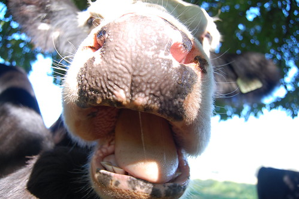

Strangely enough, my home town, and the town I'm currently living in, has a reputation for smelling pretty bad. Truthfully, it's a farming community, so that smell is usually just manure or other organic matter than ultimately yields everyone's favourite Chilliwack corn or other farming goodness.

I'd be the first to admit that as a kid that smell used to gross me out occasionally. But really, you only can smell it in the summer, and only pretty much in the heart of the growing season. Most of the time in the winter all you smell is that crisp, clean air that comes as a result of being surrounded by snow-capped mountains.

As an adult though, I find that I actually don't mind the smell at all. Maybe it's all the years I spent in Vancouver smelling the urine-filled alleys and stairwells, or maybe I'm just conscious of the fact that the smell comes along with living near the outdoors, and a healthy lifestyle. Either way, as I walked out of my little coffee shop at around 10am and was greeted with that smell, I couldn't help but smile.

Cow photo by [John Biehler](http://www.flickr.com/photos/retrocactus/2857235873/)
