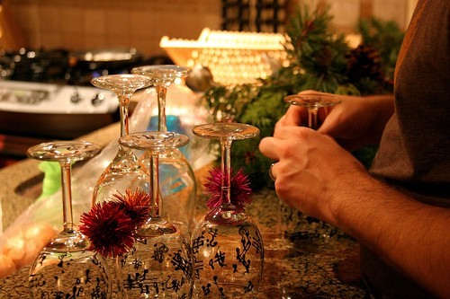

Friday night I took some time out for a few beers with Derek and Cisco. We started down at Malone's on Seymour and Pender, made our way down to the Yaletown Brew Pub momentarily (only to realize it was packed), hit Elixir at the Opus Hotel for a few bottles of wine, and finally ended up down at the Caprice for a while. I find it rather unfortunate that it's next to impossible lately to go anywhere for beers on a Friday evening and actually get in. In fact, my last couple attempts for an after work beer have always involved a lot of pub-hunting, even to find two seats available. If you compare that to somewhere like Ottawa where you can basically walk into any pub and get a seat, it's pretty discouraging. I've been told one of the reasons you get a lot of violence on the weekends is the policy most bars have of keeping people stuck outside waiting to get in. Tempers start to flare, and before you know it you have the Granville Street equivalent of road rage. Vancouver also has a weird liquor license policy where you can only acquire someone else's license -- you can't apply for a new one. What that means is that even though the amount of people in the downtown core is increasing, the amount of places for them to go for a few drinks remains fixed.

Saturday night was a relatively tame night over at Jeff and Michele's. It was a nice potlock Christmas dinner complete with a few board games and a lot of laughs. Unfortunately, the perogies weren't as good as I had hoped, but everyone appeared to eat them anyway (hey, what are friends for). Thursday night is our work Christmas party, and then next week I'm completely off. I'm not sure what I'll do, besides for hang out in Chilliwack, but I'd really like to disappear for a few days and take a breather.
