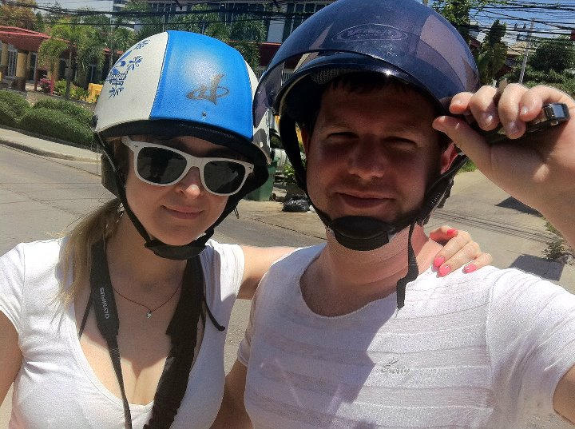

Last summer I was sitting in a rented room in Vancouver, trying to decide where I was going to go next on my little adventure. I had always had New Zealand at the top of my list, but given how it was winter in the southern hemisphere, I needed to come up with a plan that didn't involve freezing to death. After all, I am a migratory nerd, so I should probably follow the sunshine.

\[caption id="attachment\_2474" align="aligncenter" width="720" caption="Sam and Scott"\]\[/caption\]

That's when my friends, Scott and Sam, contacted me and said they were going to be in Thailand for a few months and that I should come for a visit. Thailand: land of smiles; I like happy people, so it seemed like a good fit.

Before I knew it, I had booked a multi-leg journey from Vancouver, to Thailand (via Tokyo), to Auckland and home. It cost me about $2,000, but I figured given the distances involved that it was a pretty good deal (roughly 34 hours of flying). I was excited to finally embark on a visit to South-East Asia since I had seen so many movies about how exotic and adventurous it was in that part of the world.

I've had friends visit Thialand before, and they all loved it. One friend in particular liked it a bit \*too much\* I think, as evidenced by the crazy Thai girl who continued to call him back in Canada for almost a year after he got back. But the rest all thought it was a beautiful country.

### Thailand

Without a doubt, Thailand is like no place I had ever been before. Nestled close to the equator, the temperature pretty much alternates between "holy crap" and "fuck me, is it ever hot". I also technically arrived during the rainy season, which made the humidity nearly unbearable on some days.

But, I knew that going into it all, so I'm not really complaining. Shorts, t-shirts, friends and beer - pretty hard to go wrong when you put all four together.

\[caption id="attachment\_2475" align="aligncenter" width="640" caption="Bophut, Home of Fisherman's Village"\]\[/caption\]

Compared to other places I've been this year, Thailand is comparatively easy for a foreigner to navigate. First, you can actually drive on the roads without thinking you're going to die. Second, due to costs it's pretty cheap to rent a scooter, which is what we did while we were down there (I paid around $100/month for mine, and spent about $10 for gas a month). Most people can understand a little bit of english as well, which definitely helps when you're out eating and what-not. I tried to learn some Thai, but given it's a tonal language (which is far different than english), I didn't make it past my basic pleases and thank-yous, but I still used those when I could.

\[caption id="attachment\_2483" align="aligncenter" width="640" caption="Chaweng Beach"\]\[/caption\]

I spent most of my timing living on the island of Koh Samui. It's a little island off the east coast of Thailand that is easy to navigate and has a few pretty awesome beaches. Given that we had a pool in our complex, I didn't really spend that much time at the beach, other than a few trips to play with the jellyfish.

\[caption id="attachment\_2477" align="aligncenter" width="640" caption="Full Moon Party, Koh Phangan"\]\[/caption\]

My first real "trip" within Thailand was to the island of Koh Phangan, home of the legendary full-moon party. Scott and I brought our Canadian livers with us, and promptly went to work demolishing buckets full of booze all through the night. One of the ongoing inside jokes Scott and I have was due to this one lady who screamed "BUCKET BUCKET BUCKET BUCKET BUCKET BUCKET" at me and Scott, hoping we'd buy some booze off of her. I kept saying that phrase most of the night, and even a few weeks later (after a few drinks, of course).

\[caption id="attachment\_2478" align="aligncenter" width="640" caption="Buckets at the Full Moon Party"\]\[/caption\]

A few weeks later Scott and I made the journey up to Chiang Mai in northern Thailand. We spent a few days in the city wandering around, and then rented scooters for the journey up to the famous temple on the top of the hillside.

\[caption id="attachment\_2480" align="aligncenter" width="640" caption="Wat near Chiang Mai"\]\[/caption\]

Afterwards we did an amazing overnight trip to an elephant camp where we got to feed, wash and ride elephants. I have to say it's a bit weird having an elephant open his mouth so you can stuff in a pile of bananas, but it was pretty surreal to be involved in the process.

\[caption id="attachment\_2512" align="aligncenter" width="640" caption="Baby Elephant at our camp, photo by Scott Hadfield"\]\[/caption\]

In the evening we sat around a campfire singing songs with the [mahouts](http://en.wikipedia.org/wiki/Mahout), drinking Thai whiskey and launching wish lanterns late into the night.

\[caption id="attachment\_2481" align="aligncenter" width="640" caption="Brokeback Lantern: Me and Scott releasing a wish lantern"\]\[/caption\]

The next day we hiked up to a waterfall, and then white-water rafted back to the bus. It was an amazing weekend, especially considering that trip cost us only $100 each.

I spent the next few weeks back in Koh Samui, eating food, taking in the sites, and basically just getting as much relaxing in as I could.

One aspect of Thailand I was told to take advantage of was the cheap cost of custom tailored clothing. I did an internet search and found what most people said was the best tailor on Koh Samui, Timmy's Tailors. I had a couple of shirts made and then a suit jacket, and they all turned out quite well. I have to admit, at the second fitting for the jacket I was having my doubts (since nothing really fits right until the end, and you find yourself wearing half-made garments that don't really look that great), but by the final fitting is was looking pretty sharp.

Prior to leaving Thailand I decided I wanted one more really nice suit jacket that I could wear for presentations or nice dinners out. So I picked out one of the lightest, most expensive Italian fabrics they had and made a custom jacket exactly fitted to my body. It turned out really great (so well in fact that I'm doubting how much use I'll get out of the first one, even though it's a nice jacket as well). That jacket cost me about $130 CAD when it was all said and done, but a similar jacket back home probably would have been $300-$400 off the rack, plus another $50-$100 of adjustments. So it was money well spent.

My friend's Scott and Sam decided to ditch me for a week do some exploring on their own, so I decided to finally get around to doing a mini backpacking trip. I sat down, looked at a map, and purchased 17 days worth of flights and transfers, starting with a journey to Koh Tao.

\[caption id="attachment\_2486" align="aligncenter" width="640" caption="Koh Tao, Thailand"\]\[/caption\]

Koh Tao is the third island in a chain of islands including Koh Samui and Koh Phangan. It's historically known for its great diving, but I spent most of my time there enjoying the scenery and helping take care of the local liquor problem. I only had two days there, but it was enough to get the lay of the land, sample some of the great Thai food on the island, and do a few photowalks.

\[caption id="attachment\_2488" align="aligncenter" width="640" caption="Koh Phi Phi"\]\[/caption\]

My second journey on my backpacking trip (and subsequently my last trip within Thailand) was to the island of Koh Phi Phi, part of a chain of islands where they filmed "The Beach". Koh Phi Phi was absolutely gorgeous, and it reminded me a mini Koh Phangan (complete with buckets of alcohol). I was really looking forward to visiting Maya Bay, one of the most scenic areas of Thailand, but my laptop crapped out on me and I ended up heading down to Malaysia early so I could attempt to get it fixed.

### Kuala Lumpur

\[caption id="attachment\_2494" align="alignright" width="231" caption="Petronas Towers"\]\[/caption\]

I caught a last minute flight from Phuket down to Kuala Lumpur. I knew absolutely nothing about the city other than it was the site for the Petronas Towers. I ended up booking a few nights in the uber awesome Reggae Mansion, which is where I met a pile of cool people and basically destroyed what was left of my liver.

I've seen some crazy drinking in my time, but at the Reggae Mansion I saw a New Zealand guy drink so hard that he missed his flight to London the next day - he shrugged it off, walked next door to the bar, and grabbed another beer to keep going. Go Kiwi.

If you like shopping, then Kaula Lumpur is a great destination. I only had my backpack on me so I didn't go too crazy, but given the exchange rate (3:1) and the relatively cheap prices of clothing, you can definitely get some great deals if you're spending a currency like the dollar, pound or the euro in Kuala Lumpur.

### Bali, Indonesia

Most people know of Bali due to the book/movie "Eat, Pray, Love". I actually had a friend teaching scuba-diving on the island, so I thought I would head over for a visit. From Kuala Lumpur it was was only a $100 flight I believe, so it wasn't too hard on the bank account.

\[caption id="attachment\_2490" align="aligncenter" width="640" caption="Tanah Lot sea-temple, Bali, Indonesia"\]\[/caption\]

I spent a few nights near the beach in Sanur just recuperating from my adventures in Kuala Lumpur. When I finally did decide to venture outside again, I rented a car for the entire day and visited as many sites as I could. Eventually I ended up in a nice hotel in Ubud, the cultural hub of Bali.

\[caption id="attachment\_2491" align="aligncenter" width="640" caption="Rice fields, Ubud"\]\[/caption\]

The Balinese people are super friendly, and the varied geography on the island makes for some wonderful photography. For years many people passed Bali by [due to the 2002 terrorists attacks there](http://en.wikipedia.org/wiki/2002_Bali_bombings), but tourism is almost back to what it was, and the economy is starting to take off again.

I only had one day in Ubud, but I wish I would have spent a few more. It was a nice change from the hustle and bustle of the beach towns.

### Singapore

The last stop on my backpacking adventure was to Singapore. I actually originally had no desire to go there because I heard how expensive it was, but a good friend of mine was working there at the time so I decided to go for a visit.

Without a doubt Singapore is the most expensive place I've ever been to. My friend's apartment (which isn't anything amazing) costs $6,000 Singapore dollars per month, which is obscene. At one bar we were at the beers were close to $20 each, and that was simply for draft. If you found a really good deal during happy hour, you \*might\* be able to get a beer for around $12, but all in all for most eating and drinking Singapore is pretty astronomical in terms of costs. I blew more cash in Singapore I think than I spent on the rest of my entire 17 day trip prior to that, including flights.

\[caption id="attachment\_2493" align="aligncenter" width="640" caption="Marina Sands Hotel, Singapore"\]\[/caption\]

I'm happy I ended up seeing Singapore, but unless you're made of money, I would probably skip it as a destination if you're bouncing around south-east Asia.

### Final Thoughts

Thailand is an amazing country. It has diversified geography, beautiful beaches, friendly people, and plenty of spicy and tasty food to keep you satisfied for months. While I spent a lot of time by myself in South America, my friends lived right next door to me in Thailand, which sort of reminded me of being in university again. Unlike other places I've lived, the grocery stores were well stocked, which meant it was pretty easy to find comforts from home whenever you wanted. And thanks to low-cost carriers such as Air Asia, Thailand is a pretty great point from which to branch off while exploring south-east Asia.

\[caption id="attachment\_2497" align="alignright" width="350" caption="Long-tail boat in Thailand"\]\[/caption\]

There are still quite a few areas I would like to explore, most notably Vietnam, Cambodia and Laos. So without a doubt I'll head back again someday.

But in terms of my two months, I'll look back with fondness on all the time I spent in Thailand: the times I blazed around Koh Samui on my scooter, the countless quantities of liquor we drank from a bucket, the rides we took through the jungles of northern Thailand on an elephant, and of course, the smiles we reciprocated with the friendly Thai people.
