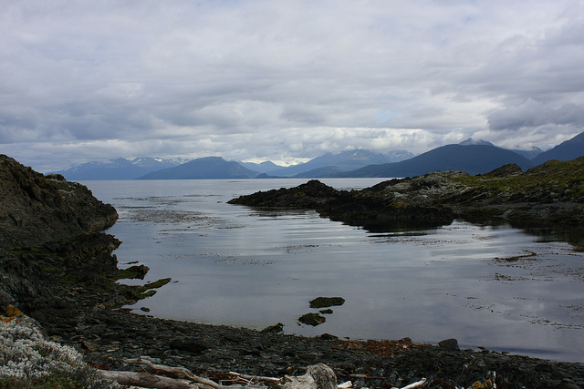

I´m currently at the Antarctica Hostel in the city of Ushuaia, Argentina, affectionately called the city at the end of the world. This is officially the southern most city in the entire world, so it´s pretty amazing to be here.

\[caption id="attachment\_1319" align="aligncenter" width="640" caption="Beagle Channel, Ushuaia"\]\[/caption\]

I´ll do a proper trip report when I´m back in Buenos Aires, but since I have a few hours to kill before my penguin tour later today, I thought I would do a quick update. The keyboard I´m using in the hostel is prety funky, and many of the keys are out of place compared to a normal keyboard. So, this entry is pretty slow going!

But I´m having a really great time here so far. Unlike Buenos Aires, I don´t feel out of place here, probably due to the fact that many people in Ushuaia are tourists. The town reminds me of a cross between Whitehorse, Halifax, and Haines, Alaska. It´s clean, people are friendly, and the views are absolutely gorgeous.

I´m here until Monday, at which point I´ll be catching a four hour flight back to Buenos Aires. I did a 3 hour sailing tour of the Beagle Channel on Thursday, and spent yesterday just chilling out in Ushuaia. I have a six hour trip to a penguin rookery later tonight (from 2:30pm until 8:30pm) with the only tour that lets you actually walk with the penguins (the other tours simply pull up next to them in a boat). Afterwards I´m going to treat myself to a nice steak, and then probably retreat to the hostel for a beer or two with my fellow travelers. I have no real plans for tomorrow, but there´s a 30 minute helicopter tour that I´m thinking of possibly going on, or possibly a scenic flight over the Beagle Channel.

So in short, I´m definitely enjoying my time at the end of the world.
