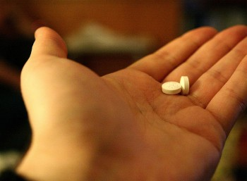

I don't like to fly. In fact, I would say that I pretty much hate it.

First, airports involve delays. You generally have to wait in line to check-in or check bags. Then you have to wait to go through security. Then you have to wait in the waiting area to board you plane. Then you board, and have to wait inside. Ideally your plane will leave on time, but often it doesn't, and you're stuck waiting on the plane.

Next, you're cramped into a small space, usually sitting next to one or two other people who probably don't really want to be on a plane either. If you're lucky, they smell nice. If you're unlucky, they smell. Or even worse, they are under the age of 12 and looking at you like they just re-released the Tickle Me Elmo doll, and you're it.

I've also had my share of scary airplane encounters.

In Cuba, the pilot put the engines into idle during our take off climb and we went into a mini nose dive.

During a huge storm in Vancouver a few years ago (the one that destroyed some of Stanley Park) the turbulence was so bad on the plane that my glasses popped off my face and ended up on the floor of the opposite window seat.

On the way to Ireland recently the pilot woke up everyone up at about 2am saying "we're about to hit some serious, serious turbulence, so wake up and put your seat belt on." Thanks for that.

As a result, I get super anxious on planes. If you're next to me on a plane and we hit some bumps, it's likely you'll have deep claw-marks in your hand from me squeezing you.

And forget sleeping on planes for me - if it's not some kid screaming in the front, it's the little bits of turbulence that my brain focuses that stop me from getting any rest on the plane.

Enter my new saviour, Ativan.

Prior to leaving to Argentina, I went to a walk-in clinic and told them how much I hated flying. I was originally hoping they would prescribe me some sedatives meant for horses or something to knock me out, but turns out they had something better in mind for me: Ativan. After warning me repeatedly that they really shouldn't prescribe it to me in a walk-in clinic, the doctor then wrote me enough for around 20 flights or so, which was great.

Ativan is anti-anxiety medication, it basically makes it so you don't really care about anything. I popped a few pills (or rather, placed them under my tongue, the way you're supposed to take Ativan) on my first flight, and sort of zoned out for all ten hours of it. It's kind of like the main protagonist in the movie _Garden State_ at the beginning - everyone else can be freaking out, but you're sort of oblivious to it.

Bad turbulence? No biggie.

Crying kid? He'll stop eventually.

Plane's on fire? I got some water here if you guys need it.

I still can't really sleep on planes, but at least I don't fly on the edge of my seat any more, which is a nice change.

So if you have a phobia of flying, then I suggest talking to your doctor and getting some of _the good stuff_. It's definitely changed my flying experience for the better.
