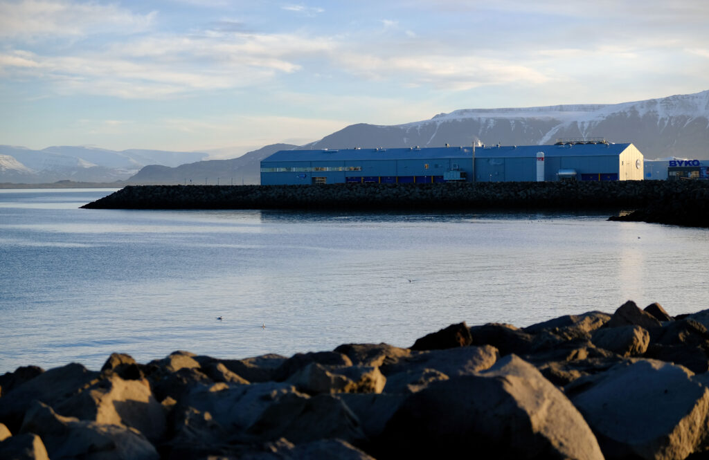
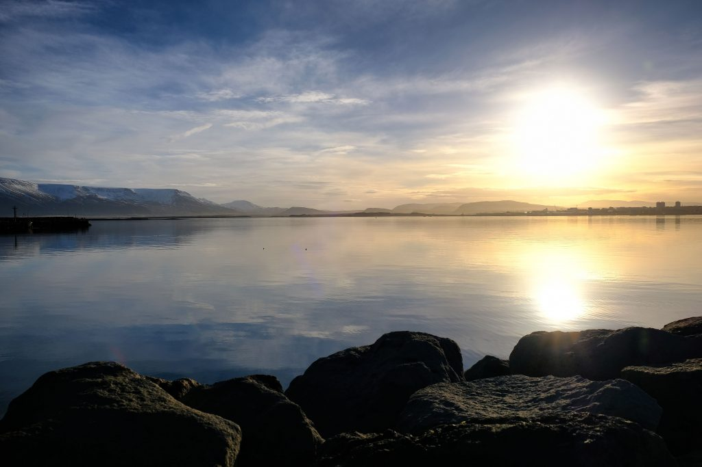
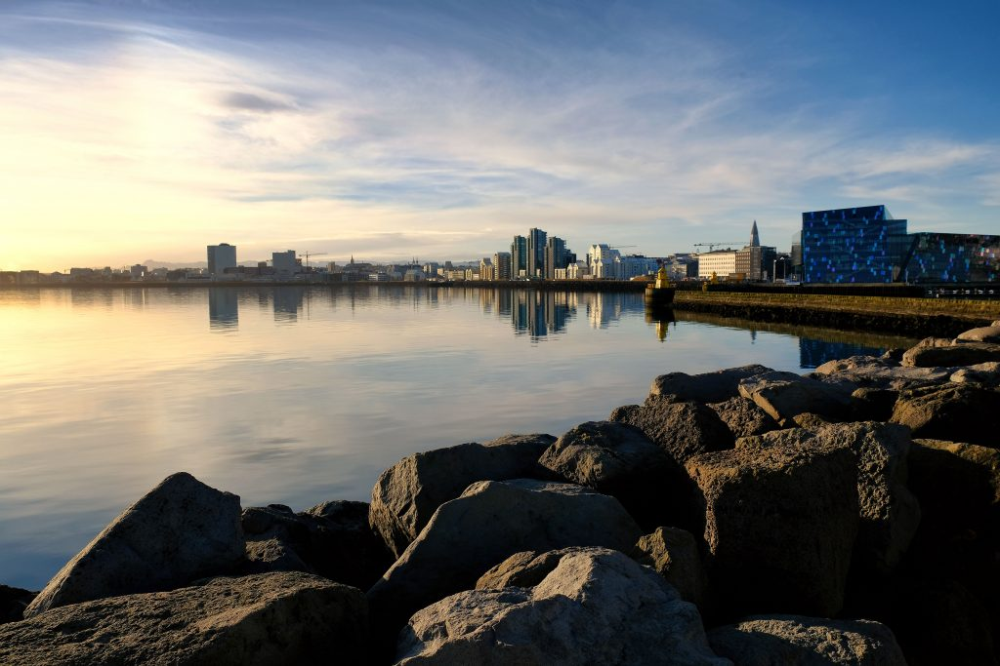
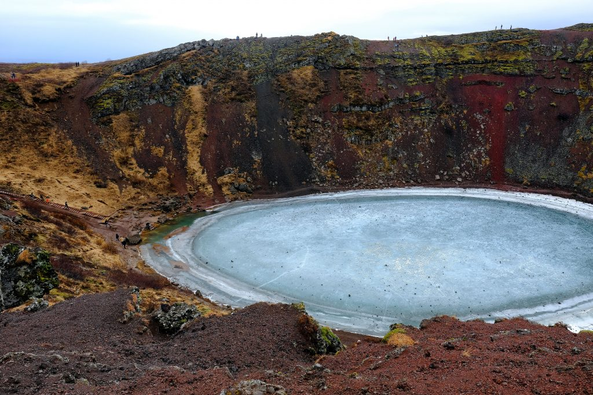
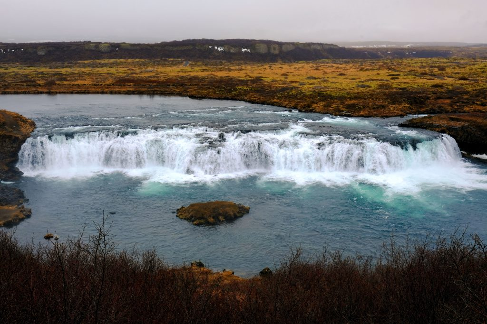
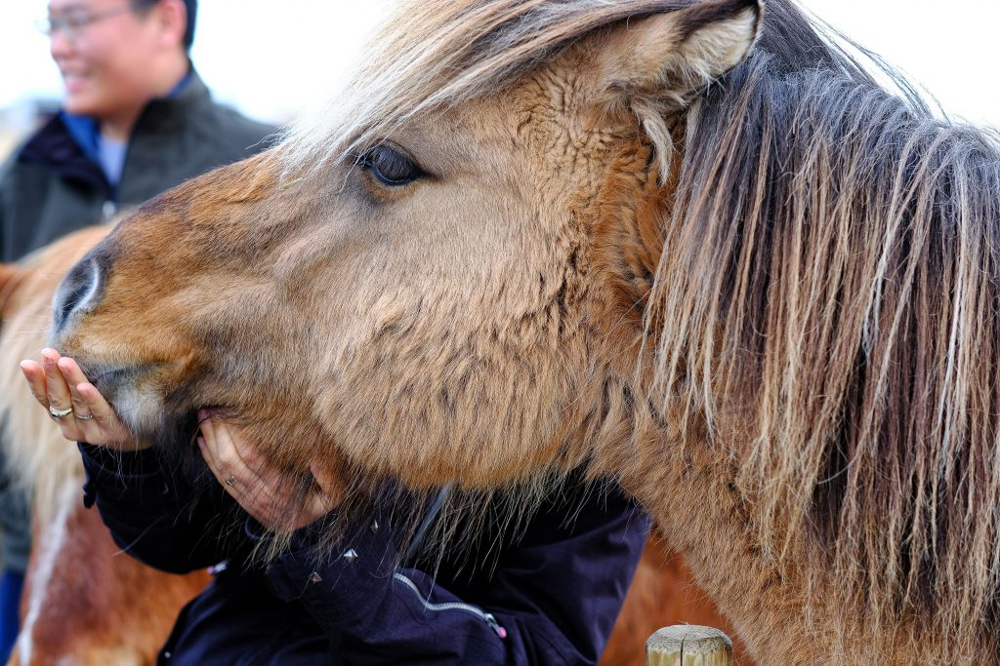
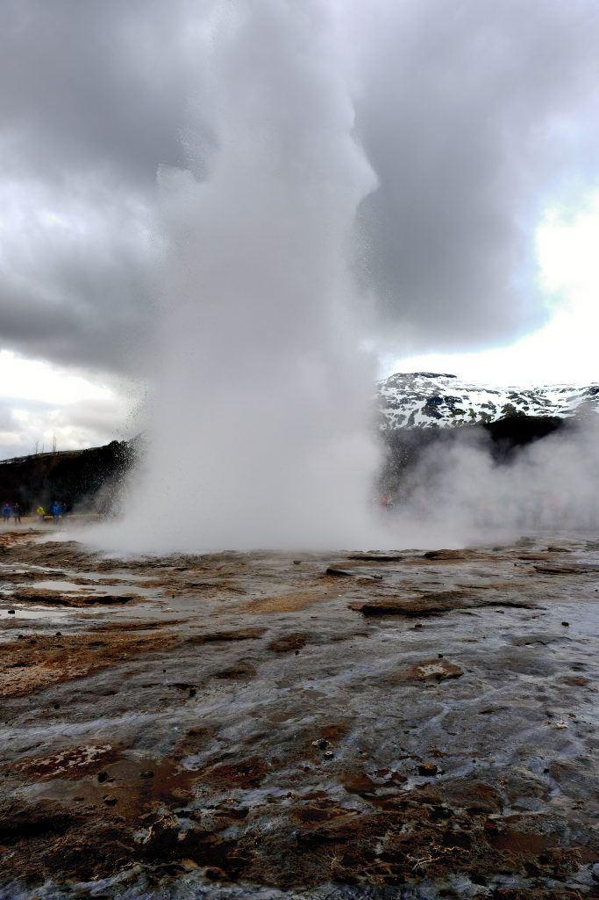
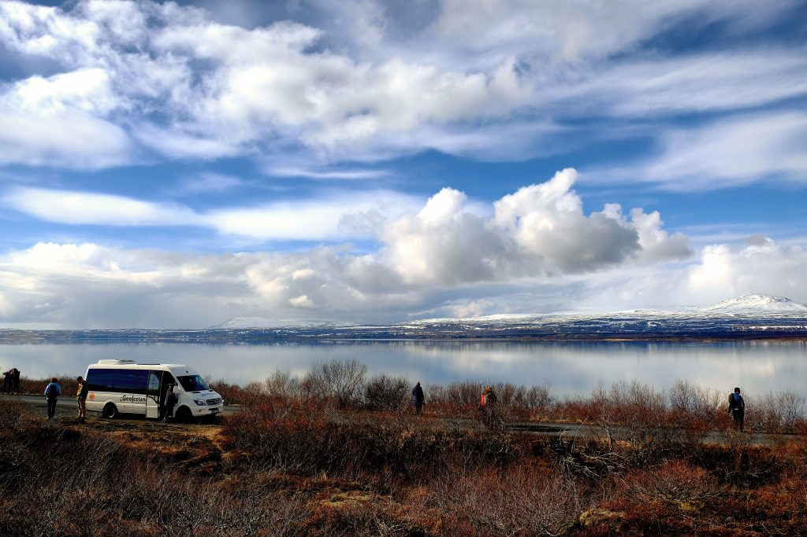
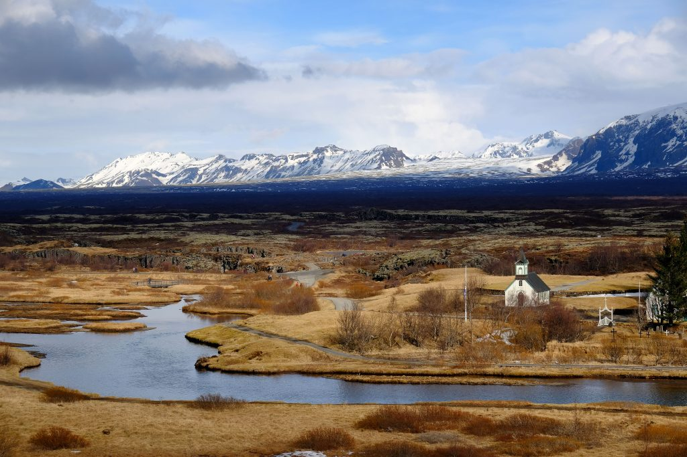

I recently made the decision to take advantage of Iceland Air's free stopover policy to visit Iceland on my way from Vancouver, Canada to Europe. If you weren't aware, Iceland Air allows anyone to stop for up to a week in Iceland without any additional charges. This is a brilliant marketing move, and it's help Iceland become a hugely successful tourist destination in the last few years (one tour guide told me that fishing used to be about 70% of the economy, and now tourism is coming close to eclipsing that).

Before I arrived, I had heard stories about how expensive the country is. Let me be clear, those rumours are true. Compared to prices back in Vancouver, I would say most items in Iceland are 2-3x as expensive. For example, I had a small latte and a banana, which back home would probably cost me about $5 Canadian - in Iceland it was more like $10. Similarly a plate of fish and chips back home is $20 or so - I saw a restaurant while walking around that was offering fish and chips for the equivalent of $50.

That said, I found Iceland really clean and super efficient. Most of the busses I was on were high-end Mercedes models, and the majority of them had included WiFi (which when you are touring a foreign country is great to have for looking items up). Walking around felt really safe, and most of the streets and buildings were clean.

Getting from the airport to Reykjavik was really easy as I bought a Grey Line transfer. Once you enter the arrivals hall in the airport there is a person standing right in front of you with a Grey Line board, and he gave me instructions for how to find the bus which runs roughly every 30 minutes. It was about a 45 minute drive to Reykjavik, after which Grey Line transferred me to a smaller vehicle that took me to my hostel another 15 minutes away.

Many of us that arrived had overnight flights from North America, which meant we were at the hostel around 7:30am. This must be a common occurrence for them, but they didn't really know what to do with us. We were told that we wouldn't be able to check-in until 2pm, which is unfortunate but of course I understand since there were likely people still in the rooms. That said the common area had a few people that were mostly sleeping on their sofas for the morning since they didn't really have anywhere else to go and were exhausted. I really wish more places would set aside a few rooms for people who come in overnight, or offer early check-ins (for a fee) to accommodate them. Since I had no room, I decided to have a $8 coffee instead. The hostel offered to watch my luggage for me, so I tossed my main suitcase into the hostel's storage area so I could go outside and shoot some photos.

## Exploring Reykjavik

I only had two days in Iceland, and booked a huge tour for my second day. So really I only had an afternoon to explore Reykjavik. I walked around for a few hours with my camera just taking photos, which was great. Reykjavik is certainly unique, and reminded me of a cross between Ushuaia, Argentina (which is in Patagonia on the Beagle Channel), and Wellington, New Zealand. Obviously fishing is a huge part of the economy in Iceland, which is evident based on all the seafood restaurants and fishing boats you see while walking around.

\[caption id="attachment\_13707" align="aligncenter" width="1024"\] Reykjavik\[/caption\]

\[caption id="attachment\_13709" align="aligncenter" width="1024"\] Reykjavik Harbour\[/caption\]

\[caption id="attachment\_13710" align="aligncenter" width="1024"\] Reykjavik\[/caption\]

I stayed at the Oddsson Hostel, which was one of the lower priced options I could find (but still $100 CAD for a night). I knew I wouldn't be spending a lot of time in the hotel, so I just decided to try and keep it cheap. In general I had a good experience there, but didn't really spend a lot of time interacting with the staff or other travellers on this trip.

## Golden Circle Tour

One of the highlights of most visitors' trips to Iceland is the Golden Circle Tour. The Golden Circle is a route around Iceland that takes you to various beautiful nature locations including several waterfalls and national parks. I booked an eight hour tour via [Saga Travel](https://sagatravel.is/) and had a really great time. Here were some of the photos I shot while on the tour:

\[caption id="attachment\_13712" align="aligncenter" width="1024"\] Volcanic Crater\[/caption\]

\[caption id="attachment\_13713" align="aligncenter" width="1024"\] Fixi Waterfalls\[/caption\]

\[caption id="attachment\_13714" align="aligncenter" width="1024"\] Icelandic Horse\[/caption\]

\[caption id="attachment\_13715" align="aligncenter" width="1024"\] Gullfoss Waterfall\[/caption\]

\[caption id="attachment\_13716" align="aligncenter" width="683"\] Geothermal Geyser\[/caption\]

\[caption id="attachment\_13717" align="aligncenter" width="1024"\] Exploring the National Park\[/caption\]

\[caption id="attachment\_13718" align="aligncenter" width="1024"\] Exploring the park\[/caption\]

After the tour the driver dropped me back off at the hostel. Since I had an early morning flight to Amsterdam, I just took it easy and got to bed early.

## Summary

Up until a few years ago, very few people I know would have considered Iceland a tourist destination, but nowadays not only are many people talking about going, but I also have several friends who have already visited. And sure, it's expensive, but unlike some other countries I have visited that were also expensive (I'm looking directly at you Singapore), Iceland seems to warrant it due to their isolated location and progressive nature of the entire country (most of the country runs on renewable resources - we could all learn some valuable lessons from them).

If you are in a time crunch, like I was, you can easily see some of the highlights of the country in just a few days. But if you do have more time, there is a really beautiful 1200km loop road around the entire country that I've heard is great for a road trip.

So if you're looking for a unique destination to visit, I would highly recommend visiting Iceland. And if you're making the trip from North America to Europe, it seems silly not to take advantage of Iceland Air's free stopover policy to enjoy some of the sights and also help with the jet lag transition.
